## 一、搭建环境

### 1.1 安装和配置 jdk（1.8 及以上）


### 1.2 下载并安装配置 Gradle


### 1.3 下载并安装配置 Scala

- 对应 gradle.properties 中的版本

### 1.4 安装 zookeeper 并启动


### 1.5 构建 kafka 源码环境

- gradle idea：在 Kafka 的根目录执行 gradle idea 命令进行构建

- 安装 Scala 插件，重启 IDEA

- 配置 Kafka 源码环境

  - 确保gradle.properties配置文件中的 scalaVersion 与安装的一致。

    - Scala 版本不一致可能会引起一些异常

  - 将 config 目录下的 log4j.properties 文件拷贝到 core/src/main/scala 目录下

    - 让 Kafka 在运行时能够输出日志信息

    - build.gradle 配置文件中添加 slf4j-simple 依赖

      ```groovy
      compile group: 'org.slf4j', name: 'slf4j-simple', version: '1.7.30'
      ```

  - 配置 server.properties 文件

    ```properties
    # 是否允许topic被删除，设置为true则topic可以被删除，
    # 开启这个功能方便Kafka在运行一段时间之后，能够删除一些不需要的临时topic
    delete.topic.enable=true
    # 禁用自动创建topic的功能
    auto.create.topics.enable=false
    # 存储log文件的目录，默认值为/tmp/kafka-logs
    # 示例是在Windows环境下运行，所以需要修改这个配置，注意这里的双反斜杠。
    log.dir=D:\\kafka\\tmp\\kafka-logs
    # 配置kafka依赖的zookeeper路径地址，这里的前提是在本地开启了一个zookeeper的服务
    # 如果本地没有zookeeper服务，可以参考下一节中zookeeper的安装、配置及运行
    zookeeper.connect=localhost:2181/kafka
    ```

  - 配置 Kafka 的启动参数

    - 配置 Main class 为 kafka.Kafka，并制定启动时所需要的配置文件地址，即：config/server.properties。配置 JMX_PORT 是为了方便搜集 Kafka 自身的 Metrics 数据。

    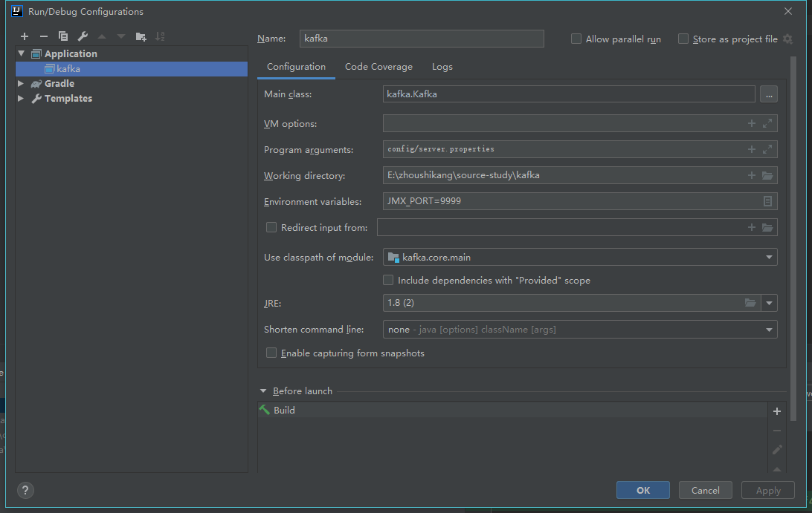

- **运行 Kafka 服务**

  - 运行成功的部分日志：

    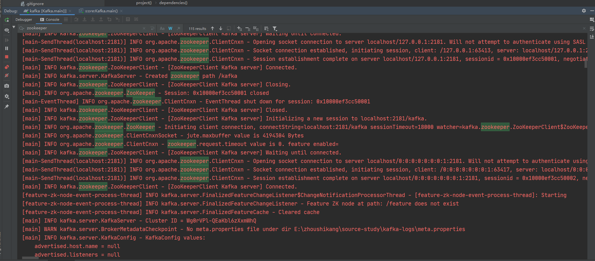


## 二、Kafka Producer

- 正常的生产逻辑具备的步骤：
  - 配置生产者客户端参数及创建相应的生产者实例。
  - 构建待发送的消息。
  - 发送消息。
  - 关闭生产者实例。

### 2.1 Producer 发送模型

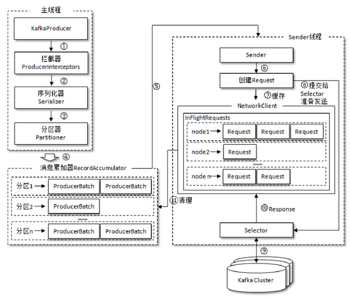

#### 2.1.1 send

```java
	/**
	* 异步向一个 topic 发送数据，发送确认后唤起回调函数
    */
    @Override
    public Future<RecordMetadata> send(ProducerRecord<K, V> record, Callback callback) {
        // intercept the record, which can be potentially modified; this method does not throw exceptions
        ProducerRecord<K, V> interceptedRecord = this.interceptors.onSend(record);
        return doSend(interceptedRecord, callback);
    }
```

#### 2.1.2 doSend

```java
// 数据发送的最终实现调用了 Producer 的 doSend() 接口。
/**
	1.当生产者关闭时，抛出异常
	2.确认数据要发送到的 topic 的 metadata 是可用的
	3.序列化 record 的 key 和 value
	4.获取该 record 的 partition 的值（可以指定,也可以根据算法计算）
	5.record 的字节超出限制或大于内存限制时,就会抛出 RecordTooLargeException 异常
	6.调用 callback 和 interceptor 的回调方法
	7.如果是事务 produce，且还没有准备好发送，则抛出异常
	8.向 RecordAccumulator 中追加数据	
		- 保证单 partition 的顺序性：调用 RecordAccumulator 的  `mutePartition()` 与  `unmutePartition()` 方法
	9.如果 batch 已经满了（达到了 batch.size 的大小）,或者 batch 的剩余空间不足以添加下一条 record，唤醒 sender 线程发送数据
*/
```

#### 2.1.3 向 RecordAccumulator 中追加数据（ProducerRecord）

```java
/**
	向 accumulator 添加一条 record，并返回添加后的结果（结果主要包含: future metadata、batch 是否满的标志以及新 batch 是否创建）
	其中， maxTimeToBlock 是 buffer.memory 的 block 的最大时
	1.数据先进行缓存
	2.每个 topicPartition 对应一个 Deque<ProducerBatch>
	3.在对一个 deque 进行操作时,会保证线程安全
	4.尝试追加数据，追加成功则返回，否则进入下一步
	5.为 topic-partition 创建一个新的 RecordBatch, 需要初始化相应的 RecordBatch，要为其分配的大小是: max（batch.size, 加上头文件的本条消息的大小）
		- 给这个 RecordBatch 初始化一个 buffer
		- 更新时间戳
		- 再次尝试追加数据
		- 给 topic-partition 创建一个 RecordBatch
		- 向新的 RecordBatch 中追加数据
		- 将 RecordBatch 添加到对应的 deque 中
		- 向未 ack 的 batch 集合添加这个 batch
		- 不要在 finally 中释放这个 buffer，因为 buffer 可能在使用中
		- 如果 dp.size() > 1 就证明这个 deque 有一个 batch 是可以发送了
	
*/
```


- ProducerRecord 写入的具体流程

```java
/**
	ProducerRecord 写入的具体流程
*/

/*
	1.从 batches：<TopicPartition, Deque<ProducerBatch>> 中获取一个 Deque<ProducerBatch>，没有的话初始化一个 deque 并返回
	2.向 deque 中追加数据
		3.选择 deque 中最新创建的 RecordBatch
		4.deque 中没有 RecordBatch 或其剩余空间不足，创建新的 RecordBatch
		5.向该 RecordBatch 追加 record
		6.将 RecordBatch 添加到对应的 queue 中
		7.向未 ack 的 batch 集合添加这个 batch
    8.添加 record 成功
*/
```

#### 2.1.4 发送 RecordBatch

- 如果发现 RecordBatch 已满足发送的条件，那么就会唤醒 sender 线程，发送 RecordBatch。
  1. batch 已经满了（达到了 batch.size 的大小）,或者 batch 的剩余空间不足以添加下一条 record
  2. 新的 batch 创建完成

```java
// 发送 RecordBatch 
/**
	1.获取那些已经可以发送的 RecordBatch 对应的 nodes（leader）
	this.accumulator.ready(cluster, now);
	2.如果有 topic-partition 的 leader 是未知的,就强制 metadata 更新
	3.如果与 node 没有连接（如果可以连接,同时初始化该连接）,就证明该 node 暂时不能发送数据,暂时移除该 node
	4.返回该 node 对应的所有可以发送的 RecordBatch 组成的 batches（key 是 node.id）,并将 RecordBatch 从对应的 queue 中移除
		- 记录将要发送的 RecordBatch
    5.将由于元数据不可用而导致发送超时的 RecordBatch 移除
    6.发送 RecordBatch（发送 produce 请求）
    	- 魔数向下兼容
    	- 将 batches 中 leader 为同一个 node 的所有 RecordBatch 放在一个请求中进行发送。
    	- 调用 NetworkClient.send() 发送请求
    7.NetworkClient.poll(): 关于 socket 的一些实际的读写操作（其中包括 meta 信息的更新）
	
	
*/
```


### 2.2 Producer Metadata 更新机制

#### 2.2.1 Metadata 内容

- Metadata

```java
 /**
 * 这个类被 client 线程和后台 sender 所共享,它只保存了所有 topic 的部分数据,
 * 当我们请求一个它上面没有的 topic meta 时,它会通过发送 metadata update 来更新 meta 信息,
 * 如果 topic meta 过期策略是允许的,那么任何 topic 过期的话都会被从集合中移到 invalidTopics 中,
 * 但是 consumer 是不允许 topic 过期的因为它明确地知道它需要管理哪些 topic
 */
public class Metadata implements Closeable {
    private final Logger log;
    /** metadata 更新失败时,为避免频繁更新 meta,最小的间隔时间,默认 100ms */
    private final long refreshBackoffMs;
    /** metadata 的过期时间, 默认 60,000ms */
    private final long metadataExpireMs;
    /** 更新版本号，每更新成功1次，version自增1,主要是用于判断metadata是否更新 */
    private int updateVersion;
    /** 请求版本号，每发送一次请求，version自增1 */
    private int requestVersion;
    /** 最近一次更新时的时间（包含更新失败的情况） */
    private long lastRefreshMs;
    /** 最近一次成功更新的时间（如果每次都成功的话，与前面的值相等, 否则，lastSuccessfulRefreshMs < lastRefreshMs) */
    private long lastSuccessfulRefreshMs;
    private KafkaException fatalException;
    /** 无效的 topics */
    private Set<String> invalidTopics;
    /** 未认证的 topics */
    private Set<String> unauthorizedTopics;
    /** nodes, topics, partitions 等集群相关信息的缓存 */
    private MetadataCache cache = MetadataCache.empty();
    private boolean needFullUpdate;
    private boolean needPartialUpdate;
    /** 会接收到 metadata 更新的列表 */
    private final ClusterResourceListeners clusterResourceListeners;
    private boolean isClosed;
    /** 存储Partition最近一次的leaderEpoch */
    private final Map<TopicPartition, Integer> lastSeenLeaderEpochs;
```

- Cluster（在 MetadataCache 下）

```java
/**
 * An immutable representation of a subset of the nodes, topics, and partitions in the Kafka cluster.
 * 并不是一个全集,metadata 的主要组成部分
 */
public final class Cluster {

    private final boolean isBootstrapConfigured;
    /** node 列表 */
    private final List<Node> nodes;
    /** 未认证的 topic 列表 */
    private final Set<String> unauthorizedTopics;
    /** 无效的 topic 列表 */
    private final Set<String> invalidTopics;
    /** 内置的 topic 列表 */
    private final Set<String> internalTopics;

    private final Node controller;
    /** partition 的详细信息 */
    private final Map<TopicPartition, PartitionInfo> partitionsByTopicPartition;
    /** topic 与 partition 的对应关系 */
    private final Map<String, List<PartitionInfo>> partitionsByTopic;
    /** 可用（leader 不为 null）的 topic 与 partition 的对应关系 */
    private final Map<String, List<PartitionInfo>> availablePartitionsByTopic;
    /** node 与 partition 的对应关系 */
    private final Map<Integer, List<PartitionInfo>> partitionsByNode;
    /** node 与 id 的对应关系 */
    private final Map<Integer, Node> nodesById;
    /** 集群信息，里面只有一个 clusterId */
    private final ClusterResource clusterResource;
```


#### 2.2.2 Producer 的 Metadata 更新流程

- Producer 在调用 `dosend()` 方法时，第一步就是通过 `waitOnMetadata` 方法获取该 topic 的 metadata 信息.

```java
/**
	1.如果 topic 失效了，抛出异常
	2.当前 metadata 中如果已经有这个 topic 的 meta 的话,就直接返回
	3.如果没有 topic 的 metadata 信息，就需要获取相应的 metadata
		- 发送 metadata 请求,直到获取了这个 topic 的 metadata 或者请求超时
		- 不停循环,直到 partitionsCount 不为 null（即直到 metadata 中已经包含了这个 topic 的相关信息）
			-- 返回当前版本号,初始值为0,每次更新时会自增,并将 needUpdate 设置为 true（强制更新）
			-- 唤起 sender，发送 metadata 请求
				--- sender 线程又会去唤醒 NetworkClient 线程，NetworkClient 线程进行一些实际的操作
			-- 等待 metadata 的更新
				--- 阻塞线程，等待 metadata 的更新
			-- 
*/
```

- Metadata 更新：通过 `sender.wakeup()` 来唤醒 sender 线程，间接唤醒 NetworkClient 线程，NetworkClient.poll() 方法来负责发送 Metadata 请求，并处理 Server 端的响应。

```java
/**
	1.maybeUpdate: 判断是否需要更新 metadata，如果需要就更新（请求更新 metadata 的地方）
	2.处理 Server 端的一些响应
		- 通过 selector 中获取 Server 端的 response
		- handleCompletedReceives：在返回的 handler 中，会处理 metadata 的更新
*/
```

-  maybeUpdate
  - KafkaProducer 线程之前是一直阻塞在两个 `while` 循环中，直到 metadata 更新
    1. sender 线程第一次调用 `poll()` 方法时，初始化与 node 的连接；
    2. sender 线程第二次调用 `poll()` 方法时，发送 `Metadata` 请求；
    3. sender 线程第三次调用 `poll()` 方法时，获取 `metadataResponse`，并更新 metadata。
  - leastLoadedNode：**由每个 node 在 `InFlightRequests`中还未确定的请求数决定**的，未确定的请求越少则负载越小。

```java
/**
	1.metadata 下次更新的时间（需要判断是强制更新还是 metadata 过期更新,前者是立马更新,后者是计算 metadata 的过期时间）
	2.如果一条 metadata 的 fetch 请求还未从 server 收到恢复,那么时间设置为 waitForMetadataFetch（默认30s）
	3.时间未到时,直接返回下次应该更新的时间
	4.leastLoadedNode(now)：选择一个连接数最小的节点
	5.可以发送 metadata 请求的话,就发送 metadata 请求
		- 通道已经 ready 并且支持发送更多的请求
			-- 发送 metadata 请求
        - 如果 client 正在与任何一个 node 的连接状态是 connecting，那么就进行等待
        - 如果没有连接这个 node，那就初始化连接
*/
```

- handleCompletedReceives：处理任何已经完成的接收响应
  -  处理 Server 端对 Metadata 请求处理后的 response
  - 判断 metadata 中 node 信息是否有效
    - 无效，则不更新 metadata 信息
    - 否则，更新 metadata 信息

#### 2.2.3 Producer Metadata 的更新策略

- Metadata 会在下面**两种情况下**进行更新
  1. KafkaProducer **第一次发送消息时强制更新**，其他时间周期性更新，它会通过 Metadata 的 `lastRefreshMs`, `lastSuccessfulRefreshMs` 这2个字段来实现；
  2. 强制更新： 调用 `Metadata.requestUpdate()` 将 `needUpdate` 置成了 true 来强制更新。
- Metadata 的**强制更新**会在以下几种情况下进行：（强制更新主要是用于处理各种异常情况。）
  1. `initConnect` 方法调用时，初始化连接；
  2. `poll()` 方法中对 `handleDisconnections()` 方法调用来处理连接断开的情况，这时会触发强制更新；
  3. `poll()` 方法中对 `handleTimedOutRequests()` 来处理请求超时时；
  4. 发送消息时，如果无法找到 partition 的 leader；
  5. 处理 Producer 响应（`handleProduceResponse`），如果返回关于 Metadata 过期的异常，比如：没有 topic-partition 的相关 meta 或者 client 没有权限获取其 metadata。

### 2.3 topic 创建过程

#### 2.3.1 topic 创建方式

- 通过 `kafka-topics.sh` 创建一个 topic，可以设置相应的副本数让 Server 端自动进行 replica 分配，也可以直接指定手动 replica 的分配。
- Server 端如果 `auto.create.topics.enable` 设置为 true 时，那么当 Producer 向一个不存在的 topic 发送数据时，该 topic 同样会被创建出来，此时，副本数默认是1。**（不推荐）**

#### 2.3.2 kafka-topics.sh 创建 topic

- 实际调用 kafka.admin.TopicCommand 的方法来创建 topic

```java
/**
	1.是否指定了 zk 连接
		- ZookeeperTopicService
		- AdminClientTopicService
	2.根据参数确定调用方法：create、alter、list、describe、delete
	3.指定 zk 连接的创建方法：ZookeeperTopicService.createTopic
*/
```

- createTopic

```java
/**
	1.根据 zk 连接创建 AdminZkClient
	2.是否分配了副本
		- createTopicWithAssignment
		- createTopic
			-- 有机架感知的情况下,返回 Broker 与机架之间的信息：getBrokerMetadatas
			-- 分配分区、副本：assignReplicasToBrokers
			-- 调用 createTopicWithAssignment
*/

/**
	createTopicWithAssignment
	1.进行 topic 名称、是否存在、是否重复分配分区、topic 配置等校验
	2.设置或创建 znode path
	3.writeTopicPartitionAssignment： 将 topic 的 Partition replicas 的更新到 zk 上
*/
```

#### 2.3.3 replicas 自动分配算法

```java
   /**
	* 副本分配时,有三个原则:
   	* 1. 将副本平均分布在所有的 Broker 上;
   	* 2. partition 的多个副本应该分配在不同的 Broker 上;
   	* 3. 如果所有的 Broker 有机架信息的话, partition 的副本应该分配到不同的机架上。
   	*
   	* 为实现上面的目标,在没有机架感知的情况下，应该按照下面两个原则分配 replica:
   	* 1. 从 broker.list 随机选择一个 Broker,使用 round-robin 算法分配每个 partition 的第一个副本;
   	* 2. 对于这个 partition 的其他副本,逐渐增加 Broker.id 来选择 replica 的分配。
   	
  	  assignReplicasToBrokers
  	  1.assignReplicasToBrokersRackUnaware：没有开启机架感应的分配算法
  	  2.assignReplicasToBrokersRackAware：开启机架感应的分配算法（如果不是所有的 broker 开启机架感应则抛出异常）
   	*/
	
	/**
		assignReplicasToBrokersRackUnaware：没有开启机架感应的分配算法
	*/
	private def assignReplicasToBrokersRackUnaware(nPartitions: Int,
                                                 replicationFactor: Int,
                                                 brokerList: Seq[Int],
                                                 fixedStartIndex: Int,
                                                 startPartitionId: Int): Map[Int, Seq[Int]] = {
    val ret = mutable.Map[Int, Seq[Int]]()
    val brokerArray = brokerList.toArray
    // 随机选择一个Broker
    val startIndex = if (fixedStartIndex >= 0) fixedStartIndex else rand.nextInt(brokerArray.length)
    // 开始增加的第一个 partition
    var currentPartitionId = math.max(0, startPartitionId)
    var nextReplicaShift = if (fixedStartIndex >= 0) fixedStartIndex else rand.nextInt(brokerArray.length)
    //  对每个 partition 进行分配
    for (_ <- 0 until nPartitions) {
      // 防止 partition 过大时,其中某些 partition 的分配（leader、follower）完全一样
      if (currentPartitionId > 0 && (currentPartitionId % brokerArray.length == 0))
        nextReplicaShift += 1
      // partition 的第一个 replica
      val firstReplicaIndex = (currentPartitionId + startIndex) % brokerArray.length
      val replicaBuffer = mutable.ArrayBuffer(brokerArray(firstReplicaIndex))
      // 其他 replica 的分配
      for (j <- 0 until replicationFactor - 1)
        replicaBuffer += brokerArray(replicaIndex(firstReplicaIndex, nextReplicaShift, j, brokerArray.length))
      ret.put(currentPartitionId, replicaBuffer)
      currentPartitionId += 1
    }
    ret
  }
```

#### 2.3.4 replicas 更新到 zk 后触发操作（创建 topic）

- 当一个 topic 的 replicas 更新到 zk 上后，监控 zk 这个目录的方法会被触发（最终调用 KafkaController 的 process 方法，根据 ControllerEvent 选择不同的方法：创建 topic 执行 processTopicChange() 方法）

```java
/**
	processTopicChange
	1.把已经删除 partition 过滤掉
	2.将新增的 tp-replicas 更新到缓存中
	3.处理新建的 topic：onNewPartitionCreation
*/
```

- onNewPartitionCreation() 详解

```JAVA
private def onNewPartitionCreation(newPartitions: Set[TopicPartition]): Unit = {
    info(s"New partition creation callback for ${newPartitions.mkString(",")}")
    // handleStateChanges 底层调用 doHandleStateChanges 方法，处理状态对应的事件
    // 创建 Partition 对象，并将其状态置为 NewPartition 状态
    partitionStateMachine.handleStateChanges(newPartitions.toSeq, NewPartition)
    // 创建 Replica 对象，并将其状态置为 NewReplica 状态；
    replicaStateMachine.handleStateChanges(controllerContext.replicasForPartition(newPartitions).toSeq, NewReplica)
    // 将 partition 对象从 NewPartition 改为 OnlinePartition 状态；
    partitionStateMachine.handleStateChanges(
      newPartitions.toSeq,
      OnlinePartition,
      Some(OfflinePartitionLeaderElectionStrategy(false))
    )
    // 将 Replica 对象从 NewReplica 改为 OnlineReplica 状态。
    replicaStateMachine.handleStateChanges(controllerContext.replicasForPartition(newPartitions).toSeq, OnlineReplica)
  }
```

```java
/**
	1.partitionStateMachine > NewPartition
		- 创建分区对象，并将其状态设置为 NewPartition
	2.replicaStateMachine > NewReplica
		- 每个 Partition 创建对应的 replica 对象，并将其状态设置为 NewReplica
	3.partitionStateMachine > OnlinePartition
		- 将 partition 对象的状态由 NewPartition 设置为 OnlinePartition
		- initializeLeaderAndIsrForPartition: 初始化 leader 和 isr，replicas 中的第一个 replica 将作为 leader，所有 replica 作为 isr，并把 leader 和 isr 信息更新到 zk；
		- 发送 LeaderAndIsr 请求给所有的 replica，发送 UpdateMetadata 给所有 Broker。
	4.replicaStateMachine > OnlineReplica
		- 将 Replica 对象的状态由 NewReplica 更新为 OnlineReplica 状态，这些 Replica 才真正可用。
*/
```


#### 2.3.5 Partition 状态机和 replica 状态机

- partition 状态机

  - 一个 Partition 对象有四种状态：

    1. `NonExistentPartition`：这个 partition 不存在；
    2. `NewPartition`：这个 partition 刚创建，有对应的 replicas，但还没有 leader 和 isr；
    3. `OnlinePartition`：这个 partition 的 leader 已经选举出来了，处理正常的工作状态；
    4. `OfflinePartition`：partition 的 leader 挂了。

  - partition 只有在 `OnlinePartition` 这个状态时，才是可用状态。

    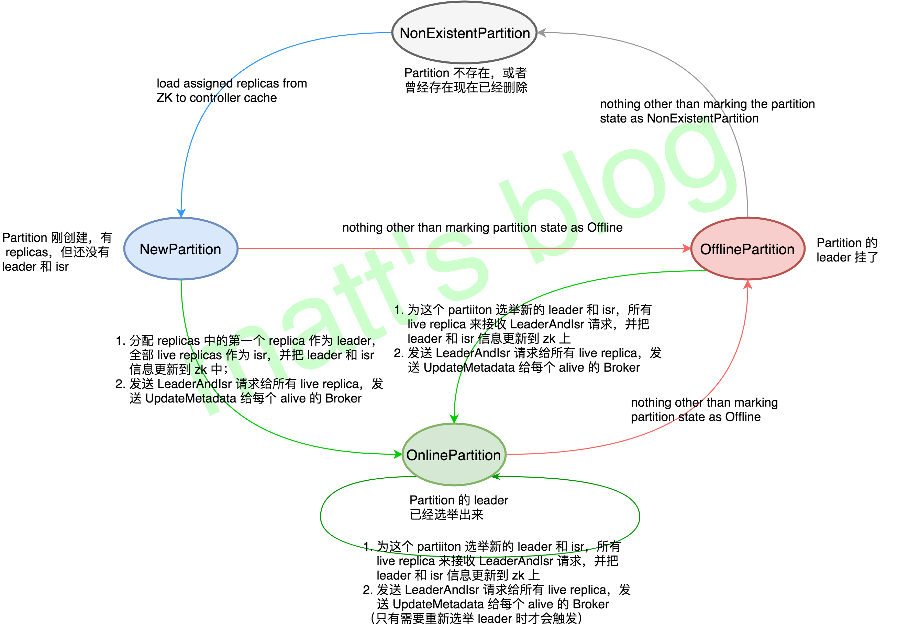

- Replica 状态机

  


### 2.4 Producer NIO 网络模型

- producer 网络模型


- Producer 整体流程

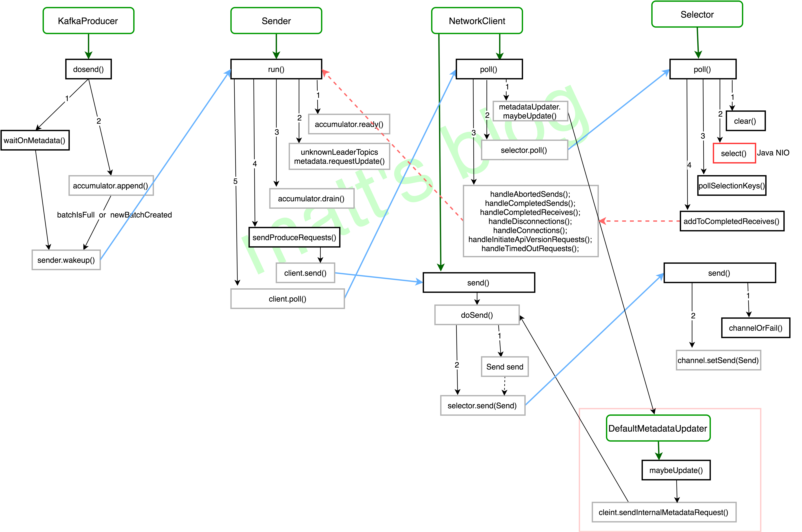

#### 2.4.1 `sender.wakeup()` 方法

```java
/**
	调用过程：Sender -> NetworkClient -> Selector(Kafka 封装的) -> Selector(Java NIO)
*/
sender.wakeup();
// org.apache.kafka.clients.producer.internals.Sender
this.client.wakeup();
// org.apache.kafka.clients.NetworkClient
this.selector.wakeup();
// org.apache.kafka.common.network.Selector
this.nioSelector.wakeup();
```

- 作用：将 Sender 线程从 `select()` 方法的阻塞中唤醒，`select()` 方法的作用是轮询注册在多路复用器上的 Channel，它会一直阻塞在这个方法上，除非满足下面条件中的一个：
  1. at least one channel is selected;
  2. this selector’s {@link #wakeup wakeup} method is invoked;
  3. the current thread is interrupted;
  4. the given timeout period expires.

#### 2.4.2 NetworkClient.poll()

```java
	/**
		1.metadataUpdater.maybeUpdate()
		2.selector.poll()
		3.process completed actions
	*/
	public List<ClientResponse> poll(long timeout, long now) {
        // 判断当前NetworkClient是否是处于active状态
        ensureActive();

        // 判断是否有打断的响应(比如UnsupportedVersionException)，如果有的话立即处理
        if (!abortedSends.isEmpty()) {
            // If there are aborted sends because of unsupported version exceptions or disconnects,
            // handle them immediately without waiting for Selector#poll.
            List<ClientResponse> responses = new ArrayList<>();
            handleAbortedSends(responses);
            completeResponses(responses);
            return responses;
        }

        // 判断是否需要更新 metadata，如果需要就更新，返回值为可以等待更新的时间
        long metadataTimeout = metadataUpdater.maybeUpdate(now);
        try {
            // 调用 selector 进行I/O的读写操作
            this.selector.poll(Utils.min(timeout, metadataTimeout, defaultRequestTimeoutMs));
        } catch (IOException e) {
            log.error("Unexpected error during I/O", e);
        }

        // process completed actions
        // 处理 Server 端的 response 及一些其他的操作。
        long updatedNow = this.time.milliseconds();
        List<ClientResponse> responses = new ArrayList<>();
        // 处理那些已经完成的 request，如果是那些不需要 response 的 request 的话，
        // 这里直接调用 request.completed()，标志着这个 request 发送处理完成；
        handleCompletedSends(responses, updatedNow);
        // 在返回的 handler 中，会处理 metadata 的更新
        handleCompletedReceives(responses, updatedNow);
        // 处理连接失败那些连接,重新请求 metadata；
        handleDisconnections(responses, updatedNow);
        // 处理新建立的那些连接（还不能发送请求,比如:还未认证）；
        handleConnections();
        // 对那些新建立的连接，发送 apiVersionRequest
        // （默认情况：第一次建立连接时，需要向 Broker 发送 ApiVersionRequest 请求）；
        handleInitiateApiVersionRequests(updatedNow);
        handleTimedOutConnections(responses, updatedNow);
        // 处理 timeout 的连接，关闭该连接，并刷新 Metadata。
        handleTimedOutRequests(responses, updatedNow);
        completeResponses(responses);

        return responses;
    }
```


#### 2.4.3 Selector.poll()

```java
/**
	1.clear(): 每次 poll 调用前都会清理上一次 poll 过程产生的部分缓存。
	2.select(timeout): 获取就绪事件的数量(调用 java nio selector)
	3.pollSelectionKeys: 处理 io 操作
		- 第一次调用：处理已经就绪的事件，进行相应的 IO 操作；
		- 第二次调用：处理新建立的那些连接，添加缓存及传输层（Kafka 又封装了一次）的握手与认证。
		- attemptWrite(key, channel, nowNanos)：写入数据
			-- 调用 write(channel) 方法
				--- channel.write()：调用 send.writeTo(transportLayer) 发送数据，底层调用 java nio 写入数据
				--- channel.maybeCompleteSend()：发送完成后,就删除这个 OP_WRITE 事件
*/
```


#### 2.4.4 NetworkClient.send()

- 调用过程

```java
/**
	1.Sender.runOnce()
	2.Sender.sendProduceRequests()
	3.NetworkClient.send()
	4.NetworkClient.dosend()
		- 检查版本信息，并根据 apiKey() 构建 Request；
		- 创建 NetworkSend 实例；
		- 调用 Selector.send 发送该 Send。
	5.Selector.send()
		- 获取该 Send 对应的 KafkaChannel，调用 setSend() 向 KafkaChannel 注册一个 Write 事件。
	6.KafkaChannel.setSend()
		- 当前 KafkaChannel 的 Send 赋值为要发送的 Send，并注册一个 OP_WRITE 事件；
		- 配合 write() 方法（在 Selector.poll() 的 attemptWrite 中调用）：调用 java nio 写入数据
*/
```


### 2.5 Producer 单 Partition 顺序性实现及配置说明

#### 2.5.1 RecordAccumulator

- 主要方法及说明：

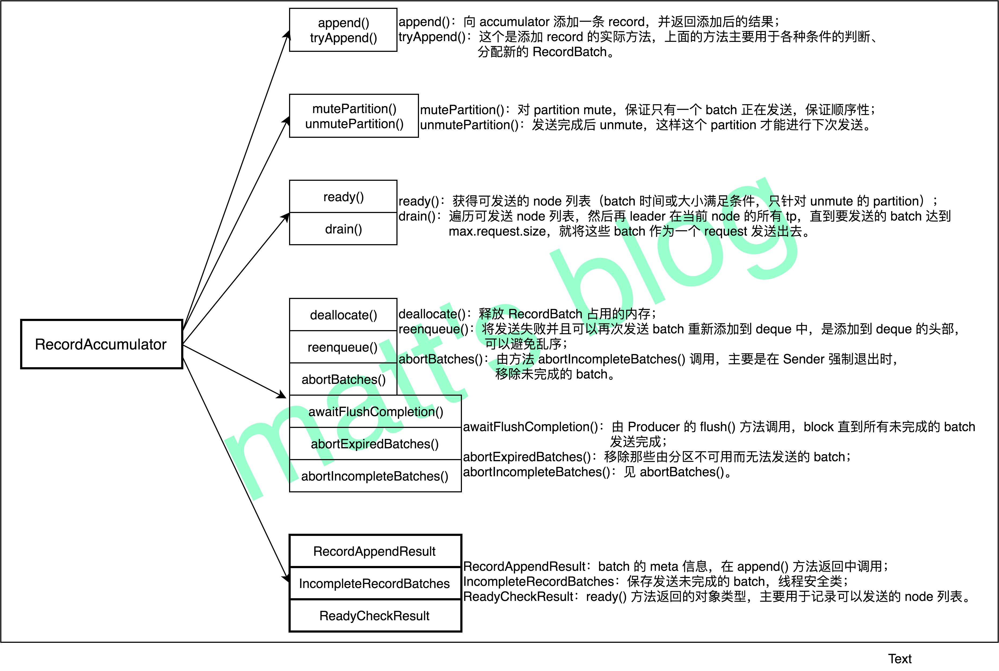

- mutePartition 和 unmutePartition

```java
	/**
     * 保证有序性关键之一，其主要做用就是将指定的 topic-partition 从 muted 集合中加入或删除
     */
	// muted 是用来记录这个 tp 是否有还有未完成的 RecordBatch。
	private final Set<TopicPartition> muted;

	public void mutePartition(TopicPartition tp) {
    	muted.add(tp);
	}

    public void unmutePartition(TopicPartition tp) {
        muted.remove(tp);
    }
```


#### 2.5.2

## 三、Kafka Consumer

### 3.1 Consumer 如何加入一个 Group

#### 3.1.1 GroupCoordinator

- __consumer_offsets
- GroupCoordinator：负责 consumer group member 管理以及 offset 管理。

- Group 状态机

  - AwaitSync ===> CompletingRebalance

  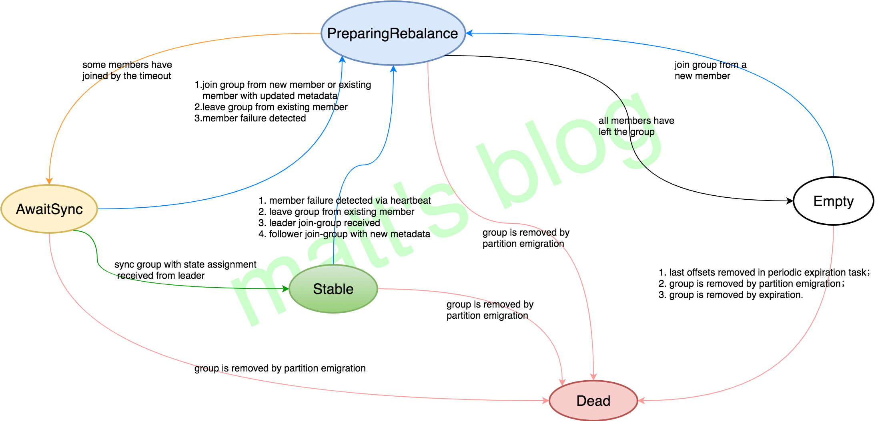

#### 3.1.2 Consumer join-group 

- ConsumerCoordinator.poll()

```java
/**
	ConsumerCoordinator.poll()
	0.invokeCompletedOffsetCommitCallbacks: 用于测试
	1.pollHeartbeat: 检查心跳线程运行是否正常,如果心跳线程失败,则抛出异常,反之更新 poll 调用的时间
	2.*ensureCoordinatorReady:确保 coordinator 已经 ready（已经连接,并可以发送请求）
		- lookupCoordinator: 获取 GroupCoordinator,并建立连接
    3.ensureActiveGroup: 向 GroupCoordinator 发送 join-group、sync-group 请求，获取 assign 的 tp list。
    	- *joinGroupIfNeeded: 发送 JoinGroup 请求,并对返回的信息进行处理
    		-- 处理完 JoinGroup 请求后，发送 SyncGroup 请求并处理
    		-- onJoinComplete：加入 group 成功
    		-- resetJoinGroupFuture: 重置 joinFuture 为空
    4.maybeAutoCommitOffsetsAsync: 启动自动 commit 时,当定时达到时,进行自动 commit
*/
```

-  ensureCoordinatorReady(timer)
  - 选择一个连接数最小的 broker，向其发送 GroupCoordinator 请求，并建立相应的 TCP 连接。
  - ensureCoordinatorReady() –> lookupCoordinator() –> sendGroupCoordinatorRequest() -> FindCoordinatorResponseHandler.onSuccess()

```java
/**
	ensureCoordinatorReady(timer)
	1.lookupCoordinator: 获取 GroupCoordinator,并建立连接
	2.调用 client.poll(future, timer);
	3.如果获取失败了，进行重试或抛出异常。
*/


	/**
		lookupCoordinator()
		1.this.client.leastLoadedNode(): 选择一个最小连接的节点
		2.sendFindCoordinatorRequest(node)：发送 FindCoordinator 请求来查找对应的 GroupCoordinator，并对 response 进行处理
	*/
		

		/**
			sendFindCoordinatorRequest(node)
			1.封装 FindCoordinatorRequest
			2.client.send(node, requestBuilder).compose(new FindCoordinatorResponseHandler())：发送请求，并通过 FindCoordinatorResponseHandler 处理响应、回调
		*/
			
			/**
				FindCoordinatorResponseHandler.onSuccess()
				1.如果正确获取 GroupCoordinator 时, 建立连接,并更新心跳时间
				2.client.tryConnect：初始化 tcp 连接
				3.heartbeat.resetSessionTimeout()：更新心跳时间
			*/
```


-  ensureActiveGroup
  -  向 GroupCoordinator 发送 join-group、sync-group 请求，获取 assign 的 tp list
    -  加入消费组
    -  同步 partition 分配方案
  - ensureActiveGroup(timer) -> joinGroupIfNeeded(timer) -> initiateJoinGroup() -> sendJoinGroupRequest() -> JoinGroupResponseHandler.handle
    - -> onJoinLeader(joinResponse)
    - -> onJoinFollower()
  - sendSyncGroupRequest(requestBuilder) -> SyncGroupResponseHandler.handle()

```java
/**
	ensureActiveGroup(timer)
	1.startHeartbeatThreadIfNeeded: 启动心跳发送线程（并不一定发送心跳,满足条件后才会发送心跳）
	2.joinGroupIfNeeded: 发送 JoinGroup 请求,并对返回的信息进行处理
*/

	/**
		joinGroupIfNeeded(timer)
		1.onJoinPrepare: 触发 onJoinPrepare, 包括 offset commit 和 rebalance listener
		2.initiateJoinGroup: 初始化 JoinGroup 请求,并发送该请求,处理响应
			- joinGroup 成功响应后，发送 sync group 请求（leader 和 follower 不同处理）
		3.join succeed,这一步时,时间上 sync-group 已经成功了
			- onJoinComplete：加入 group 成功
	*/
		
		/**
			initiateJoinGroup()
			1.PREPARING_REBALANCE: 标记为 rebalance
			2.sendJoinGroupRequest: 发送 JoinGroupRequest 请求
		*/

			/**
				sendJoinGroupRequest()
				1.封装 JoinGroupRequest
				2.设置 joinGroupTimeoutMs（超时时间）
				3.client.send(coordinator, requestBuilder, joinGroupTimeoutMs).compose(new JoinGroupResponseHandler(generation))：发送请求，并通过 JoinGroupResponseHandler 处理响应、回调
			*/

				/**	
					JoinGroupResponseHandler.handle
					1.如果正确
					2.如果此时 Consumer 的状态不是 rebalacing,就引起异常：future.raise(new UnjoinedGroupException())
					3.进行 sync-group,获取分配的 tp 列表。
						- onJoinLeader(joinResponse).chain(future)
							-- 进行 assign 操作
							-- 封装 SyncGroupRequest
							-- sendSyncGroupRequest(requestBuilder)：发送 sync group 请求
						- onJoinFollower().chain(future)
							-- 封装 SyncGroupRequest
							-- sendSyncGroupRequest(requestBuilder)：发送 sync group 请求 
				*/
					
					/**
						sendSyncGroupRequest(requestBuilder)
						1.client.send(coordinator, requestBuilder).compose(new SyncGroupResponseHandler(generation)): 向 GroupCoordinator 发送 SyncGroupRequest 请求来同步 partition 分配方案
					*/
		
						/**
							SyncGroupResponseHandler.handle()
							1.如果同步成功，group 的状态将会转变为 Stable
							2.如果同步失败
								- requestRejoin：join 的标志位设置为 true
								- 根据返回的异常进行响应的处理和抛出异常
						*/
```

- OnJoinComplete()

```java
/**
	更新订阅的 tp 列表、更新其对应的 metadata 及触发注册的 listener。
*/
```


### 3.2 Consumer poll 模型

#### 3.2.1 KafkaConsumer.poll(Duration)

```java
	/**
		poll(Duration)
		1.acquireAndEnsureOpen: 防止并发操作
		2.recordPollStart: 记录 poll 启动的时间
		3.this.subscriptions.hasNoSubscriptionOrUserAssignment(): 未订阅 topic 或分配了 partition 则抛出异常
		4.while (timer.notExpired()): 轮询拉取，直到超过输入的超时时间
			- updateAssignmentMetadataIfNeeded：更新分配元数据，协调器、心跳、消费位置
				-- coordinator.poll：获取 GroupCoordinator 并连接、加入 Group、sync Group, 期间 group 会进行 rebalance 并获取
				-- updateFetchPositions：更新要拉取 partition 的 offset（如果需要更新的话）
			- pollForFetches(timer)：拉取消息
			- 消息不为空时：
				-- 消息不为空时，立即发起下一轮的拉取消息，避免阻塞等待响应处理。注意，在消息返回之前，不能触发唤醒或其他错误。
				-- return this.interceptors.onConsume(new ConsumerRecords<>(records)): 回调执行消费者拦截器后返回给消费者
		5.poll 不到数据，返回 EMPTY
		6.释放线程，记录 poll 结束的时间
	*/

        /**
            pollForFetches(timer)：拉取消息
            1.fetcher.fetchedRecords()：从缓存队列拉取
                - 在超时时间内不断轮询
                    -- 分区记录为空，或者已拉取，从缓存队列拉取消息；将消息从缓存队列中移除
                    -- fetchRecords(nextInLineFetch, recordsRemaining)：从分区记录拉取消息
                    	--- subscriptions.position(completedFetch.partition): 更新消费的到 offset（ the fetch position）
                    	--- 获取 Lag（即 position与 hw 之间差值）,hw 为 null 时,才返回 null
                - 将记录添加到 completedFetches 中
            2.缓存中有数据则直接返回
            3.sendFetches
                - 将拉取请求构造成节点和请求的映射关系，并缓存在 UnsentRequests 中
                - 添加响应处理监听器，处理发送拉取请求后，从服务端返回的消息，并缓存在队列中
            4.用 NetworkClient 向服务端发送拉取请求(用 poll 方法发送数据)
            5.再次从缓存队列拉取
        */
	
			/**
				sendFetches():
				在每次发送 fetch 请求时，都会向所有可发送的 topic-partition 发送 fetch 请求，调用一次 fetcher.sendFetches，
				拉取到的数据，可能需要多次 poll 循环才能处理完。因为 Fetcher 线程是在后台运行，这也保证了尽可能少地阻塞用户的处理线程，
				因为如果 Fetcher 中没有可处理的数据，用户的线程是会阻塞在 poll 方法中的。
			*/


```

#### 3.2.2 poll 整体流程

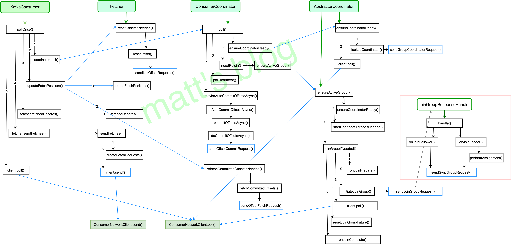


#### 3.2.3 Consumer 网络模型

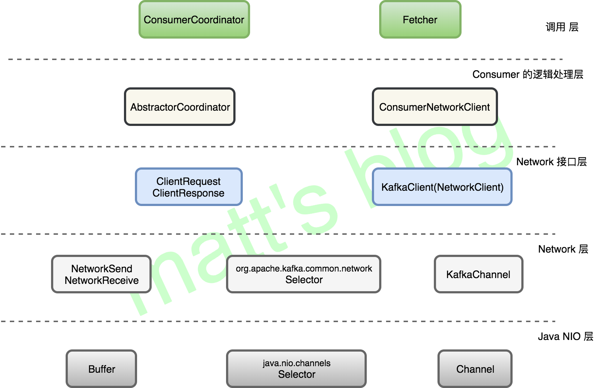


### 3.3 Consumer 两种订阅模式

| 模式        | 不同之处                                       | 相同之处                                                     |
| ----------- | ---------------------------------------------- | ------------------------------------------------------------ |
| subscribe() | 使用 Kafka Group 管理，自动进行 rebalance 操作 | 可以在 Kafka 保存 offset                                     |
| assign()    | 用户自己进行相关的处理                         | 也可以进行 offset commit，但是尽量保证 group.id 唯一性，如果使用一个与上面模式一样的 group，offset commit 请求将会被拒绝 |

#### 3.3.1 订阅模式

```java
// 订阅指定的 topic 列表,并且会自动进行动态 partition 订阅
// 当发生以下情况时,会进行 rebalance: 1.订阅的 topic 列表改变; 2.topic 被创建或删除; 3.consumer 线程 die; 4. 加一个新的 consumer 线程
// 当发生 rebalance 时，会唤醒 ConsumerRebalanceListener 线程
public void subscribe(Collection<String> topics, ConsumerRebalanceListener listener){}
// 同上，但是这里没有设置 listener
public void subscribe(Collection<String> topics) {}
//note: 订阅那些满足一定规则(pattern)的 topic
public void subscribe(Pattern pattern, ConsumerRebalanceListener listener){}
```

-  **当监控到发生下面的事件时，Group 将会触发 rebalance 操作：**
  1. 订阅的 topic 列表变化；
  2. topic 被创建或删除；
  3. consumer group 的某个 consumer 实例挂掉；
  4. 一个新的 consumer 实例通过 `join` 方法加入到一个 group 中。
- topic 列表订阅和 pattern 模式订阅

```java
/**
	1.topic 列表订阅
		- subscribe：
			-- 注册再平衡监听器
			-- 将 SubscriptionType 类型设置为 AUTO_TOPICS；
			-- 更新 SubscriptionState 中记录的 subscription（记录的是订阅的 topic 列表）
		- requestUpdateForNewTopics：更新 metadata 中的 topic 列表（topics 变量），并请求更新 metadata；
		
	2.pattern 模式订阅
		- subscribe：
			-- 注册再平衡监听器
			-- 将 SubscriptionType 类型设置为 AUTO_PATTERN；
			-- 更新 SubscriptionState 中记录的 subscribedPattern，设置为 pattern
		- 调用 coordinator.updatePatternSubscription() 方法，遍历所有 topic 的 metadata，找到所有满足 pattern 的 topic 列表，更新到 SubscriptionState 的 subscriptions 和 Metadata 的 topics 中
		- 
*/
```


#### 3.3.2 分配模式

```java
    /** 
    手动向 consumer 分配一些 topic-partition 列表，并且这个接口不允许增加分配的 topic-partition 列表，将会覆盖之前分配的 topic-partition 列表，
    如果给定的 topic-partition 列表为空，它的作用将会与 unsubscribe() 方法一样。
    
    这种手动 topic 分配是不会使用 consumer 的 group 管理，当 group 的 member 变化或 topic 的 metadata 变化也不会触发 rebalance 操作。
    */
    public void assign(Collection<TopicPartition> partitions) {}
```


#### 3.3.3 commit offset 请求

- 处理过程：
  1. 如果这个 group 还不存在（groupManager没有这个 group 信息），并且 generation 为 -1（一般情况下应该都是这样），就新建一个 GroupMetadata, 其 Group 状态为 Empty；
  2. 现在 group 已经存在，就调用 `doCommitOffsets()` 提交 offset；
  3. 如果是来自 assign 模式的请求，并且其对应的 group 的状态为 Empty（generationId < 0 && group.is(Empty)），那么就记录这个 offset；
  4. 如果是来自 assign 模式的请求，但这个 group 的状态不为 Empty（!group.has(memberId)），也就是说，这个 group 已经处在活跃状态，assign 模式下的 group 是不会处于的活跃状态的，可以认为是 assign 模式使用的 group.id 与 subscribe 模式下使用的 group 相同，这种情况下就会拒绝 assign 模式下的这个 offset commit 请求。

```scala
	/** GroupCoordinator 处理 Offset Commit 请求 */
      def handleCommitOffsets(groupId: String,
                              memberId: String,
                              groupInstanceId: Option[String],
                              generationId: Int,
                              offsetMetadata: immutable.Map[TopicPartition, OffsetAndMetadata],
                              responseCallback: immutable.Map[TopicPartition, Errors] => Unit): Unit = {
        validateGroupStatus(groupId, ApiKeys.OFFSET_COMMIT) match {
            // 处理异常情况
          case Some(error) => responseCallback(offsetMetadata.map { case (k, _) => k -> error })
          case None =>
            groupManager.getGroup(groupId) match {
              case None =>
                if (generationId < 0) {
                  // the group is not relying on Kafka for group management, so allow the commit
                  // 不使用 group-coordinator 管理的情况
                  // 如果 groupID 不存在,就新建一个 GroupMetadata, 其 group 状态为 Empty, 否则就返回已有的 groupid
                  // 如果 simple 的 groupId 与一个 active 的 group 重复了,这里就有可能被覆盖掉了
                  val group = groupManager.addGroup(new GroupMetadata(groupId, Empty, time))
                  doCommitOffsets(group, memberId, groupInstanceId, generationId, offsetMetadata, responseCallback)
                } else {
                  // or this is a request coming from an older generation. either way, reject the commit
                  responseCallback(offsetMetadata.map { case (k, _) => k -> Errors.ILLEGAL_GENERATION })
                }

              case Some(group) =>
                doCommitOffsets(group, memberId, groupInstanceId, generationId, offsetMetadata, responseCallback)
            }
        }
      }

	/** offset commit 的真正处理逻辑 */
  private def doCommitOffsets(group: GroupMetadata,
                              memberId: String,
                              groupInstanceId: Option[String],
                              generationId: Int,
                              offsetMetadata: immutable.Map[TopicPartition, OffsetAndMetadata],
                              responseCallback: immutable.Map[TopicPartition, Errors] => Unit): Unit = {
    group.inLock {
      if (group.is(Dead)) {
        // if the group is marked as dead, it means some other thread has just removed the group
        // from the coordinator metadata; it is likely that the group has migrated to some other
        // coordinator OR the group is in a transient unstable phase. Let the member retry
        // finding the correct coordinator and rejoin.
        responseCallback(offsetMetadata.map { case (k, _) => k -> Errors.COORDINATOR_NOT_AVAILABLE })
      } else if (group.isStaticMemberFenced(memberId, groupInstanceId, "commit-offsets")) {
        responseCallback(offsetMetadata.map { case (k, _) => k -> Errors.FENCED_INSTANCE_ID })
      } else if (generationId < 0 && group.is(Empty)) {
        // The group is only using Kafka to store offsets.
        // 来自 assign 的情况，只使用 kafka 存储 offsets
        groupManager.storeOffsets(group, memberId, offsetMetadata, responseCallback)
      } else if (!group.has(memberId)) {
        // 有可能 simple 与 high level 的冲突了,这里就直接拒绝相应的请求
        responseCallback(offsetMetadata.map { case (k, _) => k -> Errors.UNKNOWN_MEMBER_ID })
      } else if (generationId != group.generationId) {
        responseCallback(offsetMetadata.map { case (k, _) => k -> Errors.ILLEGAL_GENERATION })
      } else {
        group.currentState match {
          case Stable | PreparingRebalance =>
            // During PreparingRebalance phase, we still allow a commit request since we rely
            // on heartbeat response to eventually notify the rebalance in progress signal to the consumer
            val member = group.get(memberId)
            // 更新下次需要的心跳时间
            completeAndScheduleNextHeartbeatExpiration(group, member)
            groupManager.storeOffsets(group, memberId, offsetMetadata, responseCallback)

          case CompletingRebalance =>
            // We should not receive a commit request if the group has not completed rebalance;
            // but since the consumer's member.id and generation is valid, it means it has received
            // the latest group generation information from the JoinResponse.
            // So let's return a REBALANCE_IN_PROGRESS to let consumer handle it gracefully.
            responseCallback(offsetMetadata.map { case (k, _) => k -> Errors.REBALANCE_IN_PROGRESS })

          case _ =>
            throw new RuntimeException(s"Logic error: unexpected group state ${group.currentState}")
        }
      }
    }
  }

```


### 3.4 Consumer 两种 commit 机制（同步和异步）和三种 partition 分配机制


#### 3.4.1 两种 commit 机制

- 同步 commit

```java
/**	
	commitSync(Duration timeout)
  		1.coordinator.commitOffsetsSync: 通过 ConsumerCoordinator 的 commitOffsetsSync 处理真正的逻辑
  			- sendOffsetCommitRequest: 发送 OffsetCommit 请求
  			- client.poll(future, timer)：阻塞直到这个 request 完成或超时才返回
  		
  				
  	// 只对指定的 topic-partition 列表进行 commit
	commitSync(final Map<TopicPartition, OffsetAndMetadata> offsets, final Duration timeout)\
*/
```


- 异步 commit

```java
/**
	commitAsync()
	commitAsync(OffsetCommitCallback callback)
	commitAsync(final Map<TopicPartition, OffsetAndMetadata> offsets, OffsetCommitCallback callback)
	1.coordinator.commitOffsetsAsync: 通过 ConsumerCoordinator 的 commitOffsetsAsync 处理真正的逻辑
		- invokeCompletedOffsetCommitCallbacks：唤醒相应的回调函数
		- doCommitOffsetsAsync：真正的处理逻辑
			-- sendOffsetCommitRequest：发送 offset-commit 请求
			-- future.addListener：添加监听器的处理方法
				--- onSuccess：添加成功的请求,以唤醒相应的回调函数
				--- onFailure：添加失败的请求,以唤醒相应的回调函数
		- client.pollNoWakeup()：不阻塞的 poll
*/
```


#### 3.4.2 三种 partition 分配机制

- consumer 提供的三种不同 partition 分配策略，可以通过 `partition.assignment.strategy` 参数进行配置

  - org.apache.kafka.clients.consumer.RangeAssignor（默认）

  ```java
  	/**
       *
       * 分配的数量和 roundrobin 一样，但是分配的方式不同。
       * range 会直接分配 consumer 拥有的所有 partition
       */
  ```

  - org.apache.kafka.clients.consumer.RoundRobinAssignor

  ```java
  	/**
       *
       * 轮询的方式逐个分配 partition
       */
  ```

  - org.apache.kafka.clients.consumer.StickyAssignor

  ```java
  	/**
       *
       * 两个目的：
       *      1.分区的分配要尽可能均匀。
       *      2.分区的分配尽可能与上次分配的保持相同。—— 尽可能地让前后两次分配相同，进而减少系统资源的损耗及其他异常情况的发生。
       *      当两者发生冲突时，第一个目标优先于第二个目标。
       */
  ```

### 3.5 ConsumerCoordinator 与 GroupCoordinator 机制

- Kafka Server 端可以介绍的 21 种请求中，其中有 8 种是由 GroupCoordinator 来处理的

```java
/**
 * GroupCoordinator handles general group membership and offset management.
 *
 * Each Kafka server instantiates a coordinator which is responsible for a set of
 * groups. Groups are assigned to coordinators based on their group names.
 */
```

#### 3.5.1 Offset 请求的处理(2)

- OFFSET_FETCH: 查询 offset

```java
/**
	KafkaApis.handleOffsetFetchRequest(request)
	1.验证 Describe 权限
	2.version 0 从 zk 读取 offsets
	3.versions 1 及以上从 kafka 读取 offsets
		- groupCoordinator.handleFetchOffsets: 获取这个 group 消费的所有 tp offset
			-- 如果没有 Describe 权限的话,不能查看相应的 offset
        - 获取指定列表的 tp offset
        	
*/
	
	/**
		groupCoordinator.handleFetchOffsets
		1.groupManager.getOffsets: 主要是调用了 groupManager.getOffsets() 获取相应的 offset 信息
			- 在查询时加锁的原因应该是为了避免在查询的过程中 offset 不断更新
				-- group 状态已经变成 dead, offset 返回 -1（INVALID_OFFSET）
				-- partitionData = group.offset(topicPartition) match: 查找是否有匹配的 topicPartition
				
		2.
	*/
```


- OFFSET_COMMIT：提交 offset

```java
/**
	KafkaApis.handleOffsetCommitRequest
	调用 groupCoordinator.handleCommitOffsets 处理 offset commit 请求
*/

	/**
		groupCoordinator.handleCommitOffsets
		1.处理异常情况
		2.不使用 group-coordinator 管理的情况
			- 如果 groupID 不存在,就新建一个 GroupMetadata, 其 group 状态为 Empty, 否则就返回已有的 groupid
			- 如果 simple 的 groupId 与一个 active 的 group 重复了,这里就有可能被覆盖掉了
		3.使用 group-coordinator 管理的情况
		4.都是调用 doCommitOffsets(group, memberId, groupInstanceId, generationId, offsetMetadata, responseCallback) 处理
	*/
		
		/**
			doCommitOffsets(group, memberId, groupInstanceId, generationId, offsetMetadata, responseCallback)
			1.处理异常情况
			2.根据 group 的 currentState 分别处理返回
		*/
```


#### 3.5.2 Group 相关请求的处理(5)

- JOIN_GROUP

- SYNC_GROUP

- LEAVE_GROUP

  - Server 会收到 LEAVE_GROUP 请求的情况，一般来说是：

    1. consumer 调用 `unsubscribe()` 方法，取消了对所有 topic 的订阅时；

    1. consumer 的心跳线程超时时，这时 consumer 会主动发送 LEAVE_GROUP 请求；
    2. 在 server 端，如果在给定的时间没收到 client 的心跳请求，这时候会自动触发 LEAVE_GROUP 操作。

```java
/**
	groupCoordinator.handleLeaveGroup
	1.removeHeartbeatForLeavingMember: 认为心跳完成
	2.removeMemberAndUpdateGroup：从 group 移除当前 member,并进行 rebalance
*/

	/**
		removeMemberAndUpdateGroup
		1.group.currentState match
			- 如果 group 原来是在 Dead 或 Empty 时，那么由于 group 本来就没有 member，就不再进行任何操作
			- Stable | CompletingRebalance: 进行 rebalance，同 join-group 的过程
			- PreparingRebalance: 检查 join-group 的延迟操作是否完成，如果操作完成了，那么 GroupCoordinator 就会向 group 的 member 发送 join-group response，然后将状态更新为 CompletingRebalance.
	*/
```

- DESCRIBE_GROUPS

```java
/**
	groupCoordinator.handleDescribeGroup：返回 group 详细信息,主要是 member 的详细信息
*/
```

- LIST_GROUPS

#### 3.5.3 Heartbeat 心跳请求处理

- 对于 Server 端来说，它是 GroupCoordinator **判断一个 consumer member 是否存活的重要条件**，如果其中一个 consumer 在给定的时间没有发送心跳请求，那么就会将这个 consumer 从这个 group 中移除，并执行 rebalance 操作；
- 对于 Client 端而言，心跳请求是 **client 感应 group 状态变化的一个重要中介**，比如：此时有一个新的 consumer 加入到 consumer group 中了，这时候会进行 rebalace 操作，group 端的状态会发送变化，当 group 其他 member 发送心跳请求，GroupCoordinator 就会通知 client 此时这个 group 正处于 rebalance 阶段，让它们 rejoin group。

- HEARTBEAT

```java
/**
	groupCoordinator.handleHeartbeat
	1.groupManager.getGroup(groupId) match
		- None: 当前 GroupCoordinator 不包含这个 group，返回 UNKNOWN_MEMBER_ID 异常
		- Some(group)：包含这个 group
			-- group.is(Dead)：group 的状态已经变为 dead,意味着 group 的 meta 已经被清除,返回 COORDINATOR_NOT_AVAILABLE 错误
			-- group.currentState match
				--- Empty：group 的状态为 Empty, 意味着 group 的成员为空,返回 UNKNOWN_MEMBER_ID 错误
				--- CompletingRebalance：group 状态为 CompletingRebalance, 意味着 group 刚 rebalance 结束
				--- PreparingRebalance：group 状态为 PreparingRebalance
				--- Stable：
					---- 正确处理心跳信息
					---- completeAndScheduleNextHeartbeatExpiration：更新心跳时间,认为心跳完成,并监控下次的调度情况（超时的话,会把这个 member 从 group 中移除）
*/
```


## 四、存储层


### 4.1 日志管理

- Kafka 的日志管理（LogManager）主要的作用是**负责日志的创建、检索、清理**，日志相关的读写操作实际上是由日志实例对象（Log）来处理的。


#### 4.1.1 KafkaServer 启动 LogManager 线程

```java
/**
	KafkaServer.startup
		1.LogManager(config, initialOfflineDirs, zkClient, brokerState, kafkaScheduler, time, brokerTopicStats, logDirFailureChannel): 启动日志管理线程
		2.logManager.startup()
*/

	/**
		LogManager
			1.LogCleaner.cleanerConfig: 日志清理线程数,默认是1；还有相关配置
			2.new LogManager:
				- config.numRecoveryThreadsPerDataDir: 每个日志目录在开始时用日志恢复以及关闭时日志flush的线程数,默认1
	*/
```


#### 4.1.2 LogManager 初始化

```java
/**
	class LogManager
		1.createAndValidateLogDirs: 创建指定的数据目录,并做相应的检查
		2.loadLogs: 加载所有的日志,而每个日志也会调用 loadSegments() 方法加载所有的分段,过程比较慢,所以每个日志都会创建一个单独的线程。管理器采用线程池提交任务,标识不用的任务可以同时运行。
*/

	
	/**
		createAndValidateLogDirs(logDirs, initialOfflineDirs)
			创建指定的数据目录,并做相应的检查:
				1.确保数据目录中没有重复的数据目录;
				2.数据不存在的话就创建相应的目录;
				3.检查每个目录路径是否是可读的。
	*/


	/**
		loadLogs()
			1.ArrayBuffer.empty[ExecutorService]: 线程池数组
			2.for (dir <- liveLogDirs)：处理每一个日志目录
				- threadPools.append(pool)：每个对应的数据目录都有一个线程池
				- this.recoveryPointCheckpoints(dir).read()：读取数据恢复检查点文件
				- his.logStartOffsetCheckpoints(dir).read()：读取 log-start-offset 检查点文件
				- val runnable: Runnable = () ：每个分区的目录都对应了一个线程
					-- loadLog(logDir, hadCleanShutdown, recoveryPoints, logStartOffsets)：创建 Log 对象后，初始化时会加载所有的 segment
					-- jobs += jobsForDir.map(pool.submit)：提交任务
	*/

		/**
			loadLog(logDir, hadCleanShutdown, recoveryPoints, logStartOffsets)
				1.val log = Log(... ：创建 Log 对象后，初始化时会加载所有的 segment
					- loadSegments()：每个日志会调用 loadSegments() 方法加载该分区所有的 segment 文件（过程较慢）
				2.如果目录名称带有 delete 后缀，则 addLogToBeDeleted(log)
				3.否则，创建日志后,加入日志管理的映射表
					- this.futureLogs.put(topicPartition, log)
					- this.currentLogs.put(topicPartition, log)
		*/
```


#### 4.1.3 启动 LogManager 线程

```java
/**
	logManager.startup()
		1.scheduler.schedule(... cleanupLogs ...): 定时清理过期的日志 segment,并维护日志的大小（默认5min）
		2.scheduler.schedule(... flushDirtyLogs ...): 定时刷新还没有写到磁盘上日志（默认: 无限大，即选择大小策略）
		3.scheduler.schedule(... checkpointLogRecoveryOffsets ...): 定时将所有数据目录所有日志的检查点写到检查点文件中（默认 60s）
		4.scheduler.schedule(... checkpointLogStartOffsets ...): 文件对应 logStartOffset，定时将日志的起始偏移量写到检查点文件上
		5.scheduler.schedule(... deleteLogs ...): 定时删除标记为 delete 的日志文件（默认 30s）
		6.cleanerConfig.enableCleaner: 如果设置为 true
			- cleaner.startup():  自动清理 compaction 类型的 topic
*/

	
	/**
		checkpointLogRecoveryOffsets: 
			将所有数据目录所有日志的检查点写到检查点文件中
			通常所有数据目录都会一起执行，不会专门操作某一个数据目录的检查点文件
	*/
```

- 日志刷新

  - 在 Kafka 中有两种策略，将日志刷新到磁盘上：
    - 时间策略（`log.flush.interval.ms` 中配置调度周期，默认为无限大，即选择大小策略）：
    - **大小策略**（`log.flush.interval.messages` 中配置当未刷新的 msg 数超过这个值后，进行刷新）。

  ```java
  /**
  	flushDirtyLogs： 时间策略
  		1.timeSinceLastFlush: 每个日志的刷新时间并不相同
  		2.log.flush()
  			- logSegments.foreach: 刷新检查点到最新偏移量之间的所有日志分段
  				-- flush(): 刷新数据文件和索引文件（调用操作系统的 fsync）
  			- lastFlushedTime.set(time.milliseconds): 更新刷新时间
  */
  
  
  
  /**
  	Log.append: 根据大小策略，在数据追加到 Log 中的时候，判断没有 flush 的数据大小是否达到阈值
  		1.if (unflushedMessages >= config.flushInterval) flush()： 未刷新的 msg 数超过 log.flush.interval.ms 设置的值时，将日志刷新到磁盘上
  */
  ```

  

- 日志清理

  - 清理旧日志分段方法，主要有两种：
    1. 删除：**超过时间阈值、大小阈值、下一日志分段的起始偏移量小于等于 logStartOffset**的旧 segment，直接进行删除；
    2. 压缩：不是直接删除日志分段，而是采用合并压缩的方式进行。

  ```java
  /**
  	LogManager.cleanupLogs: 日志清除任务
  		1.log.deleteOldSegments(): 清除过期的 segment
  */
  
  	/**
  		deleteOldSegments:
  			1.deleteRetentionMsBreachedSegments: 清除保存时间满足条件的 segment
  			2.deleteRetentionSizeBreachedSegments: 清除保存大小满足条件的 segment
  			3.deleteLogStartOffsetBreachedSegments：某日志分段的下一个日志分段的起始偏移量 baseOffset 是否小于等于 logStartOffset，若是，则可以删除此日志分段。
  			
  			4.上述方法最终都调用 deleteOldSegments(shouldDelete, StartOffsetBreach)：删除日志数据文件及索引文件
  	*/
  
  		
  		/**
  			清除相应的 segment 及相应的索引文件
  			deleteOldSegments(predicate: (LogSegment, Option[LogSegment]) => Boolean, reason: SegmentDeletionReason)
  				1.predicate 是一个高阶函数，只有返回值为 true 该 segment 才会被删除
  				2.deleteSegments(deletable, reason)
  		*/
  
  			/**
  				deleteSegments(deletable, reason)
  					1.if (segments.size == numToDelete) roll() : 至少要由一个 segment，如果要删除所有的 segment，创建一个新的 segment
  					2.removeAndDeleteSegments: 阻塞 删除 segment
  					3.maybeIncrementLogStartOffset：如果新的 log-start-offset 的值大于原来的，更新 log-start-offset 的值
  			*/
  			
  				/**
  					removeAndDeleteSegments
  						1.this.segments.remove(segment.baseOffset): 从映射关系表中删除数据
  						2.deleteSegmentFiles(toDelete, asyncDelete): 异步删除日志 segment
  				*/
  	
  					/**
  						deleteSegmentFiles(toDelete, asyncDelete)
  							1.segments.foreach(_.changeFileSuffixes("", Log.DeletedFileSuffix)): 先将 segment 的数据文件和索引文件后缀添加 `.deleted`
  							2.scheduler.schedule("delete-file", () => deleteSegments(), delay = config.fileDeleteDelayMs): 异步调度进行删除
  					*/
  ```

  

### 4.2 Server 端如何处理 Producer 请求


#### 4.2.1 Server 端处理

- Server 端处理 produce 请求的总体过程

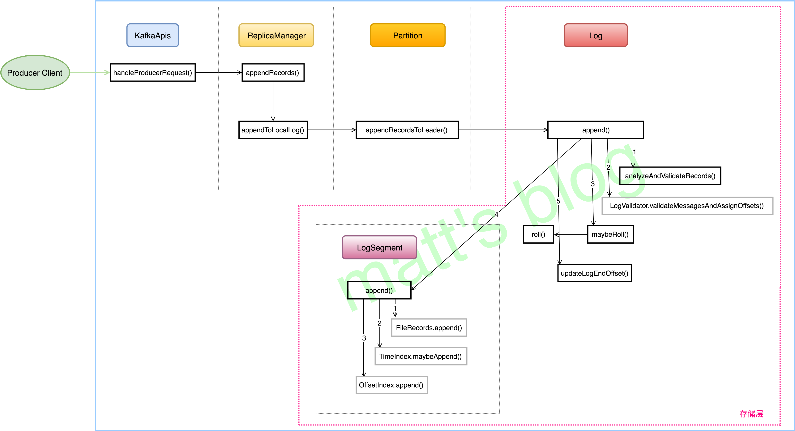

- KafkaRequestHandler.run()  ===> Kafka.handle(request) ===> request.header.apiKey match {}

```java
/**
	KafkaApis.handleProduceRequest
		1.事务 record 的处理
		2.filterByAuthorized: 筛选有权限的 record
		3.ProduceRequest.validateRecords：验证 record
		4.replicaManager.appendRecords：追加 record
			- 传入 sendResponseCallback
		5.produceRequest.clearPartitionRecords()：清除 purgatory 中的 request 数据
*/

	/**
		sendResponseCallback: 回调函数
			1.因为设置的 ack=0, 相当于 client 会默认发送成功了，如果 server 在处理的过程出现了错误,那么就会关闭 socket 连接来间接地通知 client。client 会重新刷新 meta,重新建立相应的连接
	*/
```


#### 4.4.2 ReplicaManager.appendRecords()

- 每个副本（replica）都会跟日志实例（Log 对象）一一对应，一个副本会对应一个 Log 对象。

- ReplicaManager 与 LogManger 对比如下：

|                              | 管理对象          | 组成部分               |
| ---------------------------- | ----------------- | ---------------------- |
| 日志管理器（LogManager）     | 日志（Log）       | 日志分段（LogSegment） |
| 副本管理器（ReplicaManager） | 分区（Partition） | 副本（Replica）        |

- Kafka Server 启动时，创建 ReplicaManager 对象

```java
/**
	KafkaServer.startup()
		1.replicaManager = createReplicaManager(isShuttingDown)
        2.replicaManager.startup()
        
        
   ReplicaManager: 不负责具体的日志创建，它只是管理 Broker 上的所有分区(Partition 对象)
*/
```

- appendRecords()

```java
/**
	ReplicaManager.appendRecords(): 向 partition 的 leader 写入数据
		1.isValidRequiredAcks(requiredAcks): ack 设置有效
			- appendToLocalLog：向本地的副本 log 追加数据
			- HW 改变和不变的情况下，执行一些延迟操作：delayedProducePurgatory...
			- delayedProduceRequestRequired 是否为 true
				-- ProduceMetadata：处理 ack=-1 的情况,需要等到 isr 的 follower 都写入成功的话,才能返回最后结果
				-- new DelayedProduce：延迟 produce 请求
			- false：通过回调函数直接返回结果
		2.无效的话，返回 INVALID_REQUIRED_ACKS 错误
*/

		/**
			appendToLocalLog: 向本地的 replica 写入数据
				1.entriesPerPartition.map: 遍历要写的所有 topic-partition
					- Topic.isInternal: 不能向 kafka 内部使用的 topic 追加数据
					- 查找对应的 Partition,并向分区对应的副本写入数据文件
						-- getPartitionOrException: 获取 topic-partition 的 Partition 对象
						-- partition.appendRecordsToLeader: 开始追加数据
						-- 更新 metrics
						-- 处理追加过程中出现的异常
		*/

			/**
				partition.appendRecordsToLeader(records, origin, requiredAcks)
					1.leader 在本台机器上
						- 如果 ack 设置为-1, isr 数小于设置的 min.isr 时,就会向 producer 抛出相应的异常
						- leaderLog.appendAsLeader: 向副本对应的 log 追加响应的数据
						- (info, maybeIncrementLeaderHW(leaderLog)): 判断是否需要增加 HW（追加日志后会进行一次判断）
					2.leader 不在本台机器上，抛出异常
			*/
```


#### 4.2.3 存储层 ---- Log 对象

- Log 对象的初始化（三个重要变量）

  - `nextOffsetMetadata`：可以叫做下一个偏移量元数据，它**包括 activeSegment 的下一条消息的偏移量，该 activeSegment 的基准偏移量及日志分段的大小；**
  - `activeSegment`：指的是该 Log 管理的 segments 中那个最新的 segment（这里叫做**活跃的 segment**），一个 Log 中只会有一个活跃的 segment，其他的 segment 都已经被持久化到磁盘了；
  - `logEndOffset`：表示**下一条消息的 offset**，它取自 `nextOffsetMetadata` 的 offset，实际上就是活动日志分段的下一个偏移量。

  ```java
  // nextOffsetMetadata 声明为 volatile，如果该值被修改，其他使用此变量的线程就可以立刻见到变化后的值，在生产和消费都会使用到这个值
  @volatile private var nextOffsetMetadata: LogOffsetMetadata = _
  
  // 下一个偏移量元数据
  // 第一个参数：下一条消息的偏移量；第二个参数：日志分段的基准偏移量；第三个参数：日志分段大小
  nextOffsetMetadata = new LogOffsetMetadata(activeSegment.nextOffset(), activeSegment.baseOffset, activeSegment.size.toInt)
  
  // 任何时刻，只会有一个活动的日志分段
  def activeSegment = segments.lastEntry.getValue
  
  // 下一条消息的 offset，从 nextOffsetMetadata 中获取的
  def logEndOffset: Long = nextOffsetMetadata.messageOffset
  ```

  

- 日志写入

  -  timestrap 的设置：producer 端可以设置这个字段 `message.timestamp.type` 来选择 timestrap 的类型，默认是按照创建时间
    - `CreateTime`，默认值；
    - LogAppendTime

  ```java
  /**
  	Log.append(): 向 active segment 追加 log,必要的情况下,滚动创建新的 segment
  		1.analyzeAndValidateRecords: 返回这批消息的概要信息,并对这批 msg 进行校验
  		2.trimInvalidBytes: 删除这批消息中无效的消息
  		3.new LongRef(nextOffsetMetadata.messageOffset): 计算这个消息集的起始 offset，对 offset 的操作是一个原子操作
  		4.appendInfo.firstOffset = Some(offset.value): 作为消息集的第一个 offset
  		5.设置的时间戳以 server 收到的时间戳为准
  		6.LogValidator.validateMessagesAndAssignOffsets: 验证消息,并为每条 record 设置相应的 offset 和 timestrap
  		7.validateAndOffsetAssignResult.validatedRecords: 返回已经计算好 offset 和 timestrap 的 MemoryRecords
  		8.offset.value - 1: 最后一条消息的 offset
  		9.更新 metrics 的记录
  		10.更新 partitionLeaderEpoch
  		*11.maybeRoll: 如果当前 segment 满了，就需要重新新建一个 segment
  		12.maybeDuplicate：处理重复情况
  		*13.segment.append：追加消息到当前 segment
  		14.updateLogEndOffset(appendInfo.lastOffset + 1)：修改最新的 next_offset
  		15.updatedProducers.values.foreach：更新 producer 状态
  		16.if (unflushedMessages >= config.flushInterval) flush()：根据大小策略，未刷新的 msg 数超过 log.flush.interval.ms 设置的值时，将日志刷新到磁盘上
  */
  ```

- 日志分段

  ```java
  /**
  	mayRoll: 判断是否需要创建日志分段,如果不需要返回当前分段,需要的话,返回新创建的日志分段
  		1.segment.shouldRoll 为 true
  			- roll(Some(firstOffset))：创建新的日志分段
  		2.返回原来的 activeSegment
  */
  
  	/**
  		LogSegment.shouldRoll: 判断是否需要创建日志分段
  			- 根据五个条件判断
  				1.文件满了,不足以放入这么大的 messageSet;
  				2.文件有数据,并且到分段的时间阈值;
  				3.索引文件满了
  				4.时间索引文件满了
  				5.最大的 offset，其相对偏移量超过了正整数的阈值
  	*/
  
  		/**
  			roll(Some(firstOffset))：滚动创建日志,并添加到日志管理的映射表中
  				1.math.max(expectedNextOffset.getOrElse(0L), logEndOffset): 选择最新的 offset 作为基准偏移量
  				2.Log.logFile(dir, newOffset): 创建数据文件
  				3.segments 中包含了 newOffset，删除这个 segment 或抛出异常
  				4.创建 offset、time、transaction 索引文件
  				5.LogSegment.open：创建一个 segment 对象
  				6.addSegment(segment)：添加到日志管理中
  				7.updateLogEndOffset(nextOffsetMetadata.messageOffset)：更新 offset
  				
  		*/
  ```

  

- offset 索引文件

  - 绝对偏移量 + 相对偏移量
  - 稀疏索引

- LogSegment 写入

  ```java
  /**
  	LogSegment.append: 在指定的 offset 处追加指定的 msgs, 需要的情况下追加相应的索引
  		1.log.append(records): 追加到数据文件中
  			- records.writeFullyTo(channel)
  				-- channel.write(buffer)
  		2.判断是否需要追加索引（数据每次都会添加到数据文件中,但不是每次都会添加索引的,间隔 indexIntervalBytes 大小才会写入一个索引文件）
  			- offsetIndex.append(largestOffset, physicalPosition): 添加索引
  			- bytesSinceLastIndexEntry = 0: 重置为 0
  */
  ```

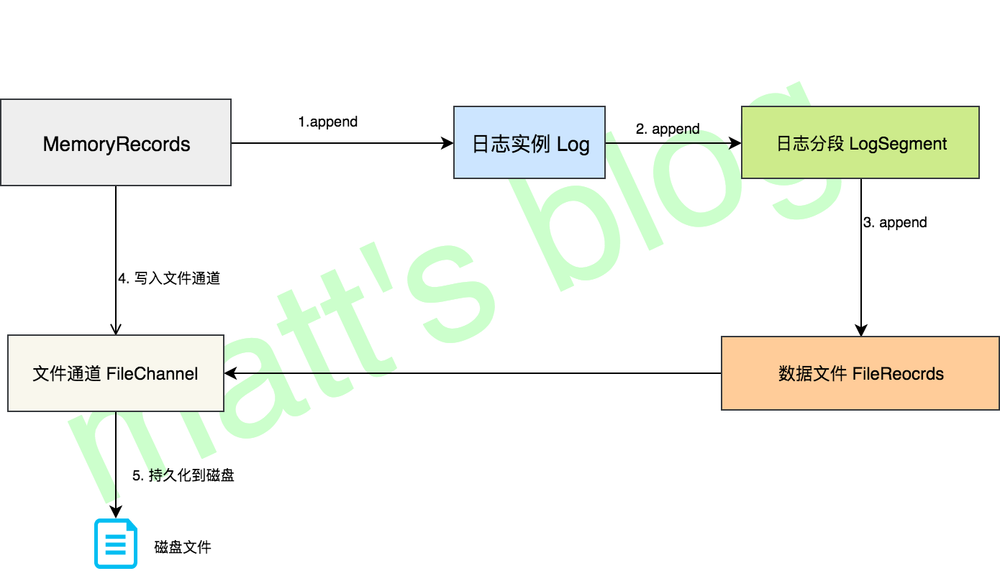

### 4.3 Server 端如何处理 Fetch 请求


#### 4.3.1 Fetch 请求处理的整体流程

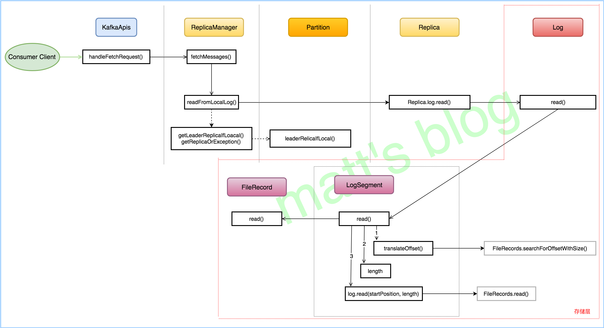


#### 4.3.2 Fetch 请求的来源

- Consumer Fetch 请求

  ```java
  /**
  	Kafka.poll().sendFetches(): 向订阅的所有 partition （只要该 leader 暂时没有拉取请求）所在 leader 发送 fetch请求
  		1.createFetchRequests: 创建 Fetch Request
  		2.client.send: 发送 Fetch Request
  */
  ```

- Replica 同步 Fetch 请求

  ```java
  /**
  	KafkaRaftClient.buildFetchRequest: 构造 Fetch 请求
  		1.关键在于 setReplicaId 方法,设置了 replicaId, consumer 的该值为 CONSUMER_REPLICA_ID（-1）
  */
  ```

#### 4.3.3 Server 端的处理

- KafkaApis.handleFetchRequest

```java
/**
	KafkaApis.handleFetchRequest: 处理 Fetch 请求
		1.follower 同步的处理
			- 判断 follower 的权限
		2.consumer 消费的处理
			- filterByAuthorized
		3.replicaManager.fetchMessages： 从 replica 上拉取数据,满足条件后调用回调函数进行返回
*/

```

- replicaManager.fetchMessages

  ```java
  /**
  	fetchMessages: 从 leader 拉取数据,等待拉取到足够的数据或者达到 timeout 时间后返回拉取的结果(新版本可能可以从非 leader 副本获取数据)
  		1.readFromLocalLog: 获取本地日志
  		2.如果满足以下条件的其中一个,将会立马返回结果:
  			- 1.timeout 达到  2.拉取结果为空  3.拉取到足够的数据  4.拉取时遇到 error 5.发现不同的 epoch
  		3.其他情况下,延迟发送结果
  			- delayedFetchPurgatory.tryCompleteElseWatch
  */
  
  		/**
  			readFromLocalLog: 按 offset 从 tp 列表中读取相应的数据
  				1.read(tp, fetchInfo, limitBytes, minOneMessage): 读取该 tp 的数据
  		*/
  
  			/**
  				read
  					1.getPartitionOrException(tp): 获取 partition
  					2.是否定义了优先副本
  						- partition.fetchOffsetSnapshot：获取 offset 的快照数据
  					3.否则，
  						- partition.readRecords：调用 partition 的 readRecords 方法读取 record
  						- shouldLeaderThrottle(quota, partition, replicaId)：如果被限速了,那么返回 empty 集合
  						- LogReadResult：返回最后的结果,返回的都是 LogReadResult 对象
  			*/
  
  ```

  

#### 4.3.4 存储层对 Fetch 请求的处理


- partition.readRecords

  ```java
  /**
  	readRecords
  		1.localLogWithEpochOrException: 获取本地 log
  		2.localLog.read(fetchOffset, maxBytes, fetchIsolation, minOneMessage): 调用 Log 的 read 方法，从指定 offset 开始读取数据
  */
  ```

  

- Log.read

  ```java
  /**
  	Log.read:
  		1.segments.floorEntry(startOffset)：先查找对应的日志分段（segment）
  		2.maxPosition = ：如果 Fetch 请求刚好发生在 the active segment 上,当多个 Fetch 请求同时处理,如果 nextOffsetMetadata 更新不及时,可能会导致发送 OffsetOutOfRangeException 异常; 为了解决这个问题, 这里能读取的最大位置是对应的物理位置（exposedPos），而不是 the log end of the active segment.
  		3.segment.read：从 segment 中读取数据
  		4.segments.higherEntry(segmentEntry.getKey)：如果该日志分段没有读取到数据,则读取更高的日志分段
  */
  ```

- LogSegment.read

  ```java
  /**
  	read: 读取日志分段（副本同步不会设置 maxSize）
  		1.translateOffset(startOffset): 将起始的 offset 转换为起始的实际物理位置
  		2.min((maxPosition - startPosition).toInt, adjustedMaxSize): 计算读取的长度
  		3.FetchDataInfo(): 根据起始的物理位置和读取长度读取数据文件
  			- log.slice(startPosition, fetchSize): 读取数据文件
  */
  
  	/**
  		translateOffset(startOffset)
  			1.offsetIndex.lookup(offset): 查找 offset 索引文件, 获取离 offset 最新的物理位置,返回包括 offset 和物理位置（不是准确值）
  				- mmap.duplicate: 查询时,mmap 会发生变化,先复制出来一个
  				- largestLowerBoundSlotFor: 二分查找
  				- parseEntry(idx, slot)：先计算绝对偏移量,再计算物理位置
  					-- OffsetPosition(baseOffset + relativeOffset(buffer, n), physical(buffer, n))
  			2. log.searchForOffsetWithSize: 从指定的位置开始消费,直到找到 offset 对应的实际物理位置,返回包括 offset 和物理位置（准确值）
  				- batchesFrom(startingPosition).foreach
  	*/
  
  	/**
  		log.slice
  			1.new FileRecords(file, channel, this.start + position, end, true)
  	*/
  ```

  - relativeOffset 和 physical 的计算方法

  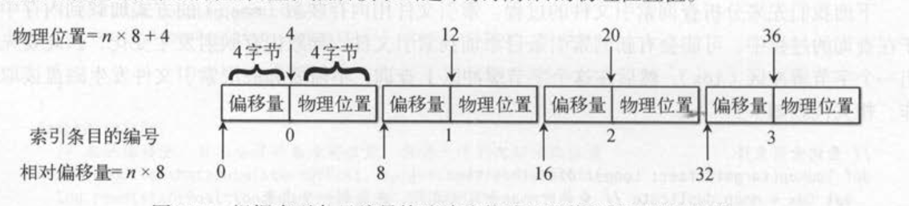

### 4.4 副本同步机制实现


#### 4.4.1 副本同步整体流程

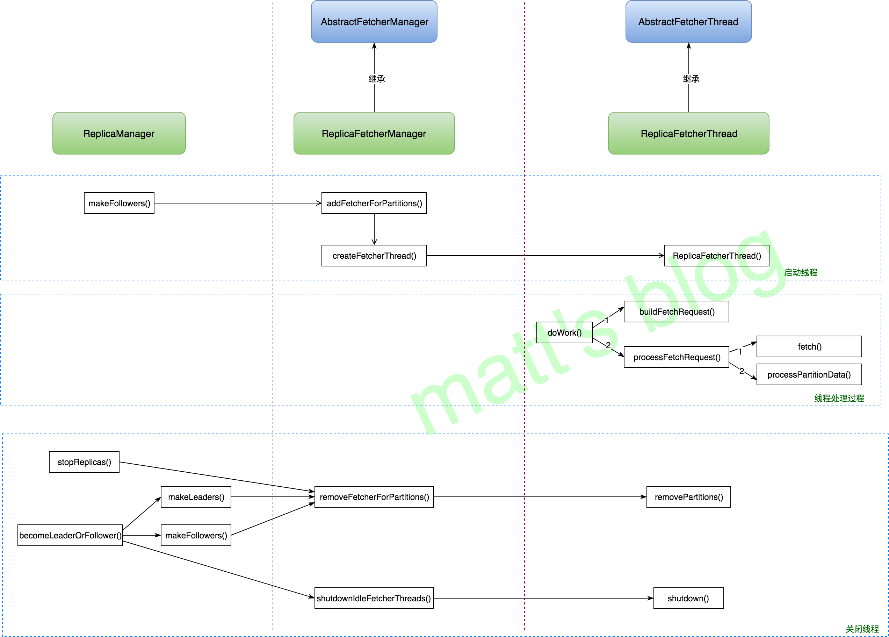

#### 4.4.2 Replica fetcher 线程启动

- 如果 Broker 的本地副本被选举为 follower，那么它将会启动副本同步线程

```java
	/**
	* 对于给定的这些副本，将本地副本设置为 follower
   	*    1.从 leader partition 集合移除这些 partition；
   	*    2.将这些 partition 标记为 follower，之后这些 partition 就不会再接收 produce 的请求了
   	*    3.停止对这些 partition 的副本同步，这样这些副本就不会再有（来自副本请求线程）的数据进行追加了；
   	*    4. 对这些 partition 的 offset 进行 checkpoint，如果日志需要截断就进行截断操作；
   	*    5. 清空 purgatory 中的 produce 和 fetch 请求；
   	*    6. 如果 broker 没有掉线，向这些 partition 的新 leader 启动副本同步线程；
   	*  上面这些操作的顺序性，保证了这些副本在 offset checkpoint 之前将不会接收新的数据，
   	*  这样的话，在 checkpoint 之前这些数据都可以保证刷到磁盘
   	
   	
   		ReplicaManager.makeFollowers(): 
   			1.partition.makeFollower(partitionState, highWatermarkCheckpoints): partition 的本地副本设置为 follower
   			2.将这些 partition 的本地副本设置为 follower，后面就不会接收关于这个 partition 的 Produce 请求了，如果依然有 client 在向这台 broker 发送数据，那么它将会返回相应的错误；
   			3.removeFetcherForPartitions: 停止关于这些 partition 的副本同步线程,可以保证这些 partition 的本地副本将不会再有新的数据追加
   			4.completeDelayedFetchOrProduceRequests: 完成那些延迟请求的处理
   			5.addFetcherForPartitions: 启动副本同步线程
   	*/


		/**
			ReplicaFetcherManager.addFetcherForPartitions: 为 topic-partition 添加 replica-fetch 线程
				1.BrokerAndFetcherId: 为这些 topic-partition 分配相应的 fetch 线程 id
				2.addAndStartFetcherThread(brokerAndFetcherId, brokerIdAndFetcherId): 为 BrokerAndFetcherId 构造 fetcherThread 线程
				3.addPartitionsToFetcherThread: 添加 topic-partition 列表
		*/
			
			/**
				addAndStartFetcherThread: 创建并启动 fetcher-thread
					1.createFetcherThread: 创建 replica-fetch 线程
						- new ReplicaFetcherThread
					2.fetcherThread.start(): 启动 replica-fetch 线程
			*/
```


#### 4.4.3 Replica fetcher 线程处理过程


```java
/**
	ShutdownableThread.run
		- while(isRunning)
			-- doWork()
*/

	/**
		AbstractFetcherThread.doWork: replica fetcher 线程处理过程
			1.maybeTruncate(): 处理需要截断数据的情况
			2.maybeFetch()：
				- buildFetch：构造 fetch request
				- partitionMapCond.await(fetchBackOffMs, TimeUnit.MILLISECONDS)：如果没有活跃的 partition，在下次调用之前，sleep fetchBackOffMs 时间
				- processFetchRequest(sessionPartitions, fetchRequest)：发送 fetch 请求，处理 fetch 的结果
	*/

		/**
			ReplicaFetcherThread.buildFetch: 构造 Fetch 请求
				1.fetchData = builder.build()：构造 fetch Data
				2.FetchRequest.Builder: 构造 fetch 请求，关键在于设置了 replicaId, 对于 consumer, 该值为 CONSUMER_REPLICA_ID（-1）
		*/

		/**
			processFetchRequest: 发送 Fetch 请求，并对返回的结果进行处理，最终写入到本地副本的 Log 实例中
				1.fetchFromLeader(fetchRequest): 发送 fetch 请求，获取 fetch 结果
				2.partitionMapCond.await(fetchBackOffMs, TimeUnit.MILLISECONDS): fetch 时发生错误，sleep fetchBackOffMs 时间
				3.responseData.nonEmpty：fetch 结果不为空
					- 判断：如果 fetch 的 offset 与返回结果的 offset 相同，并且返回没有异常，那么就将拉取的数据追加到对应的 partition 上
					- 错误为空的情况：
						-- processPartitionData： 将 fetch 的数据追加到日志文件中
						-- 如果 validBytes > 0
							--- partitionStates.updateAndMoveToEnd：更新 fetch 的 offset 位置
							--- fetcherStats.byteRate.mark(validBytes)：更新 metrics
					- 错误为 OFFSET_OUT_OF_RANGE 的情况：
						-- handleOutOfRangeError：Out-of-range 的情况处理
				4.handlePartitionsWithErrors：处理拉取遇到的错误读的 tp
		*/

			/**
				fetchFromLeader(fetchRequest): 发送 fetch 请求，获取拉取结果
					1.leaderEndpoint.sendRequest(fetchRequest): 发送请求
						- networkClient.newClientRequest: 构建 clientRequest
						- NetworkClientUtils.sendAndReceive：阻塞直到获取返回结果
			*/

			/**
				processPartitionData: 处理 fetch 的数据，将 fetch 的数据追加的日志文件中
					1.maybeWarnIfOversizedRecords: 检查 records
					2.partition.appendRecordsToFollowerOrFutureReplica: 将 fetch 的数据追加到 log 中
					3.log.updateHighWatermark: 更新 replica 的 hw（logEndOffset 在追加数据后也会立马进行修改)
					4.log.maybeIncrementLogStartOffset: 更新 LogStartOffset
			*/
```


- offset OutOfRange 情况的处理

  1.  Fetch Offset 超过了 leader 的 LEO
     - 副本回溯到 leader 的 LEO 位置（超过这个值的数据删除），然后再去进行副本同步
  2.  Fetch Offset 小于 leader 的 startOffset
     - 清空本地的数据，因为本地的数据都已经过期了，然后从 leader 的最小 offset 位置开始拉取数据。

  ```java
  /**
  	handleOutOfRangeError
  		1.fetchOffsetAndTruncate: 处理 out-of-range error
  		2.partitionStates.updateAndMoveToEnd
  */
  
  	/**
  		fetchOffsetAndTruncate: Out-of-Range 情形的处理
  			1.fetchLatestOffsetFromLeader: 获取最新的 offset
  			2.leaderEndOffset 小于 副本 LEO 的情况
  				- warn 日志信息
  				- truncate: 进行截断操作,将副本 offset 大于等于 leaderEndOffset 的数据和索引删除
  			3.leader 的 LEO 大于 follower 的 LEO 的情况
  				- 如果 leader 的 startOffset 大于副本的最大 offset
  					-- truncateFullyAndStartAt：将这个 log 的数据全部清空,并且从 leaderStartOffset 开始拉取数据
  	*/
  ```

  

#### 4.4.4 Replica fetcher 线程的关闭

- 关闭 Replica fetcher 线程的三种情况：

  1. `stopReplica()`：broker 收到了 controller 发来的 StopReplica 请求，这时会开始关闭对指定 topic-partition 的同步线程
  2. `makeLeaders`：这些 partition 的本地副本被选举成了 leader，这时候就会先停止对这些 topic-partition 副本同步线程
  3. `makeFollowers()`：这里实际上停止副本同步，然后再开启副本同步线程，因为这些 topic-partition 的 leader 可能发生了切换。

- 每个 replica fetcher 线程操作的是多个 topic-partition，而在关闭的粒度是 partition 级别，只有这个线程分配的 partition 全部关闭后，这个线程才会真正被关闭。

- `stopReplica`

  ```java
  /**
  	StopReplica 的请求实际上是 Controller 发送过来的
  */
  ```

- `ReplicaManager.makeLeaders()`

  ```java
  /**
  	ReplicaManager.makeLeaders()
  		1.replicaFetcherManager.removeFetcherForPartitions: 停止这些副本同步请求
  		2.更新这些 partition 的信息（这些 partition 成为 leader 了）
  			- partition.makeLeader: 在 partition 对象将本地副本设置为 leader
  				-- partitionsToMakeLeaders: 成功选为 leader 的 partition 集合
  				-- 否则，本地 replica 已经是 leader replica，可能是接收了重试的请求
  		3.LeaderAndIsr 请求处理完成
  */
  ```

- `makeFollowers()`

  ```java
  /**
  	replicaFetcherManager.removeFetcherForPartitions
  */
  ```

- `replicaFetcherManager.removeFetcherForPartitions`

  ```java
  /**
  	removeFetcherForPartitions: 删除 partition 的 replica-fetch 线程
  		1.遍历所有的 fetchThread 去移除这个 topic-partition 集合
  			- fetcher.removePartitions(partitions): ReplicaFetcherThread 将这些 topic-partition 从自己要拉取的 partition 列表中移除
  		2. failedPartitions.removeAll(partitions)
  */
  ```

- ReplicaFetcherThread 的关闭

  - ReplicaManager 每次处理完 LeaderAndIsr 请求后，都会调用 ReplicaFetcherManager 的 `shutdownIdleFetcherThreads()` 方法，如果 fetcher 线程要拉取的 topic-partition 集合为空，那么就会关闭掉对应的 fetcher 线程。

  ```java
  /**
  	AbstarctFetcherManager.shutdownIdleFetcherThreads: 关闭没有拉取 topic-partition 任务的拉取线程
  		1.if (fetcher.partitionCount <= 0): 如果该线程拉取的 partition 数小于 0
  			- fetcher.shutdown(): 关闭 fetcher 线程
  */
  ```

  

### 4.5 ReplicaManager 详解

- ReplicaManager 需要处理的请求的有以下六种

  1. **LeaderAndIsr** 请求；
  2. **StopReplica** 请求；
  3. **UpdateMetadata** 请求；
  4. **Produce** 请求；
  5. **Fetch** 请求；
  6. **ListOffset** 请求；

- 存储层各个类之间关系

  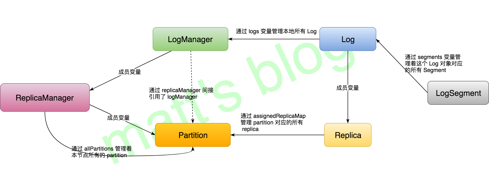

#### 4.5.1 ReplicaManager 启动

- ReplicaManager 的 Startup 方法启动两个周期性任务及 isr 扩充的情况

  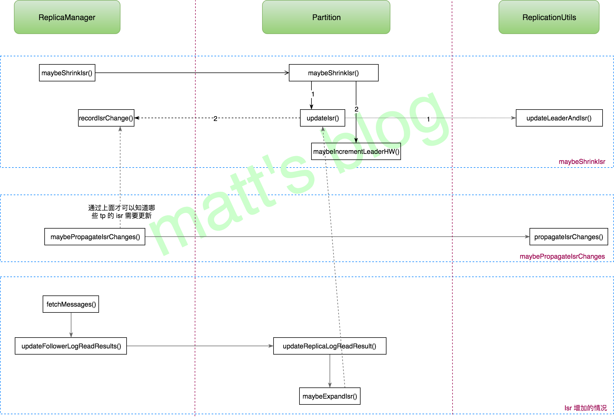

- KafkaServer.startup

  -  replicaManager.startup()

  ```java
  /**
  	 replicaManager.startup(): 启动相应的定时任务
  	 	1.maybeShrinkIsr：周期性检查 isr 是否有 replica 过期需要从 isr 中移除
  	 	2.broker 版本是否小于 KAFKA_2_7_IV2
  	 		- maybePropagateIsrChanges：周期性检查是不是有 topic-partition 的 isr 需要变动,如果需要,就更新到 zk 上,来触发 controller
  	 		- alterIsrManager.start()：同上，不依赖 zk
  	 	3.shutdownIdleReplicaAlterLogDirsThread：周期性检查是否有空闲的 replica-fetcher-thread，关闭没有拉取 topic-partition 任务的拉取线程
  	 	4.logDirFailureHandler.start()：启动 logDirFailureHandler 线程
  */
  ```

- maybeShrinkIsr

  ```java
  /**
  	ReplicaManager.maybeShrinkIsr: 遍历所有的 partition 对象,检查其 isr 是否需要抖动
  		1.nonOfflinePartition(topicPartition).foreach(_.maybeShrinkIsr())
  */
  
  	/**
  		Partition.maybeShrinkIsr: 检查这个 isr 中的每个 replcia
  			1.leaderLogIfLocal.exists: 只有本地副本是 leader, 才会做这个操作
  				- getOutOfSyncReplicas(replicaLagTimeMaxMs): 检查当前 isr 的副本是否需要从 isr 中移除
  				- newIsrLog = (isrState.isr -- outOfSyncReplicaIds).mkString(","): new isr
  				- shrinkIsr(outOfSyncReplicaIds): 更新 ISR
  				- maybeIncrementLeaderHW(leaderLog): isr 变动了,判断是否需要更新 partition 的 hw
  			2.tryCompleteDelayedRequests(): 完成延时操作
  	*/
  
  		/**
  			getOutOfSyncReplicas(replicaLagTimeMaxMs): 检查 isr 中的副本是否需要从 isr 中移除
  				1.candidateReplicaIds: 获取那些不应该在 isr 中副本的列表
  				2.candidateReplicaIds.filter: 过滤落后超过 maxLagMs 时间的副本
  		*/
  
  		/**
  			shrinkIsr: 更新 ISR
  				- if (useAlterIsr)
  					1.shrinkIsrWithAlterIsr(outOfSyncReplicas)
  					2.shrinkIsrWithZk(isrState.isr -- outOfSyncReplicas)
  						- stateStore.shrinkIsr：更新 ISR
  							-- updateIsr(controllerEpoch, leaderAndIsr)
  								--- ReplicationUtils.updateLeaderAndIsr：执行更新操作
  								--- replicaManager.recordIsrChange(topicPartition)：告诉 replicaManager 这个 partition 的 isr 需要更新
  						- maybeUpdateIsrAndVersionWithZk：成功更新到 zk 上时，更新 isrState、zkVersion
  		*/
  
  		/**
  			maybeIncrementLeaderHW：检查是否需要更新 partition 的 HW，这个方法将在两种情况下触发:
  				1.1.Partition ISR 变动; 
  				2. 任何副本的 LEO 改变;
  				在获取 HW 时,是从 isr 和认为能追得上的副本中选择最小的 LEO,之所以也要从能追得上的副本中选择,是为了等待 follower 追上 HW,否则可能没机会追上了
  		*/
  ```

-  maybePropagateIsrChanges

  ```java
  /**
  	maybePropagateIsrChanges: 判断是不是需要对 isr 进行更新，如果有 topic-partition 的 isr 发生了变动需要进行更新，那么这个方法就会被调用，它会触发 zk 的相应节点，进而触发 controller 进行相应的操作
  		1.判断是否 有 topic-partition 的 isr 需要更新
  			- zkClient.propagateIsrChanges(isrChangeSet)：在 zk 创建 isr 变动的提醒
  			- isrChangeSet.clear()：清空 isrChangeSet,它记录着 isr 变动的 topic-partition 信息
  			- lastIsrPropagationMs.set(now)：最近一次触发这个方法的时间
  */
  ```

-  shutdownIdleReplicaAlterLogDirsThread

  ```java
  /**
  	shutdownIdleReplicaAlterLogDirsThread
  		- replicaAlterLogDirsManager.shutdownIdleFetcherThreads()
  */
  
  	/**
  		shutdownIdleFetcherThreads: 关闭没有拉取 topic-partition 任务的拉取线程
  			1.if (fetcher.partitionCount <= 0): 如果该线程拉取的 partition 数小于 0
  				- fetcher.shutdown(): 关闭 fetcher 线程
  	*/
  ```

  

#### 4.5.2 Partition ISR 变化

- maybeShrinkIsr(): **检查 isr 中是否有 replica 需要从 isr 中移除，这个方法只会减少 isr 中的副本数**
- maybeExpandIsr(): **判断 isr 是否需要更新，增加 isr 中的副本数**

```java
/**
	如果 Fetch 请求是来自副本，那么会调用 updateFollowerFetchState() 更新远程副本的信息
	ReplicaManager.fetchMessages() ===> updateFollowerFetchState()
		1.partition.updateFollowerFetchState: 更新 nonOffline-partition 的 replica 信息
*/

	/**
		partition.updateFollowerFetchState
			1.followerReplica.updateFetchState: 更新副本的信息
				- 更新该副本的 _logStartOffset、LEO、lastFetchLeaderLogEndOffset 和 lastFetchTimeMs
			2.maybeExpandIsr(followerReplica, followerFetchTimeMs): 如果该副本不在 isr 中,检查是否需要进行更新
	*/

		/**
			maybeExpandIsr: 检查当前 Partition 是否需要扩充 ISR, 副本的 LEO 大于等于 hw 的副本将会被添加到 isr 中
				1.判断是否需要扩充 ISR
					- expandIsr(followerReplica.brokerId)： 扩展 ISR
						-- if (useAlterIsr)
							--- expandIsrWithAlterIsr(newInSyncReplica)
							--- expandIsrWithZk(newInSyncReplica)
		*/
```


#### 4.5.3 Updata-Metadata 请求的处理

- KafkaApis.handleUpdateMetadataRequest

```java
/**
	handleUpdateMetadataRequest: 处理 update-metadata 请求
		1.authorizeClusterOperation:  验证集群操作权限
		2.replicaManager.maybeUpdateMetadataCache: 更新 metadata, 并返回需要删除的 Partition
		3.groupCoordinator.handleDeletedPartitions: GroupCoordinator 会清除相关 partition 的信息
		4.其他处理
		5.sendResponseExemptThrottle: 发送响应
*/

	/**
		replicaManager.maybeUpdateMetadataCache: Controller 向所有的 Broker 发送请求,让它们去更新各自的 meta 信息
			1.updateMetadataRequest.controllerEpoch < controllerEpoch: 来自过期的 controller，抛出异常
			2.metadataCache.updateMetadata：更新 metadata 信息,并返回需要删除的 Partition 信息
	*/

		/**
			metadataCache.updateMetadata: 更新本地的 meta,并返回要删除的 topic-partition
				1.清空 aliveNodes 和 aliveBrokers 记录,并更新成最新的记录
				2.遍历 partition 的状态
					- LeaderAndIsr.LeaderDuringDelete：partition 被标记为了删除
						-- removePartitionInfo：从 cache 中删除
					- addOrUpdatePartitionInfo：更新 topic-partition meta
		*/
```


## 五、Controller


### 5.1 Controller 选举及服务启动流程


### 5.2 副本状态机与分区状态机


### 5.3 Partition 副本迁移实现


### 5.4 Topic 的新建/扩容/删除


### 5.5 Broker 上线下线


### 5.6 Controller 发送模型


