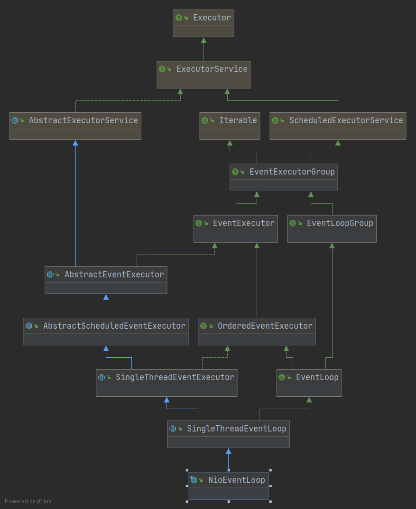

- EventLoopGroup bossGroup = new NioEventLoopGroup(1);

```java
/**
	EventLoopGroup bossGroup = new NioEventLoopGroup(1);
	===>	MultithreadEventLoopGroup
	===>	初始化一个 InternalLogger 实例
	===>	MultithreadEventExecutorGroup 初始化
			===>	EventExecutor
*/

chooser = chooserFactory.newChooser(children);

for (EventExecutor e: children) {
            e.terminationFuture().addListener(terminationListener);
        }
readonlyChildren = Collections.unmodifiableSet(childrenSet);
```

-  EventLoopGroup workerGroup = new NioEventLoopGroup();

-  serverBootstrap.bind(PORT)

```java
/**
	AbstractBootstrap.doBind()	
		- initAndRegister()	===> 初始化并注册一个 channel，生成 ChannelFuture
*/
```


### ServerBootstrap

- 引导类，用于启动服务器和引导整个程序的初始化。它和 ServerChannel 关联，而 ServerChannel 继承了 Channel。

### 启动过程

-  EventLoopGroup bossGroup = new NioEventLoopGroup(1);

```java
/**
		new NioEventLoopGroup(1); ===> MultithreadEventExecutorGroup() 
			===> executor = new ThreadPerTaskExecutor(newDefaultThreadFactory());	采用默认的线程工厂和执行器
			===> children = new EventExecutor[nThreads];	创建执行器（单例线程池）数组
			===> children[i] = newChild(executor, args);	创建 NioEventLoop(NioEventLoopGroup 下 new)
			===> chooserFactory.newChooser(children);	创建一个 EventExecutorChooser
			===> e.terminationFuture().addListener(terminationListener);	为每一个单例线程池添加一个关闭监听器
			===>  Collections.addAll(childrenSet, children);	将所有的单例线程池添加到一个 HashSet 中
		
*/
```

-  EventLoopGroup workerGroup = new NioEventLoopGroup();

-  ServerBootstrap

  - new ServerBootstrap();

  ```java
  /**
  	ServerBootstrap 是一个空构造，但是有默认的成员变量
  	
  */
  	private static final InternalLogger logger;
  
      private final Map<ChannelOption<?>, Object> childOptions;
      private final Map<AttributeKey<?>, Object> childAttrs;
      // config 对象，会在后面起很大作用???
      private final ServerBootstrapConfig config;
      private volatile EventLoopGroup childGroup;
      private volatile ChannelHandler cildHandler;
  ```

  - 主要 API（链式调用）

  ```java
  /**
  	group()
  	channel()
  	option()
  	handler()
  	childHandler()
  	bind()
  	sync()
  */
  ```

-  serverBootstrap.bind(PORT).sync();

```java
/**
	serverBootstrap.bind(PORT) ===> AbstractBootstrap.doBind()
		===> initAndRegister()
			===> channel = channelFactory.newChannel();	创建一个 NioServerSocketChannel
				===> ReflectiveChannelFactory.newChannel() ===> constructor.newInstance()	通过 jdk 反射实现
					===> SelectorProvider.openServerSocketChannel()	得到 JDK 的channel
			===> init(channel);	初始化 channel，由 ServerBootstrap 实现
				===> ChannelPipeline.addLast()
					===> checkMultiplicity()	检查 Handler 是否符合标准
					===> newContext()	创建一个 AbstractChannelHandlerContext 对象
					===> addLast0(newCtx)	将 context 添加到链尾
					===> callHandlerAdded0()
			===> config().group().register(channel);	通过 ServerBootstrap 的 bossGroup 注册 NioServerSocketChannel
				===> AbstractUnsafe.register0()	===> AbstractNioChannel.doBeginRead()
		===> doBind0()
			===> channel.bind(localAddress, promise).addListener(ChannelFutureListener.CLOSE_ON_FAILURE)
				===> AbstractChannelHandlerContext.invokeBind()	===> AbstractUnsafe.bind()	
					===> AbstractUnsafe.doBind()	执行绑定的方法
					===> pipeline.fireChannelActive()	告诉所有的 Handler，已经成功绑定
					===> safeSetSuccess(promise)	告诉 ChannelPromise 任务成功了
*/
```

- 底层利用 jdk 的 ServerSocketChannelImpl.bind()、ServerSocketChannelImpl.openServerSocketChannel()、反射 等实现

### 接收请求过程

- NioEventLoop.run()

```java
/**
	NioEventLoop.run()	===>	NioEventLoop.processSelectedKeys()	===>	unsafe.read();	
	===> AbstractNioMessageChannel.read() ===> NioServerSocketChannel.doReadMessages() ===>	SocketUtils.accept(javaChannel())
										  ===> pipeline.fireChannelRead(readBuf.get(i)); 
										  	===> AbstractChannelHandlerContext.invokeChannelRead() 
										  		===> ((ChannelInboundHandler) handler()).channelRead(this, msg);
										  			===> LoggingHandler
										  			===> ServerBootstrapAcceptor.channelRead()
										  				===> childGroup.register(child) 
										  					===> AbstractChannel.register0() ===> AbstractChannel.beginRead()
										  						===> AbstractNioChannel.doBeginRead()					  	
*/
```

- 底层利用 jdk 的 ServerSocketChannelImpl.accept() 和 SelectionKeyImpl 实现


### Pipeline、Handler、HandlerContext

#### ChannelPipeline

- 主要 API

```java
addFirst();
addLast();

addBefore();
addAfter();

remove();
```

- 原理及功能

```java
/**
	1.该接口继承了 ChannelInboundInvoker，ChannelOutboundInvoker，Iterable 接口，可以调用数据出站和入站的方法，也能遍历内部的链表。
	2.方法基本都是针对 Handler 链表的插入、追加、删除、替换操作，类似一个双向链表。同时也能返回 channel（也就是 socket）
	3.Handler 在 pipeline 中处理 I/O 事件的方式，IO 事件由 inboundHandler 或者outBoundHandler 处理，并通过调用 ChannelHandlerContext.fireChannelRead() 方法转发给其最近的处理程序。
	4.入站：SocketChannel.read(ByteBuffer);	出站：write()
*/
```


#### ChannelHandler

- 主要 API

```java
handlerAdded();	// 当把 ChannelHandler 添加到 pipeline 时被调用，准备处理事件

handlerRemoved();	// 当从 pipeline 中移除时调用，不再处理事件

exceptionCaught();	// 当处理过程中在 pipeline 发生异常时调用
```


- 原理及功能

```java
/**
	1.处理 IO 事件或拦截 IO 事件，并将其转发给下一个 ChannelHandler 处理程序。
	2.Handler 处理事件分为入站和出站，Netty 定义了两个子接口继承 ChannelHandler。
		1.ChannelInboundHandler
		2.ChannelOutboundHandler
*/
```

##### ChannelInboundHandler

- 主要 API

```java
channelRegistered();
channelUnregistered();

channelActive();	// 当 Channel 处于活动状态时被调用
channelInactive();	

channelRead();	// 当 Channel 读取数据时被调用

channelReadComplete();

userEventTriggered();

channelWritabilityChanged();
```


##### ChannelOutboundHandler

- 主要 API

```java
/**
	连接和写出数据等操作
*/
bind();	// 当请求将 Channel 绑定到本地地址时调用

connect();	
disconnect();

close();	// 当请求关闭 Channel 时调用

deregister();

read();

write();

flush();
```


##### ChannelDuplexHandler

- 间接实现了入站接口并直接实现了出站接口。通用的能够同时处理入站事件和出站事件的类。

```java
public class ChannelDuplexHandler extends ChannelInboundHandlerAdapter implements ChannelOutboundHandler 
```

#### ChannelHandlerContext

- ChannelHandlerContext 继承了出站方法调用接口（ChannelOutboundInvoker）和入站方法调用接口（ChannelInboundInvoker）
- 这两个 invoker 是针对入站或出站方法，在入站或出站 Handler 的外层再包装一层，达到在方法前后拦截并做一些特定操作的目的。
- ChannelHandlerContext 定义了一些方法，这些方法能够获取 Context 上下文环境中对应的如 channel、executor、Handler、pipeline、内存分配器、关联的 Handler 是否被删除。
- Context 就是包装了 Handler 相关的一切，以便 Context 可以在  pipeline 方便地操作 Handler。


#### ChannelPipeline、ChannelHandler、ChannelHandlerContext 创建过程

1. ChannelPipeline

   ```java
   /**
   	SocketChannel ===> AbstractChannel() ===> newChannelPipeline() ===> DefaultChannelPipeline()
       
       addLast()	===> newContext(group, filterName(name, handler), handler);
   
   */
   ```


#### ChannelPipeline 调度 Handler 

- 入站从 head（inbound） 开始，出站从 tail（outbound） 开始

```java
/**
	Pipeline.fire***(head)	===> AbstractChannelHandlerContext.invoke****(context)	===> next(Context).invoke****(next)
	===>	handler 的 **** 方法	===> pipeline.fire**** 方法(参数是找寻下一个节点的 ctx)
*/
```


### EventLoop

-  ScheduledExecutorService 接口：表示是一个定时任务接口，EventLoop 可以接受定时任务
-  EventLoop 接口（Netty 文档）：一旦 Channel 注册了，就处理该 channel 对应的所有 I/O 操作
-  SingleThreadEventExecutor：表示这是一个单线程的线程池
- NioEventLoop 是一个单例的线程池，里面含有一个死循环的线程不断做着 3 件事情：监听端口、处理端口事件、处理队列事件。每个 NioEventLoop 都可以绑定多个 channel，而每个 channel 始终只能由一个 EventLoop 来处理。



```java
/**
	NioEventLoop ===> SingleThreadEventExecutor.execute() 
		===> addTask(task)	===> offerTask(task)
		===> startThread();	===> doStartThread() ===> ThreadPerTaskExecutor.execute()
			===> if (interrupted) ===> updateLastExecutionTime() ===> SingleThreadEventExecutor.this.run(): 执行当前 NioEventLoop 的 run 方法
			
			
    NioEventLoop.run()
    	===> DefaultSelectStrategy.calculateStrategy ===> select()	获取感兴趣的事件
    	===> processSelectedKeys()	处理事件
    	===> runAllTasks()	执行队列中的任务
*/
```


### 处理耗时任务

#### Handler 加入线程池


#### Context 添加线程池

