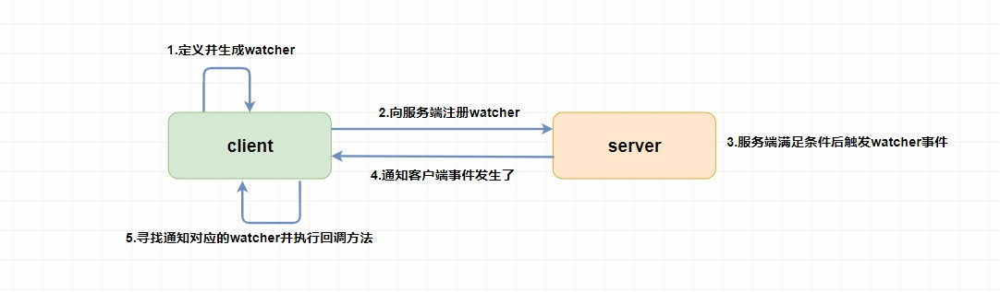
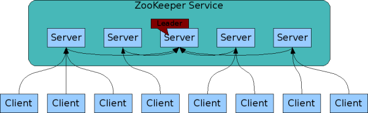

## 概览和特点

- 概览

ZooKeeper 是一个开源的**分布式协调服务**，它的设计目标是将那些复杂且容易出错的分布式一致性服务封装起来，构成一个高效可靠的**原语集**，并以一系列简单易用的接口提供给用户使用。

ZooKeeper 提供了**高可用、高性能、稳定的分布式数据一致性解决方案**，通常被用于实现诸如**数据发布/订阅、负载均衡、命名服务、分布式协调/通知、集群管理、Master 选举、分布式锁和分布式队列**等功能。

另外，**ZooKeeper 将数据保存在内存中，性能是非常棒的。 在“读”多于“写”的应用程序中尤其地高性能，因为“写”会导致所有的服务器间同步状态。（“读”多于“写”是协调服务的典型场景）。**

- 特点
  - **顺序一致性：** 从同一客户端发起的事务请求，最终将会严格地按照顺序被应用到 ZooKeeper 中去。
  - **原子性：** 所有事务请求的处理结果在整个集群中所有机器上的应用情况是一致的，也就是说，要么整个集群中所有的机器都成功应用了某一个事务，要么都没有应用。
  - **单一系统映像 ：** 无论客户端连到哪一个 ZooKeeper 服务器上，其看到的服务端数据模型都是一致的。
  - **可靠性：** 一旦一次更改请求被应用，更改的结果就会被持久化，直到被下一次更改覆盖。

## 数据模型

ZooKeeper 数据模型采用层次化的多叉树形结构，**每个节点上都可以存储数据，这些数据可以是数字、字符串或者是二级制序列。**并且。每个节点还可以拥有 N 个子节点，最上层是**根节点以“/”来代表**。每个数据节点在 ZooKeeper 中被称为 **znode**，它是 ZooKeeper 中数据的最小单元。并且，每个 znode 都有一个唯一的路径标识。

ZooKeeper 节点路径标识方式和 Unix 文件系统路径非常相似，都是由一系列使用斜杠"/"进行分割的路径表示，开发人员可以向这个节点中写入数据，也可以在节点下面创建子节点。

## 数据节点（ZNode）

每个数据节点在 ZooKeeper 中被称为 **znode**，它是 ZooKeeper 中数据的最小单元。用于存放数据。

### znode 的 4 种类型

- **持久（PERSISTENT）节点** ：一旦创建就一直存在**即使 ZooKeeper 集群宕机**，直到将其删除。
- **临时（EPHEMERAL）节点** ：临时节点的生命周期是与 **客户端会话（session）** 绑定的，**会话消失则节点消失** 。并且，**临时节点只能做叶子节点** ，不能创建子节点。
- **持久顺序（PERSISTENT_SEQUENTIAL）节点** ：除了具有持久（PERSISTENT）节点的特性之外， 子节点的名称还具有顺序性。比如 `/node1/app0000000001` 、`/node1/app0000000002` 。
- **临时顺序（EPHEMERAL_SEQUENTIAL）节点** ：除了具备临时（EPHEMERAL）节点的特性之外，子节点的名称还具有顺序性。

### znode 数据结构

每个 znode 由 2 部分组成:

- **stat** ：状态信息
- **data** ： 节点存放的数据的具体内容

Stat 类中包含了一个数据节点的所有状态信息的字段，如下表：

| znode 状态信息 | 解释                                                         |
| -------------- | ------------------------------------------------------------ |
| cZxid          | create ZXID，即该数据节点被创建时的事务 id                   |
| ctime          | create time，即该节点的创建时间                              |
| mZxid          | modified ZXID，即该节点最终一次更新时的事务 id               |
| mtime          | modified time，即该节点最后一次的更新时间                    |
| pZxid          | 该节点的子节点列表最后一次修改时的事务 id，只有子节点列表变更才会更新 pZxid，子节点内容变更不会更新 |
| cversion       | 子节点版本号，当前节点的子节点每次变化时值增加 1             |
| dataVersion    | 数据节点内容版本号，节点创建时为 0，每更新一次节点内容(不管内容有无变化)该版本号的值增加 1 |
| aclVersion     | 节点的 ACL 版本号，表示该节点 ACL 信息变更次数               |
| ephemeralOwner | 创建该临时节点的会话的 sessionId；如果当前节点为持久节点，则 ephemeralOwner=0 |
| dataLength     | 数据节点内容长度                                             |
| numChildren    | 当前节点的子节点个数                                         |

## 权限控制（ACL：AccessControlLists）

ZooKeeper 采用 ACL（AccessControlLists）策略来进行权限控制，类似于 UNIX 文件系统的权限控制。ZooKeeper 的权限控制是**基于每个 znode 节点**的，需要对每个节点设置权限，**每个 znode 支持设置多种权限控制方案和多个权限**，子节点不会继承父节点的权限，客户端无权访问某节点，但可能可以访问它的子节点。

对于 znode 操作的权限，ZooKeeper 提供了以下 5 种：

- **CREATE** : 能创建子节点
- **READ** ：能获取节点数据和列出其子节点
- **WRITE** : 能设置/更新节点数据
- **DELETE** : 能删除子节点
- **ADMIN** : 能设置节点 ACL 的权限

需要注意的是，**CREATE** 和 **DELETE** 这两种权限都是针对 **子节点** 的权限控制。

对于身份认证，提供了以下几种方式（**scheme：采用何种方式授权**）：

- **world** ： 默认方式，所有用户都可无条件访问。
- **auth** :不使用任何 id，代表任何已认证的用户。
- **digest** :用户名:密码认证方式： *username:password* 。
- **ip** : 对指定 ip 进行限制。

**授权对象 ID**：权限授予的用户或实体

| 权限模式 | 授权对象                                                     |
| -------- | ------------------------------------------------------------ |
| Ip       | 通常是一个 Ip 地址或者是 Ip 段, 例如 192.168.0.1 或者 192.168.0.1/12 |
| Digest   | 自定义, 通常是 username:BASE64(SHA-1(username:password)) 例如"foo:uigfuagsfyuagdfyuagdfdalhgf=" |
| World    | 只有一个ID 就是 anyone                                       |
| Super    | 与 digest 模式一样                                           |

## 一致性算法（Paxos ==> ZAB）

### 消息广播模式

### 崩溃恢复模式

## 会话（TCP 长连接）

Session 可以看作是 **ZooKeeper 服务器与客户端的之间的一个 TCP 长连接**，通过这个连接，客户端能够**通过心跳检测与服务器保持有效的会话**，也能够向 ZooKeeper 服务器发送请求并接受响应，同时还能够通过该连接接收来自服务器的 Watcher 事件通知。

Session 有一个属性叫做：`sessionTimeout` ，`sessionTimeout` 代表会话的超时时间。当由于服务器压力太大、网络故障或是客户端主动断开连接等各种原因导致客户端连接断开时，**只要在`sessionTimeout`规定的时间内能够重新连接上集群中任意一台服务器，那么之前创建的会话仍然有效。**

另外，在为客户端创建会话之前，服务端首先会为每个客户端都分配一个 `sessionID`。由于 `sessionID`是 ZooKeeper 会话的一个重要标识，许多与会话相关的运行机制都是基于这个 `sessionID` 的，因此，**无论是哪台服务器为客户端分配的 `sessionID`，都务必保证全局唯一**。

| **sessionID**        | 会话 ID，用来唯一标识一个会话，每次客户端创建会话的时候，ZooKeeper 都会为其分配一个全局唯一的 sessionID。 |
| -------------------- | ------------------------------------------------------------ |
| **TimeOut**          | 会话超时时间，如果客户端与服务器之间因为网络闪断导致断开连接，并在 TimeOut 时间内未连上其他 server，则此次会话失效，此次会话创建的临时节点将被清理。 |
| ***ExpirationTime*** | 下次会话超时时间点。ZooKeeper 会为每个会话标记一个下次会话超时时间点，便于对会话进行“分桶管理”，同时也是为了高效低耗的实现会话的超时检查与清理。其值接近于**当前时间 + TimeOut**，但不完全相等。 |

### 会话管理

1. 分桶策略

   通过**“分桶策略”**来进行会话的管理，分桶的原则是将每个会话的**“下次超时时间点”(ExpirationTime)**相同的会话放在同一区块中进行管理，以便于 ZooKeeper 对会话进行不同区块的隔离处理，以及同一区块的统一处理。

2. 会话激活

   为了保持 client 会话的有效性，在 ZooKeeper 运行过程中，client 会在会话超时时间过期范围内向 server 发送 PING 请求来保持会话的有效性，成为“**心跳检测**”。

3. 会话清理

   会话过期后，**集群中所有 server **都删除由该会话创建的**临时节点**(EPHEMERAL)信息。

### 选择 TCP 长连接的原因

ZooKeeper 中**一个 client 只会跟一个 server 进行交互**(除非与当前 server 连接失败，会切换到下个 server)，不管这种交互有多频繁，只需要一个 TCP 长连接就足以应对，因此选择一个 TCP 长连接，不失为一种最好的方案。

### 端口

ZooKeeper 对外的服务端口默认是 2181。

## Watcher 机制（事件监听器）

Watcher（事件监听器），是 ZooKeeper 中的一个很重要的特性。ZooKeeper 允许用户在指定节点上注册一些 Watcher，并且在一些特定事件触发的时候，ZooKeeper 服务端会将事件通知到感兴趣的客户端上去，**该机制是 ZooKeeper 实现分布式协调服务的重要特性**。

**Zookeeper 采用了 Watcher 实现数据的发布/订阅功能。**	

> Watcher机制实际上**与观察者模式类似**，也可看作是一种观察者模式在分布式场景下的实现方式。

### Watcher 架构

Watcher 实现由三个部分组成：

- Zookeeper 服务端；
- Zookeeper 客户端；
- 客户端的 ZKWatchManager 对象；

客户端首先将 Watcher 注册到服务端，同时将 Watcher 对象保存到客户端的 Watch 管理器中。当 ZooKeeper 服务端监听的数据状态发生变化时，服务端会主动通知客户端，接着客户端的 Watch 管理器会触发相关 Watcher 来回调相应处理逻辑，从而完成整体的数据发布/订阅流程。

### Watcher 特性

| 特性           | 说明                                                         |
| -------------- | ------------------------------------------------------------ |
| 一次性         | Watcher 是一次性的，一旦被触发就会移除，再次使用时需要重新注册。 |
| 客户端顺序回调 | Watcher 回调是顺序串行化执行的，只有回调后客户端才能看到最新的数据状态。一个 Watcher 回调逻辑不应该太多，以免影响别的 watcher 执行。 |
| 轻量级         | WatchEvent 是最小的通信单元，结构上只包含通知状态、事件类型和节点路径，并不会告诉数据节点变化前后的具体内容； |
| 时效性         | Watcher 只有在当前 session 彻底失效时才会无效，若在 session 有效期内快速重连成功，则 watcher 依然存在，仍可接收到通知； |

### Watcher 接口设计

Watcher 是一个接口，**任何实现了 Watcher 接口的类就是一个新的 Watcher**。Watcher 内部包含了两个枚举类：KeeperState、EventType。

- Watcher 通知状态(KeeperState)： KeeperState 是客户端与服务端连接状态发生变化时对应的通知类型。
- Watcher 事件类型(EventType)： EventType 是数据节点(znode)发生变化时对应的通知类型。**EventType 变化时 KeeperState 永远处于 SyncConnected 通知状态下；当 KeeperState 发生变化时，EventType 永远为 None**。

## Zookeeper 集群

为了保证高可用，最好是以集群形态来部署 ZooKeeper，这样只要集群中大部分机器是可用的（能够容忍一定的机器故障），那么 ZooKeeper 本身仍然是可用的。通常 3 台服务器就可以构成一个 ZooKeeper 集群了。ZooKeeper 官方提供的架构图就是一个 ZooKeeper 集群整体对外提供服务。

上图中每一个 Server 代表一个安装 ZooKeeper 服务的服务器。组成 ZooKeeper 服务的服务器都会**在内存中维护当前的服务器状态**，并且每台服务器之间都互相保持着通信。集群间通过 ZAB 协议（ZooKeeper Atomic Broadcast）来保持数据的一致性。

### zookeeper 集群角色

在 ZooKeeper 中没有选择传统的 Master/Slave 概念，而是引入了 Leader、Follower 和 Observer 三种角色。如下图所示：

ZooKeeper 集群中的所有机器通过一个 **Leader 选举过程** 来选定一台称为 “**Leader**” 的机器，Leader 既可以为客户端提供写服务又能提供读服务。除了 Leader 外，**Follower** 和 **Observer** 都只能提供读服务。Follower 和 Observer 唯一的区别在于 Observer 机器不参与 Leader 的选举过程，也不参与写操作的“过半写成功”策略，因此 **Observer 机器可以在不影响写性能的情况下提升集群的读性能**。

| 角色     | 说明                                                         |
| -------- | ------------------------------------------------------------ |
| Leader   | 为客户端提供读和写的服务，负责投票的发起和决议，更新系统状态。 |
| Follower | 为客户端提供读服务，如果是写服务则转发给 Leader。在选举过程中参与投票。 |
| Observer | 为客户端提供读服务器，如果是写服务则转发给 Leader。不参与选举过程中的投票，也不参与“过半写成功”策略。在不影响写性能的情况下提升集群的读性能。此角色于 ZooKeeper3.3 系列新增的角色。 |

### 选举过程

当 Leader 服务器出现网络中断、崩溃退出与重启等异常情况时，就会进入 Leader 选举过程，这个过程会选举产生新的 Leader 服务器。

1. **Leader election（选举阶段）**：节点在一开始都处于选举阶段，只要有一个节点得到超半数节点的票数，它就可以当选准 leader。
2. **Discovery（发现阶段）** ：在这个阶段，followers 跟准 leader 进行通信，同步 followers 最近接收的事务提议。
3. **Synchronization（同步阶段）** :同步阶段主要是利用 leader 前一阶段获得的最新提议历史，同步集群中所有的副本。同步完成之后 准 leader 才会成为真正的 leader。
4. **Broadcast（广播阶段）** :到了这个阶段，ZooKeeper 集群才能正式对外提供事务服务，并且 leader 可以进行消息广播。同时如果有新的节点加入，还需要对新节点进行同步。

### ZooKeeper 集群中的服务器状态

- **LOOKING** ：寻找 Leader。
- **LEADING** ：Leader 状态，对应的节点为 Leader。
- **FOLLOWING** ：Follower 状态，对应的节点为 Follower。
- **OBSERVING** ：Observer 状态，对应节点为 Observer，该节点不参与 Leader 选举。

### ZooKeeper 集群为啥最好是奇数台？

ZooKeeper 集群在宕掉几个 ZooKeeper 服务器之后，**如果剩下的 ZooKeeper 服务器个数大于宕掉的个数的话整个 ZooKeeper 才依然可用。**假如我们的集群中有 n 台 ZooKeeper 服务器，那么也就是剩下的服务数必须大于 n/2。先说一下结论，2n 和 2n-1 的容忍度是一样的，都是 n-1，大家可以先自己仔细想一想，这应该是一个很简单的数学问题了。 比如假如我们有 3 台，那么最大允许宕掉 1 台 ZooKeeper 服务器，如果我们有 4 台的的时候也同样只允许宕掉 1 台。 假如我们有 5 台，那么最大允许宕掉 2 台 ZooKeeper 服务器，如果我们有 6 台的的时候也同样只允许宕掉 2 台。

综上，何必增加那一个不必要的 ZooKeeper 呢？

## 使用场景

### 选主

### 命名

### 分布式锁

### 注册中心/集群管理

## 节点设计

