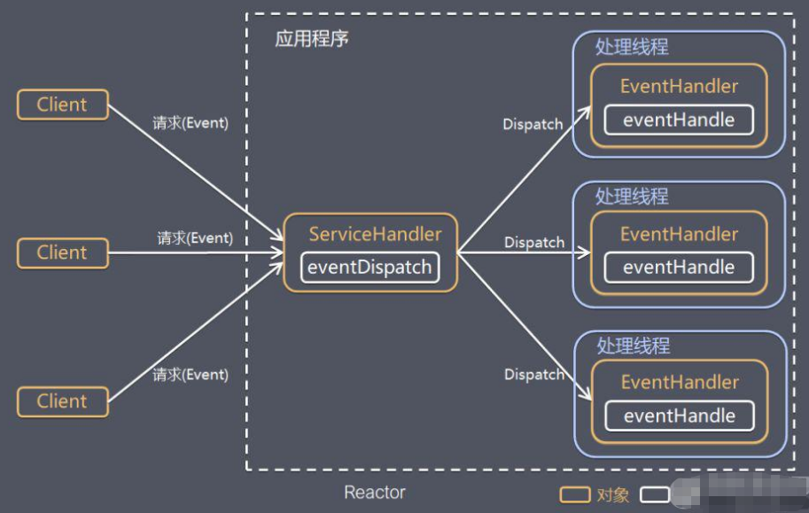
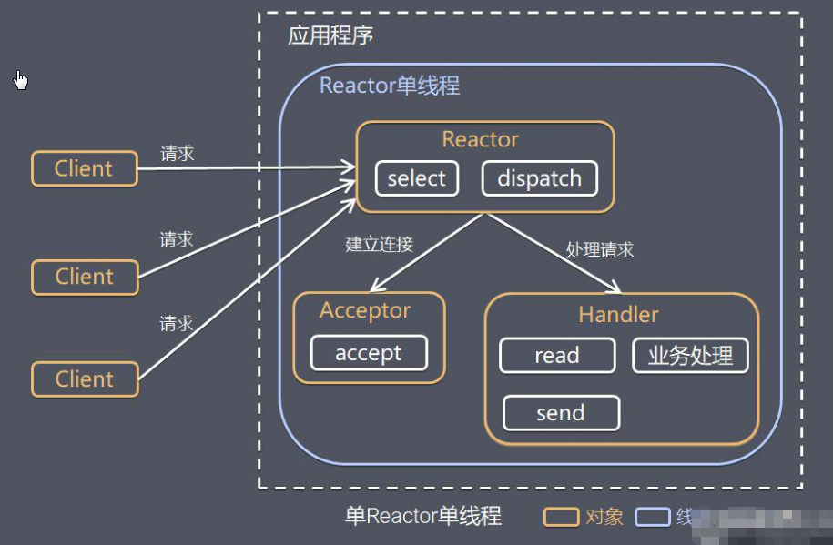
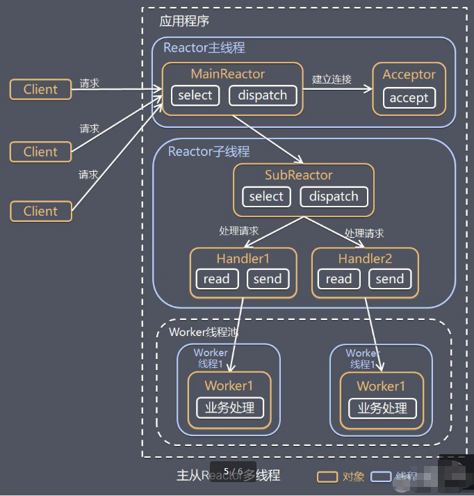

## Reactor 模式

- 针对传统阻塞 I/O 服务模型的两个缺点的解决方案：

  1. **基于 I/O 复用模型**：多个连接共用一个阻塞对象，应用程序只需要在一个阻塞对象等待，无需阻塞等待所有连接。当某个连接有新的数据可以处理时，操作系统通知应用程序，线程从阻塞状态返回，开始进行业务处理。
  2. **基于线程池复用线程资源**：不必再为每个连接创建线程，将连接完成后的业务处理任务分配给线程进行处理，一个线程可以处理多个连接的业务。

- 反应器模式、分发器模式(Dispatcher)、通知者模式(Notifier)

- 基本设计思想：**I/O 多路复用 + 线程池**

  - Reactor 模式，通过一个或多个输入同时传递给服务处理器的模式（基于事件驱动） 
  - 服务器端程序处理传入的多个请求，并将它们同步分发到相应的处理程序
  - Reactor 模式使用 IO 复用监听事件，收到事件后，分发给某个线程（进程）-----> 网络服务器高并发处理关键。 

  

- 核心组成：

  - **Reactor**：Reactor 在一个单独的线程中运行，负责监听和分发事件，分发给适当的处理程序来对 IO 事件做出反应。
  - **Handlers**：处理程序执行 IO 事件要完成的实际事件，Reactor 通过调度适当的处理程序来响应 IO 事件，处理程序执行非阻塞操作。

- 优点：

  - 响应快：不必为单个同步时间所阻塞，虽然 Reactor 本身依然是同步的
  - 可以最大程度的避免复杂的多线程及同步问题，并且避免了多线程/进程的切换开销
  - 扩展性好，可以方便的通过增加 Reactor 实例个数来充分利用 CPU 资源
  - 复用性好，Reactor 模型本身与具体事件处理逻辑无关，具有很高的复用性

### 单 Reactor 单线程模式

- Reactor 通过 select 监控客户端请求事件，收到事件后通过 dispatch 进行分发。
- 请求事件处理：
  - 建立连接请求事件：由 Acceptor 通过 Accept 处理连接请求，然后创建一个 Handler 对象处理连接完成后的后续业务处理。
  - 其他事件：Reactor 分发调用连接对应的 Handler 来响应。
- Handler 执行过程：Read ====> 业务处理 ===> Send

#### 优缺点

- 优点：模型简单，没有多线程、进程通信、竞争的问题，全部都在一个线程内完成。
- 缺点：
  - 性能：只有一个线程，无法发挥多核 CPU 的性能。handler 在处理某个连接上的业务时，整个进程无法处理其他连接事件，容易导致性能瓶颈。
  - 可靠性：线程意外终止，或者进入死循环，会导致整个系统通信模块不可用，不能接收和处理外部消息，造成节点故障。

### 单 Reactor 多线程模式

-  Reactor 对象通过 select 监控客户端请求事件，收到事件后，通过 dispatch 进行分发。
- 请求事件处理：
  - 如果是建立连接请求，则由 Acceptor 通过 accept 处理连接请求，然后创建一个 Handler 对象处理完成连接后的各种事件。
  - 其他请求，则由 reactor 分发调用连接对应的 Handler 来处理
- Handler 只负责响应事件，不做具体的业务处理，通过 read 读取数据后，会分发给后面的 worker 线程池的某个线程处理业务。
- worker 线程池会分配独立线程完成真正的业务，并将结果返回给 Handler。
- Handler 收到响应后，通过 send 将结果返回给 client。 

#### 优缺点

- 优点：可以充分利用多核 CPU 的处理能力。
- 缺点：多线程数据共享和访问比较复杂，reactor 处理所有的事件的监听和响应，在单线程运行，在高并发场景容易出现性能瓶颈。
  - 改进：让 Reactor 在多线程运行

### 主从 Reactor 多线程模式

1. Reactor 主线程 MainReactor 对象通过 select 监听连接事件，收到事件后，通过 Acceptor 处理连接事件。
2. 当 Acceptor 处理连接事件后，MainReactor 将连接分配给 SubReactor。
3. SubReactor 将连接加入到连接队列进行监听，并创建 Handler 进行各种事件处理。
4. 当有新事件发生时，SubReactor 就会调用对应的 Handler 处理。
5. Handler 通过 read 读取数据，分发给后面的 worker 线程处理。
6. worker 线程池分配独立的 worker 线程进行业务处理，并返回处理结果。
7. Handler 收到响应结果后，再通过 send 将结果返回给 client。
8. Reactor 主线程可以对应多个 Reactor 子线程，即 MainRecator 可以关联多个 SubReactor

#### 优缺点

- 优点：
  - 父线程与子线程的数据交互简单，职责明确，父线程只需要接收新连接，子线程完成后续的业务处理。
  - Reactor 主线程只需要把新连接传给子线程，子线程无需返回数据。
- 缺点：编程复杂度较高。

### 使用项目

- Nginx：主从 Reactor 多进程模型
- Memcached：主从多线程
- Netty：主从多线程模型
- Redis：