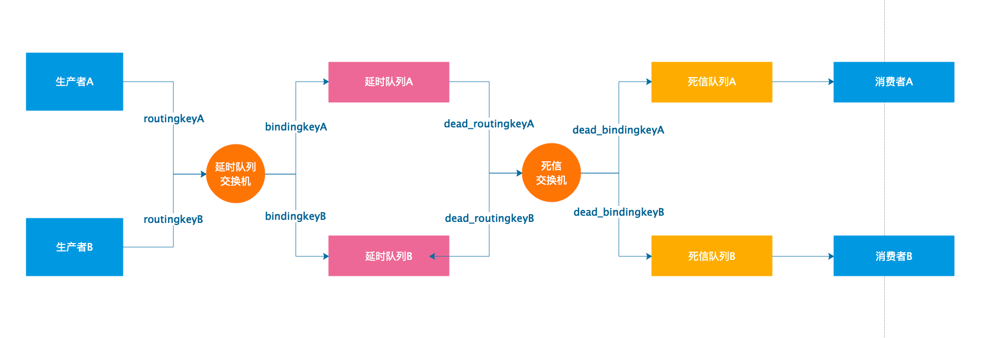
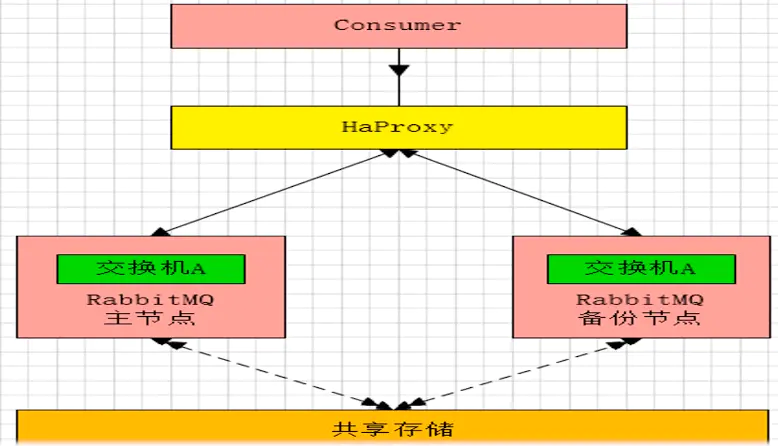
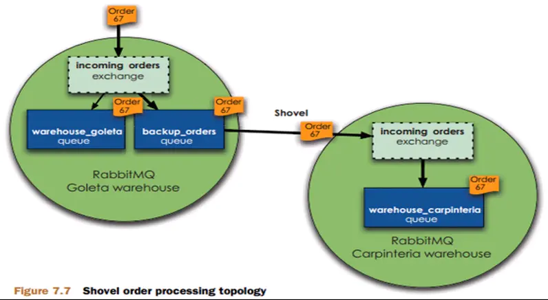
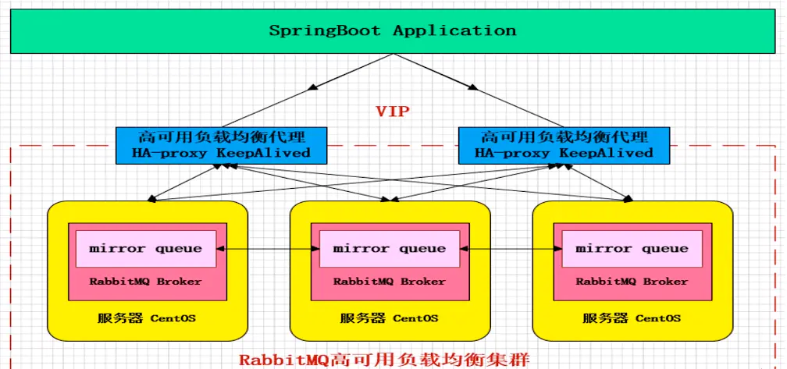
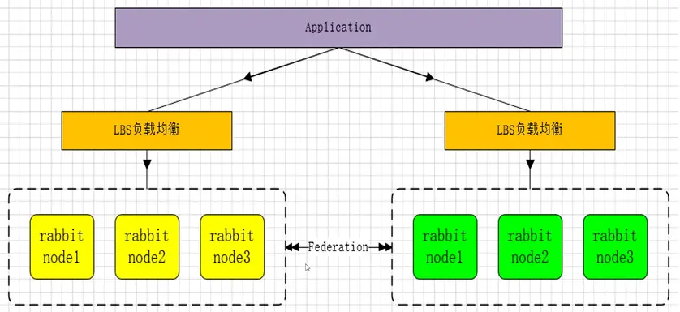
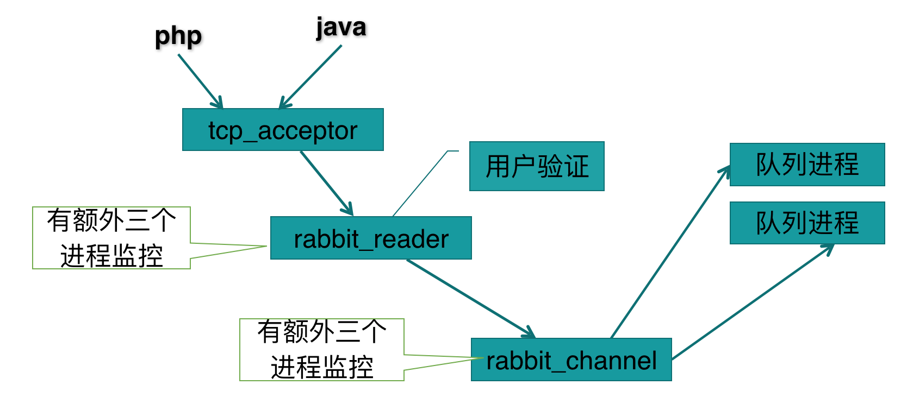
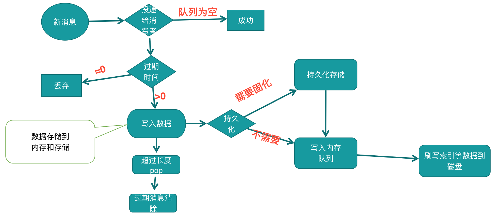

## 〇、RabbitMQ 安装

### 安装 erlang

- 获取 erlang 的 rpm 安装包

```shell
wget http://packages.erlang-solutions.com/erlang-solutions-1.0-1.noarch.rpm
rpm -Uvh erlang-solutions-1.0-1.noarch.rpm
```

- 如果这个地方这个源安装不了,请手动配置如下未使用）:

```shell
echo "[erlang-solutions]
#name=Centos $releasever - $basearch - Erlang Solutions
#baseurl=http://packages.erlang-solutions.com/rpm/centos/$releasever/$basearch
#gpgcheck=0
#gpgkey=http://packages.erlang-solutions.com/debian/erlang_solutions.asc
#enabled=1" >  /etc/yum.repos.d/erlang_solutions.repo
```

- 上述出问题：安装 epel（根据centOS选择版本）

```shell
wget http://mirrors.sohu.com/fedora-epel/epel-release-latest-6.noarch.rpm

rpm -ivh epel-release-latest-6.noarch.rpm
```

- **这里一定要先把 erl yum 一下，再remove掉，要不然不这么做的话，后面rabbitmq会安装不了**

```
yum install erlang -y
yum remove erlang -y
yum groupremove erlang -y
rm -f /usr/bin/erl

#下载指定的erlang版本并安装

wget wget http://erlang.org/download/otp_src_19.1.tar.gz
yum -y install make gcc gcc-c++ kernel-devel m4 ncurses-devel openssl-devel unixODBC unixODBC-devel wxWidgets wxWidgets-devel
yum install unixODBC unixODBC-devel -y
yum install wxWidgets wxWidgets-devel -y

tar -zxvf otp_src_19.1.tar.gz
cd otp_src_19.1
./configure --without-javac
make
make install
cd ../
#这里一定要做做一个软连接，要不然会找不到 erl 的
ln -s /usr/local/bin/erl /usr/bin/erl

```


### 安装 RabbitMQ

```
#下提rabbitmq指定版本rpm安装包
wget http://www.rabbitmq.com/releases/rabbitmq-server/v3.6.1/rabbitmq-server-3.6.1-1.noarch.rpm
rpm --import https://www.rabbitmq.com/rabbitmq-signing-key-public.asc
yum install rabbitmq-server-3.6.1-1.noarch.rpm -y

mkdir -p /data/rabbitmq
mkdir -p /data/rabbitmq/log/rabbit-mgmt
mkdir -p /data/rabbitmq/mnesia

chown -R rabbitmq:root /data/rabbitmq

NodeName=rabbitmqMyNodeName

touch -f /etc/rabbitmq/rabbitmq.config
echo "[
{mnesia, [{dump_log_write_threshold, 10000},{dump_log_time_threshold,20000}]},
{rabbit, [
    {num_tcp_acceptors,25},
    {vm_memory_high_watermark_paging_ratio, 0.5},
    {vm_memory_high_watermark, 0.5},
    {loopback_users, []},
    {queue_master_locator,<<\"min-masters\">>}
]},
{rabbitmq_management,
[{listener, [{port, 15672},{ip, \"0.0.0.0\"}]},
{http_log_dir,  \"/data/rabbitmq/log/rabbit-mgmt\"},
{rates_mode,    none}
]}
]." > /etc/rabbitmq/rabbitmq.config

echo "NODENAME=$NodeName@$NodeName
RABBITMQ_NODE_IP_ADDRESS=0.0.0.0
RABBITMQ_NODE_PORT=5672
RABBITMQ_LOG_BASE=/data/rabbitmq/log
RABBITMQ_MNESIA_BASE=/data/rabbitmq/mnesia" > /etc/rabbitmq/rabbitmq-env.conf

chkconfig rabbitmq-server on

#这里设置，这名字自己修改，并且要自己做好host

#1. echo “27.0.0.1   $NodeName” >> /etc/hosts
#2. vim /etc/hosts 
	ip $NodeName
```


- 启动 rabbitmq

```
rabbitmq-server -detached

#查看状态
rabbitmqctl status
```

- **开启5672 .15672. 4369 三个端口的防火墙**

```shell
vim /etc/sysconfig/iptables

# 配置 /etc/sysconfig/selinux 中的SELinux=disabled
vi /etc/sysconfig/selinux
# 重启防火墙
service iptables restart
```

- **启动rabbitmq插件**（启用第一个即可）

```shell
rabbitmq-plugins enable rabbitmq_management
rabbitmq-plugins enable rabbitmq_shovel
rabbitmq-plugins enable rabbitmq_shovel_management
```

- 添加用户，修改权限

```sh
rabbitmqctl add_user zhoushikang zhoushikang
rabbitmqctl set_permissions -p / zhoushikang ".*" ".*" ".*"
rabbitmqctl set_user_tags zhoushikang administrator
```


## 一、RabbitMQ 集群搭建

### RabbitMQ 模式

- RabbitMQ 模式大概分为三种：
  - 单一模式。
  - 普通模式（默认的集群模式）
  - **镜像模式**：把需要的队列做成镜像队列，存在与多个节点，属于 RabbitMQ 的 HA 方案，在对业务可靠性要求较高的场合中比较常用。
    - 要实现镜像模式，需要先搭建一个普通集群模式，在这个模式的基础上再配置镜像模式以实现高可用。
- **RabbitMQ 的集群节点包括内存节点、磁盘节点**。


### 集群部署

- **在所有 rabbitmq 节点上设置，将 cookie 写到 /var/lib/rabbitmq/.erlang.cookie 文件，并且设这个文件只有可读权限**

```
COOKIE=CQIRJLLIHWWVXCSRHQUH
echo $COOKIE > /var/lib/rabbitmq/.erlang.cookie
chown R rabbitmq:rabbitmq /var/lib/rabbitmq/.erlang.cookie
chmod a-w /var/lib/rabbitmq/.erlang.cookie
chmod o-r /var/lib/rabbitmq/.erlang.cookie
chmod g-r /var/lib/rabbitmq/.erlang.cookie
```

- 然后启动所有 rabbitmq 节点

```
/etc/init.d/rabbitmq-server restart
```

#### 案例

- 假如机器部署情况如下:

  192.168.234.133 rabbitmq01

  192.168.234.134 rabbitmq02

  192.168.234.135 rabbitmq03

- 以 rabbitmq01 作 cluster 集群主节点，在 192.168.234.134，192.168.234.135 机器上运行

```
rabbitmqctl stop_app
rabbitmqctl join_cluster rabbitmq01@rabbitmq01
rabbitmqctl start_app
```


## 二、RabbitMQ 基本概念

### ConnectionFactory、Connection、Channel

- ConnectionFactory、Connection、Channel 都是 RabbitMQ 对外提供的 API中 最基本的对象。
  - Connection 是 **RabbitMQ 的 socket 链接**，它封装了 socket 协议相关部分逻辑。
  - ConnectionFactory 为 Connection 的创建工厂。
  - Channel 是我们与 RabbitMQ 打交道的最重要的一个接口，我们大部分的业务操作是在 Channel 这个接口中完成的，包括定义 Queue、定义 Exchange、绑定 Queue 与 Exchange、发布消息等。
- **为什么使用 Channel，而不是直接使用 TCP 连接？**
  - 对于 OS 来说，建立和关闭 TCP 连接是有代价的，频繁的建立关闭 TCP 连接对于系统的性能有很大的影响，而且 TCP 的连接数也有限制，这也限制了系统处理高并发的能力。
  - 但是，**在 TCP 连接中建立 Channel 是没有上述代价的**。对于 Producer 或者 Consumer 来说，可以并发的使用多个 Channel 进行 Publish 或者 Receive。
  - 有实验表明，1s 的数据可以 Publish 10K 的数据包。当然对于不同的硬件环境，不同的数据包大小这个数据肯定不一样，而对于普通的 Consumer 或者 Producer 来说，这已经足够了。如果不够用，你考虑的应该是如何细化 split 你的设计。

### Queue

- Queue（队列）是 RabbitMQ 的内部对象，用于存储消息。

- **RabbitMQ 中的消息都只能存储在 Queue 中**，生产者生产消息并最终投递到 Queue 中，消费者可以从 Queue 中获取消息并消费。

- 多个消费者可以订阅同一个 Queue，这时 Queue 中的消息会被**平均分摊**给多个消费者进行处理，而不是每个消费者都收到所有的消息并处理。

- **声明 MessageQueue**

  > - 在 RabbitMQ 中，无论是生产者发送消息还是消费者接受消息，都首先需要声明一个 MessageQueue。这就存在一个问题，是生产者声明还是消费者声明呢？要解决这个问题，首先需要明确：
  >   - 消费者无法订阅或者获取不存在的 MessageQueue 中的信息。
  >   - **消息被 Exchange 接受以后，如果没有匹配的 Queue，则会被丢弃。**
  > - 如果是消费者去声明 Queue，就有可能会出现在声明 Queue 之前，生产者已发送的消息被丢弃的隐患。
  > - 如果一个消费者在一个信道(channel)中正在监听某一个队列的消息，RabbitMQ 是不允许该消费者在同一个 channel 去声明其他队列的。
  > - RabbitMQ 中，可以通过 queue.declare 命令声明一个队列，可以设置该队列以下属性:
  >   1. **Exclusive：排他队列**，如果一个队列被声明为排他队列，该队列仅对首次声明它的连接可见，并在连接断开时自动删除。需要注意三点：
  >      1. **排他队列是基于连接可见的**，同一连接的不同信道是可以同时访问同一个连接创建的排他队列的。
  >      2. “首次”，如果一个连接已经声明了一个排他队列，其他连接是不允许建立同名的排他队列的，这个与普通队列不同。
  >      3. 即使该队列是持久化的，一旦连接关闭或者客户端退出，该排他队列都会被自动删除的。这种队列适用于只限于一个客户端发送读取消息的应用场景。
  >   2. **Auto-delete: 自动删除**，如果该队列没有任何订阅的消费者的话，该队列会被自动删除。这种队列适用于临时队列。
  >   3. **Durable:  持久化**。
  >   4. 其他选项，例如如果用户仅仅想**查询某一个队列是否已存在**，如果不存在，不想建立该队列，仍然可以调用 queue.declare，只不过需要将参数 passive 设为 true，传给 queue.declare，如果该队列已存在，则会返回 true；如果不存在，则会返回 Error，但是不会创建新的队列。
  >   
>   
  
  

### Message acknowledgment

- 在实际应用中，可能会发生消费者收到 Queue 中的消息，但没有处理完成就宕机（或出现其他意外）的情况，这种情况下就可能会导致消息丢失。
- 为了避免这种情况发生，我们可以要求消费者在消费完消息后发送一个回执给 RabbitMQ，RabbitMQ 收到消息回执（Message acknowledgment）后才将该消息从 Queue 中移除；
- 如果 RabbitMQ 没有收到回执并检测到消费者的 RabbitMQ 连接断开，则 RabbitMQ 会将该消息发送给其他消费者（如果存在多个消费者）进行处理。这里不存在 timeout 概念，**一个消费者处理消息时间再长也不会导致该消息被发送给其他消费者，除非它的RabbitMQ连接断开。**
- 这里会产生另外一个问题，如果我们的开发人员在处理完业务逻辑后，**忘记发送回执给 RabbitMQ**，这将会导致严重的 bug——Queue 中堆积的消息会越来越多；消费者重启后会重复消费这些消息并重复执行业务逻辑…

### Message durability（持久化）

- 如果我们希望即使在 RabbitMQ 服务重启的情况下，也不会丢失消息，我们可以将 Queue 与 Message 都设置为可持久化的（durable），这样可以保证绝大部分情况下我们的 RabbitMQ 消息不会丢失。
- 但依然解决不了小概率丢失事件的发生（比如 RabbitMQ 服务器已经接收到生产者的消息，但还没来得及持久化该消息时 RabbitMQ 服务器就断电了），如果我们需要对这种小概率事件也要管理起来，那么我们要用到事务。

### Prefetch count（消息处理时间不同）

- 如果有多个消费者同时订阅同一个 Queue 中的消息，Queue 中的消息会被平摊给多个消费者。这时如果每个消息的处理时间不同，就有可能会导致某些消费者一直在忙，而另外一些消费者很快就处理完手头工作并一直空闲的情况。
- 我们可以通过设置 prefetchCount 来限制 Queue 每次发送给每个消费者的消息数，比如我们设置 prefetchCount = 1，则 Queue 每次给每个消费者发送一条消息；消费者处理完这条消息后 Queue 会再给该消费者发送一条消息。

### routing key

- 生产者在将消息发送给 Exchange 的时候，一般会指定一个routing key，来指定这个消息的路由规则，而这个 routing key 需要与 Exchange Type 及 binding key 联合使用才能最终生效。
- 在 Exchange Type 与 binding key 固定的情况下（在正常使用时一般这些内容都是固定配置好的），我们的**生产者就可以在发送消息给 Exchange 时，通过指定 routing key 来决定消息流向哪里。**
- RabbitMQ 为 routing key 设定的长度限制为 255 bytes。

### Binding

- RabbitMQ 中通过 Binding 将 Exchange 与 Queue 关联起来，这样 RabbitMQ 就知道如何正确地将消息路由到指定的 Queue 了。

### Binding key

- 在绑定（Binding）Exchange 与 Queue 的同时，一般会指定一个 binding key；消费者将消息发送给 Exchange 时，一般会指定一个 routing key；当 binding key 与 routing key 相匹配时，消息将会被路由到对应的 Queue 中。
- 在绑定多个 Queue 到同一个 Exchange 的时候，这些 Binding 允许使用相同的 binding key。
- binding key 并不是在所有情况下都生效，它依赖于 Exchange Type，比如 **fanout 类型的 Exchange 就会无视 binding key，而是将消息路由到所有绑定到该Exchange 的 Queue。**

### Exchange Types

RabbitMQ 常用的 Exchange Type 有 fanout、direct、topic、headers 这四种（AMQP规范里还提到两种Exchange Type，分别为 system 与自定义）

- fanoutExchange
  - fanout 类型的 Exchange 路由规则非常简单，它会把所有发送到该 Exchange 的消息路由到所有与它绑定的 Queue 中。
- directExchange
  - direct 类型的 Exchange 路由规则也很简单，它会把消息路由到那些 binding key 与 routing key 完全匹配的 Queue 中。
  - **DirectExchange 实现了轮询的方式对消息进行消费，而且不存在重复消费。**
- topicExchange
  - direct 类型的 Exchange 路由规则是完全匹配 binding key 与 routing key，但这种严格的匹配方式在很多情况下不能满足实际业务需求。
  - topic 类型的 Exchange 在匹配规则上进行了扩展，它与 direct 类型的 Exchage相似，也是将消息路由到 binding key 与 routing key 相匹配的Queue中，但这里的匹配规则有些不同，它约定：
    - routing key 为一个句点号“. ”分隔的字符串（我们将被句点号“. ”分隔开的每一段独立的字符串称为一个单词），如“stock.usd.nyse”、“nyse.vmw”、“quick.orange.rabbit”
    - binding key与routing key一样也是句点号“. ”分隔的字符串
    - binding key中可以存在两种特殊字符“*”与“#”，用于做模糊匹配，其中“*”用于匹配一个单词，“#”用于匹配多个单词（可以是零个）
- headers
  - headers 类型的 Exchange 不依赖于 routing key 与 binding key 的匹配规则来路由消息，而是根据发送的消息内容中的 headers 属性进行匹配。
  - 在绑定 Queue 与 Exchange 时指定一组键值对；当消息发送到 Exchange 时，RabbitMQ 会取到该消息的 headers（也是一个键值对的形式），对比其中的键值对是否完全匹配 Queue 与 Exchange 绑定时指定的键值对；如果完全匹配则消息会路由到该 Queue，否则不会路由到该 Queue。

### Vhost

- vhost 本质上是一个 mini 版的 RabbitMQ 服务器，拥有自己的 connection、queue（队列）、binding（绑定）、exchange（交换器）、user permission（权限控制）、policies（策略）。
- vhost 通过在各个实例间**提供逻辑上分离**，允许你为不同应用程序安全保密地运行数据。
- vhost 是 AMQP 概念的基础，必须在连接时进行指定，RabbitMQ 包含了默认 vhost：“/”；
- 当在 RabbitMQ 中创建一个用户时，用户通常会被指派给至少一个 vhost，并且只能访问被指派 vhost 内的队列、交换器和绑定，**vhost 之间是绝对隔离的**。


### RPC

- MQ 本身是基于异步的消息处理，所有的生产者（P）将消息发送到 RabbitMQ 后不会知道消费者（C）处理成功或者失败（甚至连有没有消费者来处理这条消息都不知道）。
- 但实际的应用场景中，我们很可能需要一些同步处理，需要同步等待服务端将我的消息处理完成后再进行下一步处理。这相当于 RPC（Remote Procedure Call，远程过程调用）。在 RabbitMQ 中也支持 RPC。
- **RabbitMQ 中实现 RPC 的机制是：**
  - 客户端发送请求（消息）时，在消息的属性（MessageProperties，在 AMQP 协议中定义了 14 种 properties，这些属性会随着消息一起发送）中设置两个值 **replyTo**（一个 Queue 名称，用于告诉服务器处理完成后将通知我的消息发送到这个 Queue 中）和 **correlationId**（此次请求的标识号，服务器处理完成后需要将此属性返还，客户端将根据这个 id 了解哪条请求被成功执行了或执行失败）
  - 服务器端收到消息并处理
  - 服务器端处理完消息后，将生成一条应答消息到 replyTo 指定的 Queue，同时带上 correlationId 属性
  - 客户端之前已订阅 replyTo 指定的 Queue，从中收到服务器的应答消息后，根据其中的 correlationId 属性分析哪条请求被执行了，根据执行结果进行后续业务处理

### RabbitMQ Server

- 也叫 broker server，是一种传输服务。
- 他的角色就是维护一条从 Producer 到 Consumer 的路线，保证数据能够按照指定的方式进行传输。这个保证不是 100% 的保证，但是对于普通的应用来说这已经足够了。
- 对于商业系统来说，可以再做一层数据一致性的 guard，就可以彻底保证系统的一致性了。

### Producer

- Producer，数据的发送方。create messages and publish (send) them to a broker server (RabbitMQ)

- 一个 Message 有两个部分：payload（有效载荷）和 label（标签）。payload 顾名思义就是传输的数据。label 是 exchange 的名字或者说是一个 tag，它描述了 payload，而且 RabbitMQ 也是通过这个 label 来决定把这个 Message 发给哪个 Consumer。AMQP 仅仅描述了 label，而 RabbitMQ 决定了如何使用这个 label 的规则。

- **生产者发送消息**

  > - 在 AMQP 模型中，**Exchange 是接受生产者消息并将消息路由到消息队列的关键组件。**ExchangeType 和 Binding 决定了消息的路由规则。所以生产者想要发送消息，首先必须要声明一个Exchange 和该 Exchange 对应的 Binding。可以通过 ExchangeDeclare 和 BindingDeclare 完成。
  > - 在 RabbitMQ 中，声明一个 Exchange 需要三个参数：ExchangeName，ExchangeType 和 Durable。
  >   - ExchangeName 是该 Exchange 的名字，该属性在创建 Binding 和生产者通过 publish 推送消息时需要指定。
  >   - ExchangeType，指 Exchange 的类型，在 RabbitMQ 中，主要有三种类型的 Exchange：direct ，fanout 和 topic，不同的 Exchange 会表现出不同路由行为。
  >   - Durable 是该 Exchange 的持久化属性，在需要做消息持久化时指定。声明一个 Binding 需要提供一个 QueueName，ExchangeName 和 BindingKey（RoutingKey）。

### Consumer

- Consumer，数据的接收方。Consumers attach to a broker server (RabbitMQ) and subscribe to a queue。

- 在经过 broker server 的 Message 中，只有 payload，label 已经被删掉了。**对于 Consumer 来说，它是不知道谁发送的这个信息的。**协议本身不支持。如果 Producer 发送的 payload 包含了 Producer 的信息就另当别论了。

-  **消费者订阅消息**

  > -  在 RabbitMQ 中消费者有 2 种方式获取队列中的消息:
  >   1. 一种是通过 basic.consume 命令，订阅某一个队列中的消息，channel 会自动在处理完上一条消息之后，接收下一条消息。（同一个 channel 消息处理是串行的）。除非关闭 channel 或者取消订阅，否则客户端将会一直接收队列的消息。
  >   2. 另外一种方式是通过 basic.get 命令主动获取队列中的消息，但是绝对不可以通过循环调用 basic.get 来代替 basic.consume，这是因为 basic.get RabbitMQ 在实际执行的时候，是首先 consume 某一个队列，然后检索第一条消息，然后再取消订阅。如果是高吞吐率的消费者，最好还是建议使用 basic.consume。
  > - 如果有多个消费者同时订阅同一个队列的话，RabbitMQ 是**采用循环（轮询）的方式分发消息**的，每一条消息只能被一个订阅者接收。


### 消息持久化（Exchange、Queue、Message）

- RabbitMQ 默认是**不持久队列、Exchange、Binding 以及队列中的消息**的，这意味着一旦消息服务器重启，所有已声明的队列、Exchange、Binding 以及队列中的消息都会丢失。
- 通过设置 Exchange 和 MessageQueue 的 durable 属性为 true，可以使得队列和 Exchange 持久化，但是这还不能使得队列中的消息持久化，这需要生产者在发送消息的时候，将 delivery mode 设置为2，只有这 3 个全部设置完成后，才能保证服务器重启不会对现有的队列造成影响。
- 这里需要注意的是，只有 durable 为 true 的 Exchange 和 durable 为 true 的 Queues 才能绑定，否则在绑定时，RabbitMQ 都会抛错的。持久化会对 RabbitMQ 的性能造成比较大的影响，可能会下降 10 倍不止。

### 事务

- 对事务的支持是 AMQP 协议的一个重要特性。假设当生产者将一个持久化消息发送给服务器时，因为 consume 命令本身没有任何 Response 返回，所以即使服务器崩溃，没有持久化该消息，生产者也无法获知该消息已经丢失。
- 如果此时使用事务，即通过 txSelect() 开启一个事务，然后发送消息给服务器，然后通过 txCommit() 提交该事务，即可以保证，如果 txCommit() 提交了，则该消息一定会持久化，如果 txCommit() 还未提交即服务器崩溃，则该消息不会服务器就收。RabbitMQ 也提供了 txRollback() 命令用于回滚某一个事务。

### Confirm 机制

- 使用事务固然可以保证只有提交的事务，才会被服务器执行。但是这样同时也将客户端与消息服务器同步起来，这**背离了消息队列解耦的本质**。
- RabbitMQ 提供了一个更加轻量级的机制来保证生产者可以感知服务器消息是否已被路由到正确的队列中——**Confirm**。如果设置 channel 为 confirm 状态，则通过该 channel 发送的消息都会被分配一个唯一的 ID，然后一旦该消息被正确的路由到匹配的队列中后，服务器会返回给生产者一个 Confirm，该 Confirm 包含该消息的 ID，这样生产者就会知道该消息已被正确分发。**对于持久化消息，只有该消息被持久化后，才会返回 Confirm。**
- **Confirm 机制的最大优点在于异步**，生产者在发送消息以后，即可继续执行其他任务。而服务器返回 Confirm 后，会触发生产者的回调函数，生产者在回调函数中处理 Confirm 信息。如果消息服务器发生异常，导致该消息丢失，会返回给生产者一个 nack，表示消息已经丢失，这样生产者就可以通过重发消息，保证消息不丢失。Confirm 机制在性能上要比事务优越很多。
- 但是 Confirm 机制，无法进行回滚，就是一旦服务器崩溃，生产者无法得到 Confirm 信息，生产者其实本身也不知道该消息是否已经被持久化，只有继续重发来保证消息不丢失，但是如果原先已经持久化的消息，并不会被回滚，这样队列中就会存在两条相同的消息，**系统需要支持去重**。

### Shovel

-  Shovel 能够可靠、持续地从一个 Broker 中的队列（作为源端，即 source）拉取数据并转发至另一个 Broker 中的交换器（作为目的端，即 destination）。
   作为源端的队列和作为目的端的交换器可以同时位于同一个 Broker 上，也可以位于不同的 Broker 上。

- **Shovel 的使用**

  > - Shovel 插件默认也在 RabbitMQ 的发布包中，执行 `rabbitmq-plugins enable rabbitmq_shovel`命令可以开启 Shovel 功能。
  > - 开启 rabbitmq shovel management 插件之后， 在 RabbitMQ 的管理界面中" Admin"的右侧会多出"Shovel Status" 和" Shovel Management " 两个 Tab 页。`rabbitmq-plugins enable rabbitmq_shovel_management`
  > - Shovel 既可以部署在源端，也可以部署在目的端。有两种方式可以部署 Shovel：
  >   - 静态方式：在 `rabbitmq.config` 配置文件中设置
  >   - 动态方式：通过 Runtime Parameter 设置

### Policy

- Policies 的作用
  - 通常来说，我们会在创建一个 Queue 时指定了队列的各项属性和参数，例如 message-ttl、x-dead-letter-exchange、x-dead-letter-route-key、x-max-length 等，一旦 RabbitMQ 创建Queue成功，则不允许再修改 Queue 的任何属性或参数，除非删除重建。 我们**在实际使用中，随着业务的变化，经常会出现需要调整 message-ttl、x-max-length 等参数来改变 Queue 行为的场景**，那这个时候怎么办呢，总不能暂停上下游的生产者和消费者来等 Queue 的删除重建吧？这个时候就需要使用到 RabbitMQ 的 Policy 机制了。
- Operator Policy 和 User Policy 的区别：
  1. Operator Policy 是给服务提供商或公司基础设施部门用来设置某些需要强制执行的通用规则 
  2. User Policy 是给业务应用用来设置的规则
- Policies 之间的优先级 在设置 Policy 时需要注意，因为 Policy 是根据 parttern 匹配队列的，因此可能会出现多个 Policy 都匹配到某一个队列的情况，此时会依据以下规则进行排序选出实际生效的 Policy： 
  1. 首先根据 priority 排序，值越大的优先级越高； 
  2. 相同 priority 则根据创建时间排序，越晚创建的优先级越高。

### Heartbeat

- 操作系统检测到 TCP 断开是一个适中的时间（在 Linux 中默认时长是 11 分钟）。AMQP 0-9-1 提供心跳检测功能来确保应用层及时发现中断的连接（或者是完全没有工作的连接）。 心跳检测还能保护连接不会在一段时间内没有活动而被终止。

- 心跳超时间隔

  - heartbeat timeout 值决定了 TCP 相互连接的最大时间，超过这个时间，该连接将被 RabbitMQ 和 客户端当作不可到达。这个值是**在 RabbitMQ 服务器和客户端连接的时候协商**的。客户端需要配置请求心跳检测。RabbotMQ 3.0 及以上的版本中，RabbitMQ 默认设置与客户端之间的心跳时长为 60 秒（3.5.5 版本之前的默认值为 580）。
  - 心跳帧每隔 timeout/2 时间会发送一次。**连续两次心跳失败后，连接将会当作不可到达**。不同客户端对此的表现不同，但是 TCP 连接都会关闭。当客户端检测到 RabbitMQ 服务节点不可到达，它需要重新发起连接。
  - 任何连接数据交换（例如 协议操作、发布消息、[消息确认](https://link.jianshu.com?t=https%3A%2F%2Fwww.rabbitmq.com%2Fconfirms.html)）都会计入有效的心跳。客户端可能也会发送心跳包，在连接中有其他数据交换，但有些只在需要时发送心跳包。
  - 可以设置 timeout 为 0 来禁用心跳检测功能。不推荐这么做。

- 除非使用 TCP 保持连接来代替，并且必须在足够短的不活动检测期间内使用， 否则***强烈不建议禁用心跳***。如果禁用了心跳，则及时检测对等方不可用性的可能性将大大降低。这*将对数据安全构成重大风险*，尤其是对发布者而言。

- 将 heartbeat timeout 值设置得太低，可能会导致由于网络瞬态拥塞，服务器流量控制寿命短暂等原因导致误报。对于大多数环境，**5 到 20 秒范围内的值是最佳的**。

- Heartbeat 和 TCP 代理

  > - 当某些网络工具（HAproxy，AWS ELB）和设备（硬件负载平衡器）在一段时间内没有任何活动时，可能会终止“空闲” TCP 连接。在大多数情况下，这是不可取的。
  > - 在连接上启用心跳后，将导致周期性的轻型网络流量。因此，**心跳具有保护客户端连接的副作用，该客户端连接可能会闲置一段时间，以防止代理和负载平衡器过早关闭**。
  > - 心跳超时为 30 秒时，连接将大约每 15 秒产生一次周期性的网络流量。5 到 15 秒范围内的活动足以满足大多数流行的代理和负载平衡器的默认设置。另请参见上面有关低超时和误报的部分。

### rabbitmq 脑裂问题

- **实质上是个网络分区问题**， 确切来说是网络不稳定导致的问题。rabbitmq 集群的网络分区容错性不好，在网络比较差的情况下容易出错，最明显的就是脑裂问题了。
- 所谓的脑裂问题，就是在多机集群中节点与节点之间失联，**都认为对方出现故障，而自身裂变为独立的个体，各自为政，那么就出现了抢夺对方的资源**，争抢启动，至此就发生了事故。
- 如何恢复
  - 人力干扰
    1. 部分重启。选择受信分区即网络环境好的分区，重启其他分区，让他们重新加入受信分区中，之后再重启受信分区，消除警告⚠️
    2. 全部重启。停掉整个集群，然后启动，不过要**保证第一个启动的是受信分区**。不然还没等所有节点加入，自己就挂了。
  - 自动处理（rabbitmq 提供了 3 种模式）
    1. ignore 默认配置，即分区不做任何处理。要使用这种，就要保证网络高可用，例如，节点都在一个机架上，用的同一个交换机，这个交换机连上一个WAN，保证网络稳定。
    2. pause_minority。优先暂停‘少数派’。就是节点判断自己在不在‘少数派’（少于或者等于集群中一半的节点数），在就自动关闭，保证稳定区的大部分节点可以继续运行。
    3. autoheal， 关闭客户端连接数最多的节点。 rabbitmq 会自动挑选一个‘获胜’分区，即连接数最小的，重启其他分区。（如果平手，就选节点多的，如果节点也一致，那就以未知方式挑选‘获胜者’）。这个更关心服务的连续性而不是数据的完整性。

### RabbitMQ 端口解析

- **4369 (epmd), 25672 (Erlang distribution)**

  Epmd 是 Erlang Port Mapper Daemon 的缩写，在 Erlang 集群中相当于 dns 的作用，绑定在 4369 端口上。

  **4369 -- erlang 发现口			25672 -- server 间内部通信口**

- **15672 (if management plugin is enabled)**

  通过 `http://serverip:15672` 访问 RabbitMQ 的 Web 管理界面，默认用户名密码都是 guest。

  15672 -- 管理界面 ui 端口

- **5672, 5671 (AMQP 0-9-1 without and with TLS)** 

  基于 AMQP 协议的客户端与消息中间件之间可以传递消息，并不受客户端/中间件不同产品、不同的开发语言等条件的限制。

  5672 -- 客户端通信口


### 死信队列

- 什么是死信队列

  - “死信”是 RabbitMQ 中的一种消息机制，当你在消费消息时，如果队列里的消息出现以下情况：
    1. 消息被否定确认，使用 `channel.basicNack` 或 `channel.basicReject` ，并且此时`requeue` 属性被设置为`false`。
    2. 消息在队列的存活时间超过设置的 TTL 时间。
    3. 消息队列的消息数量已经超过最大队列长度。
  - 那么该消息将成为“死信”。“死信”消息会被 RabbitMQ 进行特殊处理，如果配置了死信队列信息，那么该消息将会被丢进死信队列中，如果没有配置，则该消息将会被丢弃。

- 如何配置死信队列

  - 如何配置死信队列呢？大概可以分为以下步骤：

    1. 配置业务队列，绑定到业务交换机上
    2. 为业务队列配置死信交换机和 RoutingKey
    3. 为死信交换机配置死信队列

  - 为每个需要使用死信的业务队列配置一个死信交换机，这里同一个项目的死信交换机可以共用一个，然后为每个业务队列分配一个单独的路由 key。

  - **死信队列并不是什么特殊的队列，只不过是绑定在死信交换机上的队列。死信交换机也不是什么特殊的交换机，只不过是用来接受死信的交换机，所以可以为任何类型【Direct、Fanout、Topic】**。一般来说，会为每个业务队列分配一个独有的路由 key，并对应的配置一个死信队列进行监听，也就是说，一般会为每个重要的业务队列配置一个死信队列。

  - 代码 Demo

    -  RabbitMqConfig

      ```java
      /**
       * @author zhoushikang
       * @since 2020/8/6
       * 声明了两个Exchange，一个是业务Exchange，另一个是死信Exchange，
       * 业务Exchange下绑定了两个业务队列，业务队列都配置了同一个死信Exchange，并分别配置了路由key，
       * 在死信Exchange下绑定了两个死信队列，设置的路由key分别为业务队列里配置的路由key。
       */
      @Configuration
      public class RabbitMqConfig {
      
          public static final String BUSINESS_EXCHANGE_NAME = "dead.letter.demo.simple.business.exchange";
          public static final String BUSINESS_QUEUEA_NAME = "dead.letter.demo.simple.business.queuea";
          public static final String BUSINESS_QUEUEB_NAME = "dead.letter.demo.simple.business.queueb";
          public static final String DEAD_LETTER_EXCHANGE = "dead.letter.demo.simple.deadletter.exchange";
          public static final String DEAD_LETTER_QUEUEA_ROUTING_KEY = "dead.letter.demo.simple.deadletter.queuea.routingkey";
          public static final String DEAD_LETTER_QUEUEB_ROUTING_KEY = "dead.letter.demo.simple.deadletter.queueb.routingkey";
          public static final String DEAD_LETTER_QUEUEA_NAME = "dead.letter.demo.simple.deadletter.queuea";
          public static final String DEAD_LETTER_QUEUEB_NAME = "dead.letter.demo.simple.deadletter.queueb";
      
          /**
           * 声明业务 Exchange
           * @return
           */
          @Bean("businessExchange")
          public FanoutExchange businessExchange() {
              return new FanoutExchange(BUSINESS_EXCHANGE_NAME);
          }
      
          /**
           * 声明死信 Exchange
           * @return
           */
          @Bean("deadLetterExchange")
          public DirectExchange deadLetterExchange() {
              return new DirectExchange(DEAD_LETTER_EXCHANGE);
          }
      
          /**
           * 声明业务队列 A
           * @return
           */
          @Bean("businessQueueA")
          public Queue businessQueueA() {
              Map<String, Object> args = new HashMap<>(2);
              // x-dead-letter-exchange       这里声明当前队列绑定的死信交换机
              args.put("x-dead-letter-exchange", DEAD_LETTER_EXCHANGE);
              // x-dead-letter-routing-key    这里声明当前队列的死信路由 key
              args.put("x-dead-letter-routing-key", DEAD_LETTER_QUEUEA_ROUTING_KEY);
              return QueueBuilder.durable(BUSINESS_QUEUEA_NAME).withArguments(args).build();
          }
      
          /**
           * 声明业务队列 B
           * @return
           */
          @Bean("businessQueueB")
          public Queue businessQueueB() {
              Map<String, Object> args = new HashMap<>(2);
              // x-dead-letter-exchange       这里声明当前队列绑定的死信交换机
              args.put("x-dead-letter-exchange", DEAD_LETTER_EXCHANGE);
              // x-dead-letter-routing-key    这里声明当前队列的死信路由 key
              args.put("x-dead-letter-routing-key", DEAD_LETTER_QUEUEB_ROUTING_KEY);
              return QueueBuilder.durable(BUSINESS_QUEUEB_NAME).withArguments(args).build();
          }
      
          /**
           * 声明死信队列 A
           * @return
           */
          @Bean("deadLetterQueueA")
          public Queue deadLetterQueueA() {
              return new Queue(DEAD_LETTER_QUEUEA_NAME);
          }
      
          /**
           * 声明死信队列 B
           * @return
           */
          @Bean("deadLetterQueueB")
          public Queue deadLetterQueueB() {
              return new Queue(DEAD_LETTER_QUEUEB_NAME);
          }
      
          /**
           * 声明业务队列A绑定关系
           * @param queue
           * @param exchange
           * @return
           */
          @Bean
          public Binding businessBindingA(@Qualifier("businessQueueA") Queue queue,
                                          @Qualifier("businessExchange") FanoutExchange exchange) {
              return BindingBuilder.bind(queue).to(exchange);
          }
      
          /**
           * 声明业务队列B绑定关系
           * @param queue
           * @param exchange
           * @return
           */
          @Bean
          public Binding businessBindingB(@Qualifier("businessQueueB") Queue queue,
                                          @Qualifier("businessExchange") FanoutExchange exchange) {
              return BindingBuilder.bind(queue).to(exchange);
          }
      
          /**
           * 声明死信队列A绑定关系
           * @param queue
           * @param exchange
           * @return
           */
          @Bean
          public Binding beadLetterBindingA(@Qualifier("deadLetterQueueA") Queue queue,
                                          @Qualifier("deadLetterExchange") DirectExchange exchange) {
              return BindingBuilder.bind(queue).to(exchange).with(DEAD_LETTER_QUEUEA_ROUTING_KEY);
          }
      
          /**
           * 声明死信队列B绑定关系
           * @param queue
           * @param exchange
           * @return
           */
          @Bean
          public Binding beadLetterBindingB(@Qualifier("deadLetterQueueB") Queue queue,
                                            @Qualifier("deadLetterExchange") DirectExchange exchange) {
              return BindingBuilder.bind(queue).to(exchange).with(DEAD_LETTER_QUEUEB_ROUTING_KEY);
          }
      
      }
      ```

    - BusinessMessageReceiver

      ```java
      /**
       * @author zhoushikang
       * @since 2020/8/6
       * 业务队列的消费者
       */
      @Component
      public class BusinessMessageReceiver {
      
          public static final String BUSINESS_QUEUEA_NAME = "dead.letter.demo.simple.business.queuea";
          public static final String BUSINESS_QUEUEB_NAME = "dead.letter.demo.simple.business.queueb";
      
          @RabbitListener(queues = BUSINESS_QUEUEA_NAME)
          public void receiveA(Message message, Channel channel) throws IOException {
              String msg = new String(message.getBody());
              System.out.println("收到业务消息A : {" + msg + "}");
              boolean ack = true;
              Exception exception = null;
              try {
                  if (msg.contains("deadletter")) {
                      throw new RuntimeException("dead letter exception");
                  }
              } catch (Exception e) {
                  ack = false;
                  exception = e;
              }
              if (!ack) {
                  System.out.println("消息消费发生异常，error msg : {" + exception.getMessage() + "}");
                  channel.basicNack(message.getMessageProperties().getDeliveryTag(), false, false);
              } else {
                  channel.basicAck(message.getMessageProperties().getDeliveryTag(), false);
              }
          }
      
          @RabbitListener(queues = BUSINESS_QUEUEB_NAME)
          public void receiveB(Message message, Channel channel) throws IOException {
              System.out.println("收到业务消息 B : " + new String(message.getBody()));
              channel.basicAck(message.getMessageProperties().getDeliveryTag(), false);
          }
      }
      ```

    - DeadLetterMessageReceiver

      ```java
      /**
       * @author zhoushikang
       * @since 2020/8/6
       * 配置死信队列的消费者
       */
      @Component
      public class DeadLetterMessageReceiver {
      
          public static final String DEAD_LETTER_QUEUEA_NAME = "dead.letter.demo.simple.deadletter.queuea";
          public static final String DEAD_LETTER_QUEUEB_NAME = "dead.letter.demo.simple.deadletter.queueb";
      
          @RabbitListener(queues = DEAD_LETTER_QUEUEA_NAME)
          public void receiveA(Message message, Channel channel) throws IOException {
              System.out.println("收到死信消息 A : " + new String(message.getBody()));
              channel.basicAck(message.getMessageProperties().getDeliveryTag(), false);
          }
      
          @RabbitListener(queues = DEAD_LETTER_QUEUEB_NAME)
          public void receiveB(Message message, Channel channel) throws IOException {
              System.out.println("收到死信消息 B : " + new String(message.getBody()));
              channel.basicAck(message.getMessageProperties().getDeliveryTag(), false);
          }
      
      }
      ```

    - SendMessageController

      ```java
      @RestController
      public class SendMessageController {
      
          public static final String BUSINESS_EXCHANGE_NAME = "dead.letter.demo.simple.business.exchange";
      
          /**
           * 使用 RabbitTemplate，这提供了接收/发送等等
           */
          @Autowired
          RabbitTemplate rabbitTemplate;
          
          
          
          
          
          @RequestMapping("/sendmsg")
          public void sendMsg(String msg) {
              rabbitTemplate.convertAndSend(BUSINESS_EXCHANGE_NAME, "", msg);
          }
          
      ```

      

    

- 死信消息的变化

  - “死信”被丢到死信队列中后，会发生什么变化呢？

    > - 如果队列配置了参数 `x-dead-letter-routing-key` 的话，“死信”的路由 key 将会被替换成该参数对应的值。如果没有设置，则保留该消息原有的路由 key。
    > - 另外，由于被抛到了死信交换机，所以消息的 Exchange Name 也会被替换为死信交换机的名称。

- 死信队列应用场景

  > - 一般用在较为重要的业务队列中，确保未被正确消费的消息不被丢弃，一般发生消费异常可能原因主要有由于消息信息本身存在错误导致处理异常，处理过程中参数校验异常，或者因网络波动导致的查询异常等等，当发生异常时，当然不能每次通过日志来获取原消息，然后让运维帮忙重新投递消息（没错，以前就是这么干的= =）。
  >
  > - 通过配置死信队列，可以让未正确处理的消息暂存到另一个队列中，待后续排查清楚问题后，编写相应的处理代码来处理死信消息，这样比手工恢复数据要好太多了。

- 总结

  - 死信队列其实并没有什么神秘的地方，不过是绑定在死信交换机上的普通队列，而死信交换机也只是一个普通的交换机，不过是用来专门处理死信的交换机。
  - **死信消息的生命周期**：
    1. 业务消息被投入业务队列
    2. 消费者消费业务队列的消息，由于处理过程中发生异常，于是进行了 nack 或者 reject 操作
    3. 被 nack 或 reject 的消息由 RabbitMQ 投递到死信交换机中
    4. 死信交换机将消息投入相应的死信队列
    5. 死信队列的消费者消费死信消息
  - 死信消息是 RabbitMQ 为我们做的一层保证，其实我们也可以不使用死信队列，而是在消息消费异常时，将消息主动投递到另一个交换机中，当你明白了这些之后，这些 Exchange 和 Queue 想怎样配合就能怎么配合。比如从死信队列拉取消息，然后发送邮件、短信、钉钉通知来通知开发人员关注。或者将消息重新投递到一个队列然后设置过期时间，来进行延时消费。

### RabbitMQ 的 TTL

- `TTL` 是 RabbitMQ 中一个消息或者队列的属性，表明**一条消息或者该队列中的所有消息的最大存活时间**，单位是毫秒。
- 换句话说，如果一条消息设置了 TTL 属性或者进入了设置 TTL 属性的队列，那么这条消息如果在 TTL 设置的时间内没有被消费，则会成为“死信”。**如果同时配置了队列的 TTL 和消息的 TTL，那么较小的那个值将会被使用。**
- 设置 TTL 值的两种方式：
  1. 在创建**队列**的时候设置队列的 “x-message-ttl” 属性；
  2. 针对每条**消息**设置 TTL
  3. 区别：**如果设置了队列的 TTL 属性，那么一旦消息过期，就会被队列丢弃，而第二种方式，消息即使过期，也不一定会被马上丢弃，因为消息是否过期是在即将投递到消费者之前判定的，如果当前队列有严重的消息积压情况，则已过期的消息也许还能存活较长时间。**
4. 如果**不设置** TTL，表示消息永远不会过期，如果将 TTL **设置为 0**，则表示除非此时可以直接投递该消息到消费者，否则该消息将会被丢弃。

### 延时队列

- 什么是延时队列
  - `延时队列`，最重要的特性就体现在它的`延时`属性上，跟普通的队列不一样的是，**普通队列中的元素总是等着希望被早点取出处理，而延时队列中的元素则是希望被在指定时间得到取出和处理**，所以延时队列中的元素是都是带时间属性的，通常来说是需要被处理的消息或者任务。
  - 简单来说，延时队列就是用来存放需要在指定时间被处理的元素的队列。

- 使用场景

  - 需要在某个事件发生之后或者之前的指定时间点完成某一项任务的场景，如：
    1. 发生订单生成事件，在十分钟之后检查该订单支付状态，然后将未支付的订单进行关闭；
    2. 发生店铺创建事件，十天后检查该店铺上新商品数，然后通知上新数为 0 的商户；
    3. 发生账单生成事件，检查账单支付状态，然后自动结算未支付的账单；
    4. 发生新用户注册事件，三天后检查新注册用户的活动数据，然后通知没有任何活动记录的用户；

- 利用 RabbitMQ 实现延时队列

  - `延时队列`，就是要消息延迟一段时间后被处理，TTL 则刚好能让消息在延迟多久之后成为死信，另一方面，成为死信的消息都会被投递到死信队列里，这样只需要**消费者一直消费死信队列里的消息**就可以了，因为里面的消息都是希望被立即处理的消息。

    

- 问题（优化）：
  1. 如果**在队列上设置 TTL**，在使用的时候，每增加一个新的时间需求，就要新增一个队列。
  2. **将 TTL 设置在消息属性**。如果使用在消息属性上设置 TTL 的方式，消息可能并不会按时“死亡“，因为 RabbitMQ 只会检查第一个消息是否过期，如果过期则丢到死信队列，索引如果第一个消息的延时时长很长，而第二个消息的延时时长很短，则第二个消息并不会优先得到执行。
- 利用 RabbitMQ 插件实现延迟队列
  - 解决上述问题：安装一个插件即可：https://www.rabbitmq.com/community-plugins.html ，下载 `rabbitmq_delayed_message_exchange` 插件，然后解压放置到RabbitMQ的插件目录。
  - 接下来，进入 RabbitMQ 的安装目录下的 sbin 目录，执行下面命令让该插件生效，然后重启 RabbitMQ。
- 总结
  - **延时队列在需要延时处理的场景下非常有用，使用 RabbitMQ 来实现延时队列可以很好的利用 RabbitMQ 的特性，如：消息可靠发送、消息可靠投递、死信队列来保障消息至少被消费一次以及未被正确处理的消息不会被丢弃。**
  - 另外，通过 RabbitMQ 集群的特性，可以很好的解决单点故障问题，不会因为单个节点挂掉导致延时队列不可用或者消息丢失。

## 三、RabbitMQ 高可用集群

### RabbitMQ 的4种集群架构

#### 1.主备模式

- 也称为 Warren (兔子窝) 模式。实现 rabbitMQ 的高可用集群，一般在并发和数据量不高的情况下，这种模式非常的好用且简单。

- 原理：就是一个主/备方案，主节点提供读写，备用节点不提供读写。如果主节点挂了，就切换到备用节点，原来的备用节点升级为主节点提供读写服务，当原来的主节点恢复运行后，原来的主节点就变成备用节点，和 activeMQ 利用 zookeeper 做主/备一样，也可以一主多备。、

  

- HaProxy 配置:

  ```shell
  listen rabbitmq_cluster
  
  bind 0.0.0.0:567  # 配置 tcp 模式
  
  mode tcp  # 简单的轮询
  
  balance roundrobin  # 主节点 roundrobin  随机
  
  server 你的76机器 hostname  192.168.11.76:5672 check inter 5000 rise 2 fall 2
  
  server 你的77机器 hostname  192.168.11.77:5672 backup check inter 5000 rise 2 fall 2  # 备用节点
  ```

  

#### 2.远程模式（shovel）（实际不推荐，改用多活模式）

- 远程模式可以实现双活的一种模式，简称 shovel 模式，所谓的 shovel 就是把消息进行不同数据中心的复制工作，可以跨地域的让两个 MQ 集群互联，远距离通信和复制。 Shovel 就是我们可以把消息进行数据中心的复制工作，我们可以跨地域的让两个 MQ 集群互联。

- 在使用了 shovel 插件后，模型变成了近端同步确认，远端异步确认的方式，大大提高了订单确认速度，并且还能保证可靠性。

  

- 如上图所示，当我们的消息到达 exchange，它会判断当前的负载情况以及设定的阈值，如果负载不高就把消息放到我们正常的 warehouse_goleta 队列中，如果负载过高了，就会放到 backup_orders 队列中。backup_orders 队列通过 shovel 插件与另外的 MQ 集群进行同步数据，把消息发到第二个 MQ 集群上。

#### 3.镜像队列模式

-  非常经典的 mirror 镜像模式，**保证 100% 数据不丢失**。在实际工作中也是用得最多的，并且实现非常的简单，一般互联网大厂都会构建这种镜像集群模式。mirror 镜像队列，目的是为了保证 rabbitMQ 数据的高可靠性解决方案，主要就是实现数据的同步，一般来讲是 2 - 3 个节点实现数据同步。对于 100% 数据可靠性解决方案，一般是采用 3 个节点。

- 集群架构如下：

  
  
  - **镜像是按队列来算的，而不是按节点来算的。Mirror queue**

#### 4.多活模式（federation）

-  也是实现异地数据复制的主流模式，因为 shovel 模式配置比较复杂，所以一般来说，**实现异地集群的都是采用这种双活 或者 多活模型来实现的。**这种模式需要依赖 rabbitMQ 的 federation 插件，可以实现持续的，可靠的 AMQP 数据通信，多活模式在实际配置与应用非常的简单。

- rabbitMQ 部署架构采用双中心模式(多中心)，那么在两套(或多套)数据中心各部署一套 rabbitMQ 集群，各中心的rabbitMQ 服务除了需要为业务提供正常的消息服务外，中心之间还需要实现部分队列消息共享。

- 多活集群架构如下：

  


### 镜像队列集群搭建

同上述集群搭建。

### HAProxy 实现镜像队列的负载均衡

1. 简介
2. HAproxy 的规划（搭建 2 台 HAProxy 服务器用于 HAProxy 高可用）
3. HAProxy 的安装
4. HAProxy 各节点的配置文件
   1. global
   2. defaults
   3. 监听 RabbitMQ 集群
      1. 配置 TCP 模式（TCP 或 HTTP）
      2. 简单的轮询
      3. 健康检查（每隔 5s，2次正确可用，2次不正确不可用，主备机制）
   4. HAProxy  web 监控，查看统计信息
5. 启动 HAProxy，查看 HAProxy 进程状态
6. 访问 HAProxy（关闭防火墙）
7. 测试


### KeepAlived 搭建高可用的 HAProxy 集群

1. KeepAlived 简介
2. KeepAlived 安装
3. KeepAlived 的配置
   1. 标识节点的字符串，通常为本机 hostname
   2. 检测 HAProxy 的脚本
   3. 配置 主节点/备节点
   4. 认证匹配
      1. 虚拟 ip 地址（可指定多个）
4. 编写执行脚本（一定要赋权否则不能执行）
5. 启动 KeepAlived
6. 高可用测试

##  四、RabbitMQ 实践 

### 常用的三种交换机

- Direct Exchange ：直连型交换机，根据消息携带的路由键将消息投递给对应队列。
  - **实现了轮询的方式对消息进行消费，而且不存在重复消费。**
- Fanout Exchange：扇型交换机，这个交换机没有路由键概念，就算你绑了路由键也是无视的。这个交换机在接收到消息后，**会直接转发到绑定到它上面的所有队列。**
- **Topic Exchange**：主题交换机，这个交换机其实跟直连交换机流程差不多，但是它的特点就是在它的路由键和绑定键之间是有规则的。
  - 规则：
    - \* (星号) 用来表示一个单词 (必须出现的)
    - \# (井号) 用来表示任意数量（零个或多个）单词

### 消息的回调（生产者推送消息的消息确认）

- 消息的回调，其实就是**消息确认**（生产者推送消息成功，消费者接收消息成功）
- 从总体的情况分析，推送消息存在四种情况：
  1. 消息推送到 server，但是在 server 里找不到交换机
     1. 结论： 这种情况触发的是 **ConfirmCallback 回调函数。**
  2. 消息推送到 server，找到交换机了，但是没找到队列
     1. 这种情况触发的是 **ConfirmCallback 和 RetrunCallback **两个回调函数。
     2. 消息是推送成功到服务器了的，所以 ConfirmCallback 对消息确认情况是 true；而在 RetrunCallback 回调函数的打印参数里面可以看到，消息是推送到了交换机成功了，但是在路由分发给队列的时候，找不到队列，所以报了错误 NO_ROUTE 
  3. 消息推送到 sever，交换机和队列啥都没找到
     1. 这种情况触发的是 **ConfirmCallback** 回调函数。
  4. 消息推送成功
     1. 这种情况触发的是 **ConfirmCallback** 回调函数。

### **消费者接收到消息的消息确认机制**

- 消息接收的确认机制主要存在三种模式：

  - **自动确认**， 这也是默认的消息确认情况。 AcknowledgeMode.NONE

    ```bash
    # RabbitMQ 成功将消息发出（即将消息成功写入 TCP Socket）中立即认为本次投递已经被正确处理，不管消费者端是否成功处理本次投递。
    # 所以这种情况如果消费端消费逻辑抛出异常，也就是消费端没有处理成功这条消息，那么就相当于丢失了消息。
    # 一般这种情况我们都是使用 try catch 捕捉异常后，打印日志用于追踪数据，这样找出对应数据再做后续处理。
    ```

    

  -  根据情况确认

  -  **手动确认** ， 这个比较关键，也是我们配置接收消息确认机制时，多数选择的模式。

    ```bash
    # 消费者收到消息后，手动调用 basic.ack/basic.nack/basic.reject 后，RabbitMQ 收到这些消息后，才认为本次投递成功。
    
    # basic.ack 用于肯定确认 
    # basic.nack 用于否定确认（注意：这是AMQP 0-9-1的 RabbitMQ 扩展） 
    # basic.reject 用于否定确认，但与 basic.nack 相比有一个限制:一次只能拒绝单条消息 
    
    # 消费者端以上的 3 个方法都表示消息已经被正确投递，但是 basic.ack 表示消息已经被正确处理。
    #而 basic.nack,basic.reject 表示没有被正确处理：
    
    # reject
    channel.basicReject(deliveryTag, true);  拒绝消费当前消息，如果第二参数传入true，就是将数据重新丢回队列里，那么下次还会消费这消息。设置false，就是告诉服务器，我已经知道这条消息数据了，因为一些原因拒绝它，而且服务器也把这个消息丢掉就行。 下次不想再消费这条消息了。
    
    使用拒绝后重新入列这个确认模式要谨慎，因为一般都是出现异常的时候，catch 异常再拒绝入列，选择是否重入列。
    
    但是如果使用不当会导致一些每次都被你重入列的消息一直消费-入列-消费-入列这样循环，会导致消息积压。
    
    # nack
    channel.basicNack(deliveryTag, false, true);
    第一个参数依然是当前消息到的数据的唯一 id;
    第二个参数是指是否针对多条消息；如果是 true，也就是说一次性针对当前通道的消息的 tagID 小于当前这条消息的，都拒绝确认。
    第三个参数是指是否重新入列，也就是指不确认的消息是否重新丢回到队列里面去。
    
    同样使用不确认后重新入列这个确认模式要谨慎，因为这里也可能因为考虑不周出现消息一直被重新丢回去的情况，导致积压。
    ```

    

### 代码 Demo

- pom.xml 中添加 rabbitmq 依赖

  ```xml
  <!--rabbitmq-->
  <dependency>
      <groupId>org.springframework.boot</groupId>
      <artifactId>spring-boot-starter-amqp</artifactId>
  </dependency>
  ```

  

#### rabbitmq-provider

- 配置 application.yml

  ```yml
  server:
    port: 8021
  spring:
    #给项目来个名字
    application:
      name: rabbitmq-provider
    #配置rabbitMq 服务器
    rabbitmq:
      host: 192.168.234.133
      port: 5672
      username: zhoushikang
      password: zhoushikang
  
      #消息确认配置项
      #确认消息已发送到交换机(Exchange)
      publisher-confirm-type: correlated
      #确认消息已发送到队列(Queue)
      publisher-returns: true
  ```

  

- 队列和交换机持久化以及连接使用设置：TopicRabbitConfig

  ```java
  @Configuration
  public class TopicRabbitConfig {
  ```

  - 设置队列

    ```java
    /**
         * 绑定值
         */
        public final static String man = "topic.man";
        public final static String woman = "topic.woman";
    
        @Bean
        public Queue firstQueue() {
            return new Queue(TopicRabbitConfig.man);
        }
    
        @Bean
        public Queue secondQueue() {
            return new Queue(TopicRabbitConfig.woman);
        }
    ```

  - 设置Topic 交换机

    ```java
    @Bean
        TopicExchange exchange() {
            return new TopicExchange("topicExchange");
        }
    ```

  - 将队列和交换机绑定，同时确定绑定的键值(RoutingKey)

    ```java
    /**
    * 将 firstQueue 和 topicExchange 绑定，而且绑定的键值为 topic.man
    * 这样只要是消息携带的路由键是 topic.man，才会分发到该队列
    * @return
    */
    @Bean
    Binding bindingExchangeMessage1() {
        return BindingBuilder.bind(firstQueue()).to(exchange()).with(man);
    }
    
    /**
    * 将 secondQueue 和 topicExchange 绑定，而且绑定的键值为用上通配路由键规则 topic.#
    * 这样只要是消息携带的路由键是以 topic. 开头，都会分发到该队列
    * @return
    */
    @Bean
    Binding bindingExchangeMessage2() {
        return BindingBuilder.bind(secondQueue()).to(exchange()).with("topic.#");
    }
    ```

- 消息推送 controller：SendMessageController

  ```java
  @RestController
  public class SendMessageController {
  
      /**
       * 使用 RabbitTemplate，这提供了接收/发送等等
       */
      @Autowired
      RabbitTemplate rabbitTemplate;
  ```

  - 消息发送接口

  ```java
  	@GetMapping("/sendTopicMessage1")
      public String sendTopicMessage1() {
          String messageId = String.valueOf(UUID.randomUUID());
          String messageData = "message: M A N ";
          String createTime = LocalDateTime.now().format(DateTimeFormatter.ofPattern("yyyy-MM-dd HH:mm:ss"));
          Map<String, Object> manMap = new HashMap<>();
          manMap.put("messageId", messageId);
          manMap.put("messageData", messageData);
          manMap.put("createTime", createTime);
          rabbitTemplate.convertAndSend("topicExchange", "topic.man", manMap);
          return "man ok";
      }
  ```

- 消息的回调（生产者推送消息的消息确认）

  - 配置相关的消息确认回调函数，RabbitConfig.java

    ```java
    @Configuration
    public class RabbitConfig {
    
        @Bean
        public RabbitTemplate createRabbitTemplate(ConnectionFactory connectionFactory) {
            RabbitTemplate rabbitTemplate = new RabbitTemplate();
            rabbitTemplate.setConnectionFactory(connectionFactory);
    
            // 设置开启 Mandatory，才能触发回调函数，无论消息结果怎样都强制用回调函数
            rabbitTemplate.setMandatory(true);
    
            rabbitTemplate.setConfirmCallback((correlationData, ack, cause) -> {
                System.out.println("ConfirmCallback:    " + "相关数据: " + correlationData);
                System.out.println("ConfirmCallback:    " + "确认情况: " + ack);
                System.out.println("ConfirmCallback:    " + "原因: " + cause);
            });
    
            rabbitTemplate.setReturnCallback((message, replyCode, replyText, exchange, routingKey ) -> {
                System.out.println("ReturnCallback:     "+"消息："+message);
                System.out.println("ReturnCallback:     "+"回应码："+replyCode);
                System.out.println("ReturnCallback:     "+"回应信息："+replyText);
                System.out.println("ReturnCallback:     "+"交换机："+exchange);
                System.out.println("ReturnCallback:     "+"路由键："+routingKey);
            });
    
            return rabbitTemplate;
        }
    
    }
    ```

    

#### rabbitmq-consumer

- 配置 application.yml

  ```yml
  server:
    port: 8022
  spring:
    #给项目来个名字
    application:
      name: rabbitmq-consumer
    #配置rabbitMq 服务器
    rabbitmq:
      host: 192.168.234.133
      port: 5672
      username: zhoushikang
      password: zhoushikang 
  ```

- 创建消息接收监听类：DirectReceiver.java

  ```java
  @Component
  @RabbitListener(queues = "TestDirectQueue")
  public class DirectReceiver {
  
      @RabbitHandler
      public void process(Map testMessage) {
          System.out.println("第一个---DirectReceiver 消费者收到消息: " + testMessage.toString());
      }
  }
  ```

- 消费者接收到消息的消息确认机制

  - 新建消息监听类（MessageListenerConfig.java）：第一条消息由监视器消费

    ```java
    @Configuration
    public class MessageListenerConfig {
    
        @Autowired
        private CachingConnectionFactory connectionFactory;
    
        @Autowired
        private MyAckReceiver myAckReceiver;
    
        @Bean
        public SimpleMessageListenerContainer simpleMessageListenerContainer() {
            SimpleMessageListenerContainer container = new SimpleMessageListenerContainer(connectionFactory);
            container.setConcurrentConsumers(1);
            container.setMaxConcurrentConsumers(1);
            // RabbitMQ 默认是自动确认，这里改为手动确认消息
            container.setAcknowledgeMode(AcknowledgeMode.MANUAL);
            // 设置一个队列
            container.setQueueNames("TestDirectQueue", "fanout.A");
            //如果同时设置多个如下： 前提是队列都是必须已经创建存在的
            //  container.setQueueNames("TestDirectQueue","TestDirectQueue2","TestDirectQueue3");
    
            //另一种设置队列的方法,如果使用这种情况,那么要设置多个,就使用addQueues
    //        container.setQueues(new Queue("TestDirectQueue", true));
    //        container.addQueues(new Queue("TestDirectQueue2", true));
    
            container.setMessageListener(myAckReceiver);
    
            return container;
        }
    
    }
    ```

  - 对应的手动确认消息监听类，MyAckReceiver.java（手动确认模式需要实现 ChannelAwareMessageListener）：

    ```java
    @Component
    public class MyAckReceiver implements ChannelAwareMessageListener {
    
    
        @Override
        public void onMessage(Message message, Channel channel) throws Exception {
            long deliveryTag = message.getMessageProperties().getDeliveryTag();
    
            try {
                // 因为传递消息的时候使用 map 传递，所以将 map 从 message 内取出需要做些处理
                String msg = message.toString();
                //可以点进Message里面看源码,单引号中间的数据就是我们的map消息数据
                String[] msgArray = msg.split("'");
                Map<String, String> msgMap = mapStringToMap(msgArray[1].trim(), 3);
                String messageId = msgMap.get("messageId");
                String messageData = msgMap.get("messageData");
                String createTime = msgMap.get("createTime");
    
                // 根据消息来自的队列名进行区分处理
                if ("TestDirectQueue".equals(message.getMessageProperties().getConsumerQueue())) {
                    System.out.println("消费的消息来自的队列名为: " + message.getMessageProperties().getConsumerQueue());
                    System.out.println(" 消息成功消费到    messageId: " + messageId + "    messageData: " + messageData + "    createTime: " + createTime);
                    System.out.println("执行 TestDirectQueue 中的消息的业务处理流程......");
                }
    
                if ("fanout.A".equals(message.getMessageProperties().getConsumerQueue())) {
                    System.out.println("消费的消息来自的队列名为: " + message.getMessageProperties().getConsumerQueue());
                    System.out.println(" 消息成功消费到    messageId: " + messageId + "    messageData: " + messageData + "    createTime: " + createTime);
                    System.out.println("执行 fanout.A 中的消息的业务处理流程......");
                }
                channel.basicAck(deliveryTag, true);
            } catch (Exception e) {
                channel.basicReject(deliveryTag, false);
                e.printStackTrace();
            }
        }
    
        /**
         * {key=value,key=value,key=value} 格式转换成map
         * @param string
         * @param entryNum
         * @return
         */
        private Map<String, String> mapStringToMap(String string, int entryNum) {
            string = string.substring(1, string.length() - 1);
            String[] strings = string.split(",", entryNum);
            Map<String, String> map = new HashMap<>();
            for (String str : strings) {
                String key = str.split("=")[0].trim();
                String value = str.split("=")[1].trim();
                map.put(key, value);
            }
            return map;
        }
    }
    ```


## 五、rabbitmq 实现原理

### 1.启动过程

进程执行命令：

```shell
/usr/local/erl18.3/erts-7.3/bin/beam.smp -W w -A 64 -P 1048576 -K true -B i -- -root /usr/local/erl18.3 -progname erl -- -home /var/lib/rabbitmq -- -pa /usr/lib/rabbitmq/lib/rabbitmq_server-3.6.1/ebin -noshell -noinput -s rabbit boot -sname rabbitmqTest199@rabbitmqTest199 -boot start_sasl -config /etc/rabbitmq/rabbitmq -kernel inet_default_connect_options [{nodelay,true}] -rabbit tcp_listeners [{"0.0.0.0",5672}] -sasl errlog_type error -sasl sasl_error_logger false -rabbit error_logger {file,"/data/rabbitmq/log/rabbitmqTest199@rabbitmqTest199.log"} -rabbit sasl_error_logger {file,"/data/rabbitmq/log/rabbitmqTest199@rabbitmqTest199-sasl.log"} -rabbit enabled_plugins_file "/etc/rabbitmq/enabled_plugins" -rabbit plugins_dir "/usr/lib/rabbitmq/lib/rabbitmq_server-3.6.1/plugins" -rabbit plugins_expand_dir "/data/rabbitmq/mnesia/rabbitmqTest199@rabbitmqTest199-plugins-expand" -os_mon start_cpu_sup false -os_mon start_disksup false -os_mon start_memsup false -mnesia dir "/data/rabbitmq/mnesia/rabbitmqTest199@rabbitmqTest199" -kernel inet_dist_listen_min 25672 -kernel inet_dist_listen_max 25672
```

#### 参数解析

- **-s rabbit boot**：等于 erl shell 脚本窗口的 rabbit::boot()  执行，-s 为首个执行窗口，可以拥有多个 -s 参数
- **-os_mon start_cpu_sup false -os_mon start_disksup false -os_mon start_memsup false**：-os_mon 为启动 erlang 自带的一些监控进程


### 2.连接和通道

rabbitmq-server 在启动的时候

会进行监听 rabbitmq.config 或者 rabbitmq-env.conf 配置的5672端口

需要进行 amqp 协议进行连接



#### RabbitMQ 连接和通道主要相关进程

- **tcp_acceptor**

  此进程是由 rabbitmq-server 在启动的时候，启动用于处理 tcp 握手的进程

- **rabbit_reader**

  此程是每个连接 tcp 握手成功后就会创建的一个进程，每个连接对应一个 rabbit_reader，并且这个进程会额外的产生另外的三个监控进程。

  rabbit_reader 进程主要工作是读取当前 tcp 连接 tcp 发送过来的数据进行解析，除了用户验证等基础业务逻辑外 ，基本不处理其他业务逻辑。

  

- **rabbit_channel**

  此程是每个连接里创建通道的时候，由 rabbit_reader 创建的一个进程

  每个通道对应一个 rabbit_channel 进程

  在 rabbit_reader 里从 tcp 连接读取出来的数据事先判断是哪一个通道的数据，则进行下发。 channel 进程拿到数据进行业务逻辑处理

  每个 channel 进程，同样的会产生三个额外监控进程

- **channel 进程主要工作**
  1. 事务逻辑处理
  2. confirm 确认
  3. ack
  4. unack
  5. nack
  6. 通过 exchange 和 routingkey 找到队列，将消息下发给找到的队列进程

- **队列进程解析**

  在每个节点上运行的队列，都会生成一个进程

  每个队列进程处理各自队列写入，持久化，及消费者注册及数据消费和 ACK 等逻辑

  由于 Erlang 底层是协程，所以队列数是可以非常之多

  由于 rabbitmq amqp 协议写入消费的时候，提交的参数是 exchange 和 Routingkey 两个参数，如果没有指定交换机的话默认为 amq.default 交换机.

- **在写入的时候,并不是指定写入哪一个队列。而是通过 exchange 和 routingkey 找到队列**

  channel 通道进程在拿到新写入的消息的时候, 拿到 exchange 和 Routingkey 到 mnesia 数据库查到与当前 exchange 和 Routingkey 同时绑定的队列列表，查到有哪些队列进程.

  然后将每个队列的进程PID，进行分组: 主队列 PID 组及从队列 PID 组.

  然后再异步的优先提交给主队列，再提交从队列进程.

  每个队列可能在集群节点里，多个节点上存在。但同一时刻只会有一个节点是某一个队列的主节点，其他为从节点

- **主从节点的概念是按队列来算的**，并不是按 rabbitmq-server 来算，不同于 mysql 的主从概念

  **channel 通道进程在提交数据给队列进程的时候，是给同一个队列的主从节点多写实现的**，并不是先写主，再由主同步给从的概念.

  并且 channel 进程在往队列进程发送数据的时候，会进行判断队列进程是不是属于当前 erlang 节点，如果不是的话，会自动走 rabbitmq 启动的代理进程。 代理进程之间通信协议由默认的 25672 端口实现，当然这个端口是可以在我们的 rabbitmq.config 配置文件中进行修改。


### 3.写入概要




- 

### 存储机制

- 持久化和非持久化消息（都在“持久层”处理完成）
  - 持久化消息在到达队列时就被写入到磁盘，如果内存足够，还会在内存中保存一份备份，提高一定的性能，当内存吃紧的时候从内存中清除。
  - 非持久化消息一般只保存在内存中，在内存吃紧的时候会被换入到磁盘空间，以节省内存空间。
- 持久层时逻辑概念，实际上包含两个部分：
  - **队列索引（rabbit_queue_index)**：负责维护队列中落盘消息的信息，包括消息的存储地点、是否己被交付给消费者、是否己被消费者 ack 等。每个队列都有与之对应的一个 rabbit_queue_index。
  - **消息存储（rabbit_msg_store)**：以键值对的形式存储消息，它被所有队列共享，在每个节点中有且只有一个。从技术上可分为两种：
    - msg_store_persistent：负责持久化消息的持久化，重启后消息不会丢失；
    - msg_store_transient：负责非持久化消息的持久化，重启后消息会丢失。
  - 消息（包括消息体、属性和 headers ）可以直接存储在 rabbit_queue_index 中，也可以被保存在 rabbit_msg_store 中。
- 存储文件目录：msg_store_persistent、msg_store_transient、queues
- **最佳的配备**：是较小的消息存储在 rabbit_queue_index 中而较大的消息存储在 rabbit_msg_store 中
- 消息的读取、删除（标记为垃圾数据）、垃圾回收（文件合并）


#### 队列的结构

- 由以下两部分组成
  - rabbit_amqqueue_process：负责协议相关的消息处理，即接收生产者发布的消息、向消费者交付消息、处理消息的确认（包括生产端的 confirm 和消费端的 ack ）等。
  - backing_queue：是消息存储的具体形式和引擎，并向 rabbit_amqqueue_process 提供相关的接口以供调用。
- 如果消息投递的目的队列为空，且由消费者订阅了这个队列，那么该消息会直接发送给消费者，不会经过队列这一步。
- RabbitMQ 中的队列消息可能会处于以下**四种状态**：
  1. alpha：消息内容（包括消息体、属性和 headers）和消息索引都存储在内存中。
  2. beta：消息内容保存在磁盘中，消息索引保存在内存中。
  3. gamma：消息内容保存在磁盘中，消息索引在磁盘和内存中都有。（只有持久化的消息才有的状态）
  4. delta：消息内容和索引都在磁盘中。
- 区分这四种状态的主要作用是满足不同的内存和 CPU 需求:
  - alpha：最耗内存，但很少消耗 CPU
  - delta：需要执行两次 I/O 操作才能读取到消息，一次是读取消息索引（从 rabbit_queue_index 中），一次是读取消息内容（从 rabbit_msg_store 中）
  - beta 和 gamma 状态都只需要执行一次 I/O 操作就可以读取到消息 （从 rabbit_msg_store 中）
- 对于普通的没有设置优先级和镜像的队列，backing_queue 的默认实现是 rabbit_variable_queue，其内部通过 5 个子队列 Q1、Q2、Delta、Q3 和 Q4 来体现消息的各个状态。
  - 消息流动顺序（不一定经历所有状态）：Q1 ===》 Q2 ====》 Delta ===》 Q3 ===》 Q4
  - 从 Q1 到 Q4 基本经历：**内存到磁盘，再由磁盘到内存这样的一个过程**，如此可以在队列负载很高的情况下，能够通过将部分消息由磁盘保存来节省内存空间，而在负载降低的时候，这部分消息又渐渐回到内存被消费者获取，使得整个队列具有很好的弹性。
- 消费者获取消息也会引起消息的状态转换。
  - Q4
  - Q3
  - Delta===》Q3；Q1===》Q4

#### 惰性队列

-  惰性队列会尽可能地将消息存入磁盘中，而在消费者消费到相应的消息时才会被加载到内存中，它的一个重要的设计目标是**能够支持更长的队列，即支持更多的消息存储。**当消费者由于各种各样的原因（比如消费者下线、宕机或者由于维护而关闭等）致使长时间内不能消费消息而造成堆积时，惰性队列就很有必要了。
- 惰性队列会将接收到的消息直接存入文件系统中，而不管是持久化的或者是非持久化的，这样可以减少了内存的消耗，但是会增加 I/O 的使用，如果消息是持久化的，那么这样的 I/O 操作不可避免，**惰性队列和持久化的消息可谓是“最佳拍档”。**
- 队列具备两种模式：default 和 lazy，默认是 default。
- 惰性队列和普通队列相比，只有很小的内存开销。


### 内存和磁盘告警

- 生产者和消费者不应该设置在同一个 Connection 上，这样发生阻塞时可以在阻止生产者的同时而又不影响消费者的运行。

#### 内存告警

- 内存阈值设置方式：
  - rabbitmqctl set_vm_memory_high_watermark {fraction}
  - 通过 rabbitmq.config 配置文件来配置
- 查看服务日志（/data/rabbitmq/log/)

#### 磁盘告警

- 当磁盘空间低于确定的阈值（默认为 50 MB）时，RabbitMQ 会阻塞生产者，避免因非持久化消息的持续换页而耗尽磁盘空间导致服务崩溃。
- 相对谨慎的做法是将磁盘阈值设置为与操作系统所显示的内存大小一致。
- 设置方式
  - rabbitmqctl set_disk_free_limit {disk_limit}
  - 通过 rabbitmq.config 配置文件来配置

### 流控

- **流控机制是用来避免消息的发送速率过快而导致服务器难以支撑的情形。**
  - 内存和磁盘的告警相当于全局的流控（Global Flow Control），一旦触发会阻塞集群中所有的 Connection。
  - 本次的流控机制时针对单个 connection 的，可称为 Per-Connection Flow Control 或 Internal Flow Control
- 原理：
  - 当有大量消息发往某个进程时，会导致该进程邮箱（mailbox）过大，最终内存溢出崩溃。
  - RabbitMQ 使用了一种基于**信用证算法（ credit-based algorithm ）的流控机制**来限制发送消息的速率以解决前面所提出的问题。
  - 基于信用证的流控机制最终将消息发送进程的发送速率限制在消息处理进程的处理能力范围之内。
- 流控机制不只是作用于 Connection ，同样作用于信道（channel) 和队列。**从 Connection 到 Channel，再到队列，最后是消息持久化存储形成一个完整的流控链**，对于处于整个流控链中的任意进程，只要该进程阻塞，上游的进程必定全部被阻塞。也就是说，如果某个进程达到性能瓶颈，必然会导致上游所有的进程被阻塞。所以我们可以利用流控机制的这个特点找出瓶颈之所在。
- 几个关键进程及对应顺序：
  1. rabbit_reader（connection）：Connection 的处理进程，负责接收、解析 AMQP 协议数据包等。
  2. rabbit_channel：Channel 的处理进程，负责处理 AMQP 协议的各种方法、进行路由解析等。
  3. rabbit_amqqueue_process ：队列的处理进程，负责实现队列的所有逻辑。
  4. rabbit_msg_store：负责实现消息的持久化。
- **打破队列瓶颈的案例——通过封装将多个队列连接成一个队列**。

### 镜像队列（避免单点故障）

- 引入镜像队列（Mirror Queue ）的机制，可以将队列镜像到集群中的其他 Broker 节点之上，如果集群中的一个节点失效了，队列能自动地切换到镜像中的另 一个节点上以保证服务的可用性。
- 只要确保队列的 master 节点均匀散落在集群中的各个 Broker 节点即可确保很大程度上的负载均衡。
- 支持事务和 confirm 机制
  - 在 publisher confirm 机制中，生产者进行当前消息确认的前提是该消息被全部进程所接收了。
- backing_queue 的实现不是 rabbit_variable_queue，而是：
  - master：rabbit_mirror_queue_master
  - slave: rabbit_mirror_queue_slave
- 组播
  - 所有对 rabbit_mirror_queue_master 的操作都会通过组播 GM(Guaranteed Multicast) 的方式同步到各个 slave 中。
  - rabbit_mirror_queue_slave 负责回调处理
  - master 上的回调处理是由 coordinator 负责完成的
- 镜像队列的配置主要是通过添加相应的 Policy 来完成

## 六、RabbitMQ 应用与面试

### 1.消息堆积

当消息生产的速度，长时间远远大于消费的速度时，就会造成消息堆积。

- 消息堆积的影响：
  - 可能导致新消息无法进入队列
  - 可能导致旧消息无法丢弃
  - 消息等待消费的时间过长，超过了业务容忍范围。
- 产生堆积的情况：
  - 生产者大量发布消息
  - 消费者消费失败
  - 消费者出现性能瓶颈
  - 消费者挂掉
- 解决办法：
  - 排查消费者的消费性能瓶颈
  - 增加消费者的多线程处理
  - 部署增加多个消费者
  - 从队列原理解决
    - 增加 prefetch_count 的值，即一次发送多条消息给消费者，加快消息被消费的速度
    - 采用 multiple ack，降低处理 ack 带来的开销
    - 流量控制——通过封装将多个队列连接成一个队列。
  - 使用 Shovel 将队列中的消息移交给另一个集群（一备一）
    - 1--->2；停止，消费；2 ----> 1；停止
    - 使用镜像队列或引入 Federation 实现一备多
- 场景实例：

### 2.消息丢失

- 消息丢失的场景：
  - 消息在生产者丢失：使用 publisher confirm 模式
  - 消息在 RabbitMQ 丢失：持久化交换机、队列、消息，确保 RabbitMQ 服务器重启时能从磁盘恢复对应的交换机、队列和消息。
  - 消息在消费者丢失：将 “自动回复 MQ 服务器” 设置为 “手动回复 MQ 服务器”，消费者出现异常或宕机后，MQ 服务器会重发给绑定该队列的消费者，如果只绑定了一个消费者，那么该消息会一直保存在 MQ 服务器，知道消费者能正常消费。
- 解决方案
  - publisher confirm 机制
    - 普通确认模式
    - 批量确认模式（multiple ack）
    - 异步监听确认模式（Spring 整合 RabbitMQ 后只使用该模式）
  - 持久化（Spring 整合 RabbitMQ 后默认开启）
  - 自动确认===》手动确认

### 3.有序消费消息

- 出现场景及解决（？）
  - 多消费者竞争：
    - 生产者根据消息的 id 算出一个 hash 值，然后再对队列的个数取余，就可以让相同 id 的所有操作压到同一个队列中，且每一个队列都只有一个消费者，此时就不会出现乱序的情况。
  - 单消费者多线程
    - 消费者拉取消息后根据 id 算出一个 hash 值，然后把同 id 的商品压到同一内存队列，让同一个线程去处理，此时就保证了有序性。

### 4.重复消费

- 出现场景：（消费者手动确认模式）
  - 消费者未响应 ACK，主动关闭 channel 或 connection
  - 消费者未响应 ACK，消费者服务挂掉
- 解决方案
  - 消费消息的业务是幂等性操作，就算重复消费也没问题，可以不做处理。
  - 不支持幂等性操作：在消费者端每次消费成功后将该条消息 id 保存到数据库，每次消费前查询该消息 id，如果该条消息 id 已经存在表示已经消费过，不再消费，否则消费。使用 Redis 存储消息 id（setnx 命令）

### 5.提升队列的性能

- 开启 Erlang 语言的 HiPE 功能（提升 30%~40%）
- 打破 rabbit_amqqueue_process 的性能瓶颈：以多个 rabbit_amqqueue_process 替换单个 rabbit_amqqueue_process
  - 多个队列，会破坏原有代码的逻辑，可读性差，要进行封装。
  - **将交换器、队列、绑定关系、生产和消费的方法全部进行封装，这样对于应用来说好比在操作一个（逻辑）队列。**
  - 实现细节
    1. 声明交换器、队列、绑定关系
    2. 封装生产者
    3. 封装消费者 Encapsulation

### 6.网络分区（脑裂）

- 出现情况，与 net_ticktime(默认 60s) 这个参数息息相关的
  - 网络设备（比如中继设备、网卡）出现故障也会导致网络分区。
  - 如果一个节点不能在 T（取值范围: 0.75 × net_ticktime < T < 1.25 × net_ticktime） 时间连上另一个节点，那么 Mnesia 通常认为这个节点己经挂了，就算之后两个节点又重新恢复了内部通信，但是这两个节点都会认为对方已经挂了， Mnesia 此时认定了发生网络分区的情况。
- 当一个集群发生网络分区时，这个集群会分成两个部分或者更多，它们各自为政，互相都认为对方分区内的节点已经挂了，包括队列、交换器及绑定等元数据的创建和销毁都处于自身分区内，与其他分区无关。
- 网络分区带来的影响大多是负面的，极端情况下不仅会造成数据丢失，还会影响服务的可用性。
- RabbitMQ 为什么还要引入网络分区？
  - 其中一个原因就与它本身的**数据一致性复制原理**有关。
- **查看是否出现网络分区的四种方式**：
  - RabbitMQ 服务日志：出现类似 ** ERROR ** mnesia event got  日志，则出现网络分区。
  - rabbitmqctl cluster_status 命令：在 partitions 一项中有相关内容，则出现网络分区。
  - 通过 Web 管理界面的方式查看：出现网络分区探测警告，则出现网络分区。
  - 通过 HTTP API 的方式调取节点信息来检测是否发生网络分区：partitions 项有内容，则出现网络分区。

- 手动从网络分区中恢复：
  - 挑选一个信任区：有决定 Mnesia 内容的权限。
  - 3 个要点：
    1. 如何挑选信任分区？（**优先级从上到下**）
       1. 分区中要有 disc 节点。
       2. 分区中的节点数最多；
       3. 分区中的队列数最多；
       4. 分区中的客户端连接数最多。
    2. 如何重启节点？（**两种重启方式**）
       1. 使用 rabbitmqctl stop 命令关闭，然后再用 rabbitmq-server -detached 命令启动（同时重启 Erlang 虚拟机和 RabbitMQ 应用）
       2. 使用 rabbitmqctl_stop_app 关闭，然后使用 rabbitmqctl_start_app 命令启动（**只需要重启 RabbitMQ 应用，推荐**）
    3. 重启的顺序有何考究？（**两种重启顺序中选一个**）
       1. **停止其他非信任分区中的所有节点，然后再启动这些节点。**如果此时还有网络分区的告警，则再重启信任分区中的节点以去除告警。
       2. 关闭整个集群中的节点，然后再启动每一个节点，这里需要确保启动的第一个节点在信任的分区之中。
       3. 考虑队列"漂移"现象（只出现在镜像队列中）：master 漂移（关闭重启后所有 master 漂移到同一个节点上，不能实现负载均衡。）
          1. 重启前删除镜像队列的配置，一定程度上缓解 master 漂移。（rabbitmqctl / Web 管理界面 / HTTP API 删除）
  - **具体的网络分区恢复步骤：**
    1. 挂起生产者和消费者进程。这样可以减少消息不必要的丢失，如果进程数过多，情形又比较紧急，也可跳过此步骤。
    2. 删除镜像队列的配置。
    3. 挑选信任分区。
    4. 关闭非信任分区中的节点。采用 rabbitmqctl stop_app 命令关闭
    5. 启动非信任分区中的节点。采用与步骤 4 对应的 rabbitmqctl start_app 命令启动。
    6. 检查网络分区是否恢复，如果己经恢复则转步骤 8 ；如果还有网络分区的报警则转步骤 7。
    7. 重启信任分区中的节点。
    8. 添加镜像队列的配置。
    9. 恢复生产者和消费者的进程。

- 自动从网络分区恢复
  - RabbitMQ 提供了三种方式：（默认不自动处理）
    1. pause-minority 模式
       1. 当发生网络分区时，自动检测自身是否处于“少数派”，RabbitMQ 会自动关闭（RabbitMQ 应用）这些节点的运作。（保障了 CAP 中的 P）
       2. 需要考虑出现 2v2 、3v3 等分裂成对等点数的分区情况。
       3. 适用情况：对于对等分区的处理不够优雅，可能会关闭所有的节点。一般情况下，可应用于非跨机架、奇数节点数的集群中。
    2. pause-if-all-down 模式
       1. 该模式下，RabbitMQ 集群中的节点在和所配置的列表中的任何节点不能交互时才会关闭。
       2. 适用情况：对于受信节点的选择尤为考究，尤其是在集群中所有节点硬件配置相同的情况下。此种模式可以处理对等分区的情形。
    3. autoheal 模式。
       1. 在 autoheal 模式下，当认为发生网络分区时 RabbitMQ 会自动决定一个获胜（ winning）的分区，然后重启不在这个分区中的节点来从网络分区中恢复。
       2. 适用情况：可以处于各个情形下的网络分区 。但是如果集群中有节点处于非运行状态，则此种模式会失效。