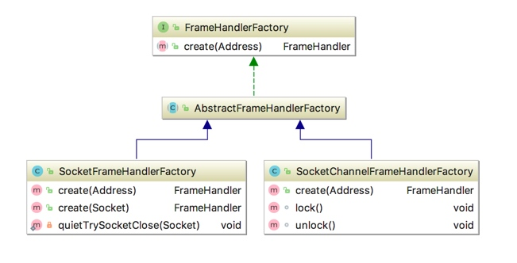
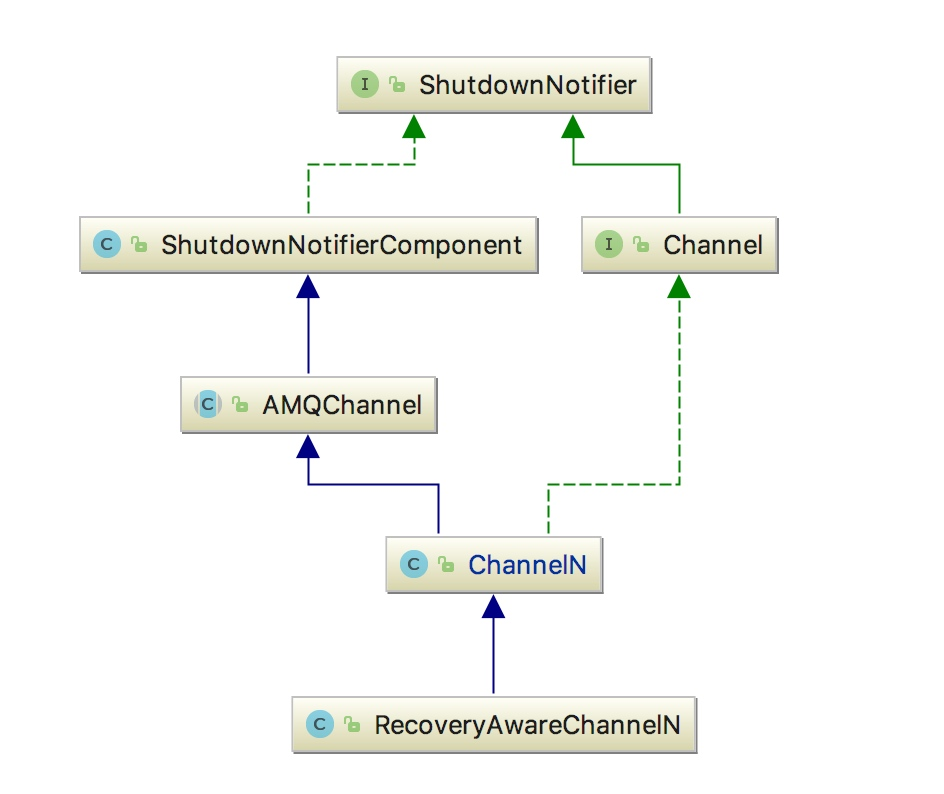

## 生产者生产消息步骤

### factory.newConnection()

1. 默认创建**空的收集器**
2. 创建 **FrameHandlerFactory**，在内部根据参数选择 BIO 或 NIO 的方式创建（默认使用 BIO 方式创建）
3. 根据 executor （用于消费者消费使用的(consumerWorkServiceExecutor)）**设置参数**，包括 virtualHost 等等
4. 默认自动恢复连接（isAutomaticRecoveryEnabled() 为 true）
   1. 创建 AutorecoveringConnection(params, fhFactory, addressResolver, metricsCollector)
   2. 初始化 conn.init(); ----> 最终都调用 **AMQConnection#start** 方法进行启动
      1. factory.create(addr, connectionName());
         1. 通过 socketFactory 创建（默认的） socket
         2. 设置 socket 选项
         3. 开启 socket连接
      2. 创建 RecoveryAwareAMQConnection（conn）
      3. **conn.start()** 启动 connection
         1. 创建 consumer 服务
         2. 创建长连接心跳
         3. 判断主循环是否在运行中
         4. 先发送 header，确保 socket 是否会发生错误，这比在 MainLoop（主事件循环）去确保要好。_channel0.enqueueRpc(connStartBlocker);
         5. 设置 timeout，发送一个协议头开始新的连接，格式为'AMQP0091'
         6.  启动 MainLoop(源码是 connection.startMainLoop() -> 启动 mainLoopThread)，把连接启动放入到 frameHandler
         7.  获取 mechanisms(机制),返回的数据形如:AMQPLAIN PLAIN
         8.  获取 token 过期时间，刷新 credentialsProvider
         9.  构建 **Start-OK** (认证机制)
         10.  协商通道最大编号、创建通道管理器、协商出心跳时间、**发送心跳**、发送TuneOk、发送 Open 打开连接
      4.  this.metricsCollector.newConnection(conn);------->默认不处理
   3. 添加 AutomaticRecoveryListener
   4. 返回 conn

### connection.createChannel();

1. 通过 RecoveryAwareAMQConnection 的 createdChannel() 方法创建 channel
   1.  ensureIsOpen();
   2. 通过 ChannelManager 的 createdChannel() 方法创建 channel（同步方法）
      1. 分配 channelNumber
      2.  ch = addNewChannel(connection, channelNumber);
         1. 判断如果已包含 channelNumber，抛出异常
         2. 实例化 channel ------> 直接 new
         3. 保存 channelNumber 和 ChannelN 的映射关系
      3. ch.open ：打开 channel
         1. 核心方法：c.transmit(this);——调用 AMQCommand 的传输方法；将 AMQChannel 中封装的内容发给 broker，然后等待 broker 返回，进而通过之前附值的 _activeRpc 来处理回传的帧
2. **注册 channel**：this.wrapChannel(ch);
   1. 注册 AutorecoveringChannel 并返回


### channel.exchangeDeclare(EXCHANGE_NAME, "direct", true, false, null);

1. AutorecoveringChannel#exchangeDeclare
   1.  delegate.exchangeDeclare：声明 Exchange，返回 AMQP.Exchange.DeclareOk
   2.  使用 map 保存 Exchange 记录：recordExchange(ok, exchange, type, durable, autoDelete, arguments);

### channel.queueDeclare(QUEUE_NAME, true, false, false, null);

- 同 exchangeDeclare


### channel.queueBind(QUEUE_NAME, EXCHANGE_NAME, ROUTING_KEY);

1. AutorecoveringChannel#queueBind
   1.  delegate.queueBind
      1. 验证 queue 名字长度是否大于 255：validateQueueNameLength(queue);
      2. 返回 AMQP.Queue.BindOk
   2. 使用 list 保存 binding 记录：先 remove，再 add


### channel.basicPublish(EXCHANGE_NAME, ROUTING_KEY, MessageProperties.PERSISTENT_TEXT_PLAIN, message.getBytes());

- channelN.basicPublish------>basicPublish(exchange, routingKey, false, props, body);
  1. 设置 deliveryTag
  2. 创建 **AMQCommand**
     1. 根据特定的 method、header 和 body 创建 command：new CommandAssembler((Method) method, contentHeader, body);
        1. 设置属性
        2. 更新 CAState 状态 ：updateContentBodyState
  3.  transmit(command);----> 同步方法
     1.  ensureIsOpen();
     2.  quiescingTransmit(c);---->同步方法
        1.  this._trafficListener.write(c);
        2.  核心方法源码,将 Command 转换为多个 Frame 并且发送：AMQCommand.transmit
           1.  获取 channelNumber
           2. 获取 connection：channel.getConnection();
           3. 同步：synchronized (assembler)
              1.  将 header 转换成 Frame
              2.  如果 body 长度超过 client 与 server 协商出的最大帧长度，将分多个 Frame 发送
              3. connection 写入 method 和 header 的 frame
              4.  刷新磁盘：connection.flush();


## 消费者消费消息步骤

### Consumer 接口 

```java
public interface Consumer {
    
    void handleConsumeOk(String consumerTag);
    
    void handleCancelOk(String consumerTag);
    
    void handleCancel(String consumerTag) throws IOException;
    
    void handleShutdownSignal(String consumerTag, ShutdownSignalException sig);
    
    void handleRecoverOk(String consumerTag);
    
    void handleDelivery(String consumerTag,
                        Envelope envelope,
                        AMQP.BasicProperties properties,
                        byte[] body)
        throws IOException;
```

### handleDelivery

- WorkPoolRunnable#run
  -  handleDelivery
- executeUnlessShuttingDown
  1. checkShutdown
  2.  addWork
     1. addWorkItem（为特定客户端添加(入队)项）
     2. this.executor.execute(new WorkPoolRunnable());（通过线程池创建线程运行）
  3. delegate.handleDelivery

### channel.basicConsume()

- 
- ChannelN.basicConsume
  1. 根据传入的参数创建 Method 类
  2. 根据 Method 类 创建 **BlockingRpcContinuation** 类
     1. 重写 transformReply，获取响应的结果   ===》传入到 _blocker.setValue(transformReply(command)); 中
        1. 获取实际的 consumerTag，并保存 consumerTag 和 Consumer 的映射
        2.  handleConsumeOk
           1.  executeUnlessShuttingDown
              1. checkShutdown
              2.  addWork
                 1. addWorkItem（为特定客户端添加(入队)项）
                 2. this.executor.execute(new WorkPoolRunnable());（通过线程池创建线程运行）
                    1. 执行 WorkPoolRunnable 线程的 run 方法
        3.  return actualConsumerTag;
     2. AMQChannel#**handleCommand**（将响应的结果存入到 Future 对象中（BlockingValueOrException））
        1.  **_blocker.setValue(transformReply(command));**
        2.  transformReply(command)
     3. AMQConnection#**readFrame**
        1. AMQChannel#**handleFrame**
           1.  AMQChannel#**handleCompleteInboundCommand**
              1.  nextOutstandingRpc.**complete**(command);	RpcContinuationRpcWrapper
                 1. AMQChannel#**handleCommand**（将响应的结果存入到 Future 对象中（BlockingValueOrException））
                 2.  transformReply(command)
              2.  **markRpcFinished**
                 1.  dispatcher.setUnlimited(false);

### MainLoop（在 newConnection#start 方法中启动）

-  MainLoop  实现 run() ===> **在 newConnection#start 方法中启动**
  -  Frame frame = _frameHandler.readFrame();	===》读取传入的 Frame
  -  readFrame(frame);			===>将 Frame 读取出来

### channel.basicQos(32);

- ChannelN#basicQoc()
  -  exnWrappingRpc(new Basic.Qos(prefetchSize, prefetchCount, global));

### channel.basicAck(envelope.getDeliveryTag(), false);

- RecoveryAwareChannelN#basicAck()
  -  transmit(new Basic.Ack(realTag, multiple));

## ConnectionFactory 类

### 参数

- username
- password
- virtualHost
- host
- post
- ...

### 关键方法

- **newConnection**

  ```java
  /**
  	参数：executor、addressResolver、clientProvidedName
  	
  */
  public Connection newConnection(ExecutorService executor, AddressResolver addressResolver, String clientProvidedName)
          throws IOException, TimeoutException {
          if(this.metricsCollector == null) {
              // 这是一个空的收集，没有任何操作
              this.metricsCollector = new NoOpMetricsCollector();
          }
          // make sure we respect the provided thread factory
      	// 创建 FrameHandlerFactory，在内部根据参数选择 BIO 或 NIO 的方式创建
          FrameHandlerFactory fhFactory = createFrameHandlerFactory();
      	// 此executor是用于消费者消费使用的(consumerWorkServiceExecutor)
          ConnectionParams params = params(executor);
          // set client-provided via a client property
          if (clientProvidedName != null) {
              Map<String, Object> properties = new HashMap<String, Object>(params.getClientProperties());
              properties.put("connection_name", clientProvidedName);
              params.setClientProperties(properties);
          }
  		// 默认自动恢复连接
          if (isAutomaticRecoveryEnabled()) {
              // see com.rabbitmq.client.impl.recovery.RecoveryAwareAMQConnectionFactory#newConnection
              // No Sonar: no need to close this resource because we're the one that creates it
              // and hands it over to the user
              AutorecoveringConnection conn = new AutorecoveringConnection(params, fhFactory, addressResolver, metricsCollector); //NOSONAR
  
              conn.init();
              return conn;
          } else {
              List<Address> addrs = addressResolver.getAddresses();
              Exception lastException = null;
              for (Address addr : addrs) {
                  try {
                      FrameHandler handler = fhFactory.create(addr, clientProvidedName);
                      AMQConnection conn = createConnection(params, handler, metricsCollector);
                      conn.start();
                      this.metricsCollector.newConnection(conn);
                      return conn;
                  } catch (IOException e) {
                      lastException = e;
                  } catch (TimeoutException te) {
                      lastException = te;
                  }
              }
              if (lastException != null) {
                  if (lastException instanceof IOException) {
                      throw (IOException) lastException;
                  } else if (lastException instanceof TimeoutException) {
                      throw (TimeoutException) lastException;
                  }
              }
              throw new IOException("failed to connect");
          }
      }
  ```

  

- **createFrameHandlerFactory**

  ```java
  protected synchronized FrameHandlerFactory createFrameHandlerFactory() throws IOException {
          if(nio) {
              if(this.frameHandlerFactory == null) {
                  if(this.nioParams.getNioExecutor() == null && this.nioParams.getThreadFactory() == null) {
                      this.nioParams.setThreadFactory(getThreadFactory());
                  }
                  this.frameHandlerFactory = new SocketChannelFrameHandlerFactory(connectionTimeout, nioParams, isSSL(), sslContextFactory);
              }
              return this.frameHandlerFactory;
          } else {
              return new SocketFrameHandlerFactory(connectionTimeout, socketFactory, socketConf, isSSL(), this.shutdownExecutor, sslContextFactory);
          }
  
      }
  ```

  

- **AMQConnection 的 start 方法**

  ```java
  /**
       * Start up the connection, including the MainLoop thread.
       * Sends the protocol
       * version negotiation header, and runs through
       * Connection.Start/.StartOk, Connection.Tune/.TuneOk, and then
       * calls Connection.Open and waits for the OpenOk. Sets heart-beat
       * and frame max values after tuning has taken place.
       * @throws IOException if an error is encountered
       * either before, or during, protocol negotiation;
       * sub-classes {@link ProtocolVersionMismatchException} and
       * {@link PossibleAuthenticationFailureException} will be thrown in the
       * corresponding circumstances. {@link AuthenticationFailureException}
       * will be thrown if the broker closes the connection with ACCESS_REFUSED.
       * If an exception is thrown, connection resources allocated can all be
       * garbage collected when the connection object is no longer referenced.
       * 
       * client 收到 Connection.Tune 方法后，必须要开始发送心跳,
       * 并在收到 Connection.Open 后，必须要开始监控 .server 在收到 Connection.Tune-Ok 后，
       * 需要开始发送和监控心跳．
       */
      public void start()
              throws IOException, TimeoutException {
          // 创建 consumer 服务
          initializeConsumerWorkService();
          // 创建长连接心跳
          initializeHeartbeatSender();
          // 判断主循环是否在运行中
          this._running = true;
          // Make sure that the first thing we do is to send the header,
          // which should cause any socket errors to show up for us, rather
          // than risking them pop out in the MainLoop
          /**
          	先发送 header，确保 socket 是否会发生错误，这比在 MainLoop（主事件循环）去确保要好。
          */
          AMQChannel.SimpleBlockingRpcContinuation connStartBlocker =
              new AMQChannel.SimpleBlockingRpcContinuation();
          // We enqueue an RPC continuation here without sending an RPC
          // request, since the protocol specifies that after sending
          // the version negotiation header, the client (connection
          // initiator) is to wait for a connection.start method to
          // arrive.
          _channel0.enqueueRpc(connStartBlocker);
          try {
              // The following two lines are akin to AMQChannel's
              // transmit() method for this pseudo-RPC.
              _frameHandler.setTimeout(handshakeTimeout);
              // 发送一个协议头开始新的连接，格式为'AMQP0091'
              _frameHandler.sendHeader();
          } catch (IOException ioe) {
              _frameHandler.close();
              throw ioe;
          }
  
          /**
          * 此处就是启动 MainLoop(源码是 connection.startMainLoop())
          * 把连接启动放入到 framehandler 的  initialize()方法中，这样的设计是否合理??
          */
          this._frameHandler.initialize(this);
  
          AMQP.Connection.Start connStart;
          AMQP.Connection.Tune connTune = null;
          try {
              connStart =
                      (AMQP.Connection.Start) connStartBlocker.getReply(handshakeTimeout/2).getMethod();
  
              _serverProperties = Collections.unmodifiableMap(connStart.getServerProperties());
  
              Version serverVersion =
                      new Version(connStart.getVersionMajor(),
                                         connStart.getVersionMinor());
  
              if (!Version.checkVersion(clientVersion, serverVersion)) {
                  throw new ProtocolVersionMismatchException(clientVersion,
                                                                    serverVersion);
              }
  			// mechanisms(机制),返回的数据形如:AMQPLAIN PLAIN
              String[] mechanisms = connStart.getMechanisms().toString().split(" ");
              SaslMechanism sm = this.saslConfig.getSaslMechanism(mechanisms);
              if (sm == null) {
                  throw new IOException("No compatible authentication mechanism found - " +
                                                "server offered [" + connStart.getMechanisms() + "]");
              }
  
              // 刷新 credentialsProvider
              String username = credentialsProvider.getUsername();
              String password = credentialsProvider.getPassword();
  
              if (credentialsProvider.getTimeBeforeExpiration() != null) {
                  if (this.credentialsRefreshService == null) {
                      throw new IllegalStateException("Credentials can expire, a credentials refresh service should be set");
                  }
                  if (this.credentialsRefreshService.isApproachingExpiration(credentialsProvider.getTimeBeforeExpiration())) {
                      credentialsProvider.refresh();
                      username = credentialsProvider.getUsername();
                      password = credentialsProvider.getPassword();
                  }
              }
  
              LongString challenge = null;
              LongString response = sm.handleChallenge(null, username, password);
  
              do {
                  // 构建Start-OK(认证机制)
                  Method method = (challenge == null)
                                          ? new AMQP.Connection.StartOk.Builder()
                                                    .clientProperties(_clientProperties)
                                                    .mechanism(sm.getName())
                                                    .response(response)
                                                    .build()
                                          : new AMQP.Connection.SecureOk.Builder().response(response).build();
  
                  try {
                      Method serverResponse = _channel0.rpc(method, handshakeTimeout/2).getMethod();
                      if (serverResponse instanceof AMQP.Connection.Tune) {
                          connTune = (AMQP.Connection.Tune) serverResponse;
                      } else {
                          challenge = ((AMQP.Connection.Secure) serverResponse).getChallenge();
                          response = sm.handleChallenge(challenge, username, password);
                      }
                  } catch (ShutdownSignalException e) {
                      Method shutdownMethod = e.getReason();
                      if (shutdownMethod instanceof AMQP.Connection.Close) {
                          AMQP.Connection.Close shutdownClose = (AMQP.Connection.Close) shutdownMethod;
                          if (shutdownClose.getReplyCode() == AMQP.ACCESS_REFUSED) {
                              throw new AuthenticationFailureException(shutdownClose.getReplyText());
                          }
                      }
                      throw new PossibleAuthenticationFailureException(e);
                  }
              } while (connTune == null);
          } catch (TimeoutException te) {
              _frameHandler.close();
              throw te;
          } catch (ShutdownSignalException sse) {
              _frameHandler.close();
              throw AMQChannel.wrap(sse);
          } catch(IOException ioe) {
              _frameHandler.close();
              throw ioe;
          }
  
          try {
              // 协商通道最大编号,协商规则如下
              // (clientValue == 0 || serverValue == 0) ?Math.max(clientValue, serverValue) :Math.min(clientValue, serverValue);
              int negotiatedChannelMax =
                  negotiateChannelMax(this.requestedChannelMax,
                                      connTune.getChannelMax());
  
              int channelMax = ConnectionFactory.ensureUnsignedShort(negotiatedChannelMax);
  
              if (channelMax != negotiatedChannelMax) {
                  LOGGER.warn("Channel max must be between 0 and {}, value has been set to {} instead of {}",
                          MAX_UNSIGNED_SHORT, channelMax, negotiatedChannelMax);
              }
  			// 创建通道管理器
              _channelManager = instantiateChannelManager(channelMax, threadFactory);
  			//协商 Frame 的最大长度
              int frameMax =
                  negotiatedMaxValue(this.requestedFrameMax,
                                     connTune.getFrameMax());
              this._frameMax = frameMax;
  
              // 协商出心跳时间
              int negotiatedHeartbeat =
                  negotiatedMaxValue(this.requestedHeartbeat,
                                     connTune.getHeartbeat());
  
              int heartbeat = ConnectionFactory.ensureUnsignedShort(negotiatedHeartbeat);
  
              if (heartbeat != negotiatedHeartbeat) {
                  LOGGER.warn("Heartbeat must be between 0 and {}, value has been set to {} instead of {}",
                          MAX_UNSIGNED_SHORT, heartbeat, negotiatedHeartbeat);
              }
  			// 发送心跳
              setHeartbeat(heartbeat);
  			
              // 发送TuneOk
              _channel0.transmit(new AMQP.Connection.TuneOk.Builder()
                                  .channelMax(channelMax)
                                  .frameMax(frameMax)
                                  .heartbeat(heartbeat)
                                .build());
              // 发送 Open 打开连接
              _channel0.exnWrappingRpc(new AMQP.Connection.Open.Builder()
                                        .virtualHost(_virtualHost)
                                      .build());
          } catch (IOException ioe) {
              _heartbeatSender.shutdown();
              _frameHandler.close();
              throw ioe;
          } catch (ShutdownSignalException sse) {
              _heartbeatSender.shutdown();
              _frameHandler.close();
              throw AMQChannel.wrap(sse);
          }
  
          if (this.credentialsProvider.getTimeBeforeExpiration() != null) {
              String registrationId = this.credentialsRefreshService.register(credentialsProvider, () -> {
                  // return false if connection is closed, so refresh service can get rid of this registration
                  if (!isOpen()) {
                      return false;
                  }
                  if (this._inConnectionNegotiation) {
                      // this should not happen
                      return true;
                  }
                  String refreshedPassword = credentialsProvider.getPassword();
  
                  UpdateSecretExtension.UpdateSecret updateSecret = new UpdateSecretExtension.UpdateSecret(
                          LongStringHelper.asLongString(refreshedPassword), "Refresh scheduled by client"
                  );
                  try {
                      _channel0.rpc(updateSecret);
                  } catch (ShutdownSignalException e) {
                      LOGGER.warn("Error while trying to update secret: {}. Connection has been closed.", e.getMessage());
                      return false;
                  }
                  return true;
              });
  
              addShutdownListener(sse -> this.credentialsRefreshService.unregister(this.credentialsProvider, registrationId));
          }
  
          // We can now respond to errors having finished tailoring the connection
          this._inConnectionNegotiation = false;
      }
  ```

  

## Frame 与 FrameHandler

### Frame (帧)分析

- AMQP 帧(Frame)的格式

  1. tcp/ip 是一个流协议，amqp 没有采用在流中添加帧定界符来区分帧数据（原因官方认为简单，但是很慢），而是采用在`header`中写入帧大小来区分不同的帧（官方认为简单而且很快）。

  2. `Frame(帧)`就是传输协议的具体实现，即传输的具体数据包

     - 读取一个`Frame`，大概要实现的逻辑
       1. 第一步:读取`header`，检查Frame的类型(1,2,3,8四种类型,[AMQP.java](https://gitee.com/jannal/rabbitmq/blob/master/rabbitmq-java-client/src/main/java/com/rabbitmq/client/AMQP.java)类中定义)和`Channel`编号
       2. 第二步:根据帧的类型(`type`)和`payload`的长度(size)来读取指定大小的`payload`进行处理
       3. 第三步:读取最后一个字节(结束帧)。
       4. 从上面的三步骤来看其实就是在做自定义协议解析的工作，不只是针对AMQP，其实自己定义的协议很多时候也是这么做的。
     - AMQP协议定义了五种类型的帧:`协议头帧`、`method frame(方法帧)`、`content header frame(内容头帧)`、`content body(消息体帧)`、`HEARTBEAT(心跳帧)`

  3. Frame 源码分析

     1. Frame的属性

        ```java
        public class Frame {
            /** Frame type code */
            public final int type;
        
            /** Frame channel number, 0-65535 通道编号，一个TCPIP连接，多个通道，每个通道都有自己的编号*/
            public final int channel;
        
            /** Frame payload bytes (for inbound frames) 有效载荷,就是除了协议头之外的内容*/
            private final byte[] payload;
        
            /** Frame payload (for outbound frames) 字节流的累加器，用于*/
            private final ByteArrayOutputStream accumulator;
        
            /**
             * 自定义协议都是 【协议头】+【协议体】,NON_BODY_SIZE指的是没有协议体内容的情况下最小的传输
             * 长度。从这里可以看出【协议头】=type(1B)+channel(2B)+payloadSize(4B)+1(1B),总共占用8B(8个字节)
             */
            private static final int NON_BODY_SIZE = 1 /* type */ + 2 /* channel */ + 4 /* payload size */ + 1 /* end character */;
                
        }
        ```

     2. 读取Frame

        ```java
        public static Frame readFrom(DataInputStream is) throws IOException {
            int type;
            int channel;
        
            try {
                //读取1B
                type = is.readUnsignedByte();
            } catch (SocketTimeoutException ste) {
                // System.err.println("Timed out waiting for a frame.");
                return null; // failed
            }
        
            if (type == 'A') {
                /*
                 * Probably an AMQP.... header indicating a version
                 * mismatch.
                 */
                /*
                 * Otherwise meaningless, so try to read the version,
                 * and throw an exception, whether we read the version
                 * okay or not.检查协议版本
                 */
                protocolVersionMismatch(is);
            }
            //读取2B
            channel = is.readUnsignedShort();
            //读取4B
            int payloadSize = is.readInt();
            //构造存放内容的字节数组
            byte[] payload = new byte[payloadSize];
            /**
             *  readFully数据缓冲区的空间还有剩余时会阻塞等待读取，直到装满。
             *  此处不能使用is.read(payload),
             *  read(byte[] b)一直阻塞等待读取字节，直到字节流中的数据已经全部读完。
             *  而readFully(byte[] b)是当数据缓冲区的空间还有剩余时会阻塞等待读取，直到装满。
             */
        
            is.readFully(payload);
        
            int frameEndMarker = is.readUnsignedByte();
            //如果读取完body之后最后一个字节不是结束帧，就代表数据格式不正确，以此来判断Frame的传输的正确性
            if (frameEndMarker != AMQP.FRAME_END) {
                throw new MalformedFrameException("Bad frame end marker: " + frameEndMarker);
            }
        
            return new Frame(type, channel, payload);
        }
        ```

     

### FrameHandler

- UML图

  

- **SocketFrameHandler**：BIO 模式

- **SocketChannelFrameHandler**：NIO 模式

  - `SocketChannelFrameHandler `委托 `SocketChannelFrameHandlerState` 进行读写以及 Socket 选项设置


### FramehandlerFactory

- UML 图

  

## Command


### AMQCommand


### CommandAssembler


## Channel 接口

### UML 图



### 方法

-  **getChannelNumber**()：获取 channelNumber
-  **getConnection**()：获取携带此 channel 的 connection
-  **basicQos**(int prefetchSize, int prefetchCount, boolean global)：请求特定的“服务质量”设置（prefetchSize、profetchCount（主要）、global）
-  **basicPublish**(String exchange, String routingKey, BasicProperties props, byte[] body)：发布一条消息
-  **exchangeDeclare**(String exchange, String type)：根据参数主动声明一个 Exchange
  -  exchangeDeclarePassive：被动声明一个 Exchange，会先检查 Exchange 的名称是否存在
  -  exchangeDeclareNoWait：设置 noWait 属性为 true，并且返回 void
  -  exchangeDelete(String exchange, boolean ifUnused)：删除一个 Exchange
  -  exchangeDeleteNoWait：删除一个 Exchange，并设置 noWait 属性为 true
  -  exchangeBind(String destination, String source, String routingKey)：将交换器绑定到交换器，不带额外的参数
  -  exchangeBindNoWait：同上，设置 noWait 属性为 true，且返回 void
  -  exchangeUnbind：解除交换器与交换器的绑定，不带额外参数。 
  -  exchangeUnbindNoWait：同上
-  **queueDeclare**：主动声明一个队列
  -  queueDeclareNoWait：声明队列、设置 noWait 为 true、返回 void（因为服务器将没有 response）
  -  queueDeclarePassive：被动声明一个队列，先检查是否存在
  -  queueDelete：删除一个队列，不管是否正在使用还是拥有消息
  -  queueDeleteNoWait：同上
  -  queueBind(String queue, String exchange, String routingKey)：绑定队列到 Exchange上，不带额外参数
  -  queueBindNoWait：同上
  -  queueUnbind：从交换器中解除队列绑定
  -  queuePurge(String queue)：清除给定队列的内容
-  **basicGet**(String queue, boolean autoAck)：从一个队列中获取一条消息
-  **basicAck**(long deliveryTag, boolean multiple)：确认收到一个或多个消息
-  **basicNack**(long deliveryTag, boolean multiple, boolean requeue)：拒绝一个或多个接收到的消息。
-  **basicConsume**(String queue, Consumer callback)：消费消息
  - consumerTag 消费者标签，用来区分多个消费者
-  **basicCancel**(String consumerTag)：取消一个消费者
-  **basicRecover()**：请求代理（broker）重新发送未确认的消息。
-  事务
  - **txSelect**()：在此 channel 上开启 TX 模式。
  -  **txCommit**()：在此 channel 上提交一个 Tx 事务。
  -  **txRollback**()：在此 channel 上回滚一个 TX 事务。
-  **confirmSelect**()：在此 channel 上启用 publisher acknowledgements。
  -  getNextPublishSeqNo：在 confirm 模式下，返回下一消息的序列号，用于发布。
-  **waitForConfirms**
- RPC
  -  **asyncRpc**(Method method)：通过此 channel 异步发送方法。
  -  **rpc**(Method method)：通过此 channel 同步发送方法。
  -  **asyncCompletableRpc**(Method method)：通过此 channel 异步发送方法。
-  **messageCount**(String queue)：返回队列中准备传递给消费者的消息的数量，假定队列存在
-  **consumerCount**(String queue)：返回队列中消费者的数量，假定队列存在

### **transmit 方法——核心的 AMQP 帧传输方法

-  **exnWrappingRpc** 方法最终都会调用 transmit 方法

- `transmit(AMQCommand c)`:传输方法，委托`AMQCommand`进行传输。channel 接口方法的主要实现方法。

  ```java
  public void transmit(AMQCommand c) throws IOException {
          synchronized (_channelMutex) {
              ensureIsOpen();
              quiescingTransmit(c);
          }
      }
      public void quiescingTransmit(AMQCommand c) throws IOException {
          synchronized (_channelMutex) {
              if (c.getMethod().hasContent()) {
                  while (_blockContent) {
                      try {
                          _channelMutex.wait();
                      } catch (InterruptedException ignored) {}
  
                      // This is to catch a situation when the thread wakes up during
                      // shutdown. Currently, no command that has content is allowed
                      // to send anything in a closing state.
                      ensureIsOpen();
                  }
              }
              // 调用 AMQCommand 的传输方法
              c.transmit(this);
          }
      }
  ```

- AMQCommand#transmit 核心实现

  ```java
  /**
       * Sends this command down the named channel on the channel's
       * connection, possibly in multiple frames.
       * 核心方法源码,将 Command 转换为多个 Frame 并且发送
       *
       * @param channel the channel on which to transmit the command
       * @throws IOException if an error is encountered
       */
      public void transmit(AMQChannel channel) throws IOException {
          // 获取 channelNumber 和 connection
          int channelNumber = channel.getChannelNumber();
          AMQConnection connection = channel.getConnection();
  
          synchronized (assembler) {
              Method m = this.assembler.getMethod();
              if (m.hasContent()) {
                  // 获取内容帧 body 数组
                  byte[] body = this.assembler.getContentBody();
  
                  // 将 header 转换成 Frame
                  Frame headerFrame = this.assembler.getContentHeader().toFrame(channelNumber, body.length);
  
                  // 如果 body 长度超过 client 与 server 协商出的最大帧长度，将分多个 Frame 发送
                  int frameMax = connection.getFrameMax();
                  boolean cappedFrameMax = frameMax > 0;
                  int bodyPayloadMax = cappedFrameMax ? frameMax - EMPTY_FRAME_SIZE : body.length;
  
                  if (cappedFrameMax && headerFrame.size() > frameMax) {
                      String msg = String.format("Content headers exceeded max frame size: %d > %d", headerFrame.size(), frameMax);
                      throw new IllegalArgumentException(msg);
                  }
                  // 写入方法帧
                  connection.writeFrame(m.toFrame(channelNumber));
                  // 写入 header（内容头） 帧
                  connection.writeFrame(headerFrame);
  
                  // 写入消息体帧
                  for (int offset = 0; offset < body.length; offset += bodyPayloadMax) {
                      int remaining = body.length - offset;
  
                      int fragmentLength = Math.min(remaining, bodyPayloadMax);
                      Frame frame = Frame.fromBodyFragment(channelNumber, body,
                              offset, fragmentLength);
                      connection.writeFrame(frame);
                  }
              } else {
                  connection.writeFrame(m.toFrame(channelNumber));
              }
          }
  
        connection.flush();
      }
  
  ```
  
  

### ChannelManager

- 负责 Channel 的管理，创建 Channel、添加新的 Channel、获取 Channel、Channel 关闭等、

- 构造方法

  ```java
  public ChannelManager(ConsumerWorkService workService, int channelMax, ThreadFactory threadFactory, MetricsCollector metricsCollector) {
          if (channelMax == 0) {
              // The framing encoding only allows for unsigned 16-bit integers
              // for the channel number
              channelMax = (1 << 16) - 1;
          }
          _channelMax = channelMax;
          channelNumberAllocator = new IntAllocator(1, channelMax);
  
          this.workService = workService;
          this.threadFactory = threadFactory;
          this.metricsCollector = metricsCollector;
      }
  ```

  

- 创建 channel

  ```java
  public ChannelN createChannel(AMQConnection connection) throws IOException {
          ChannelN ch;
          synchronized (this.monitor) {
              // 通过IntAllocator分配一个Channel编号(channelNumber)
              int channelNumber = channelNumberAllocator.allocate();
              if (channelNumber == -1) {
                  return null;
              } else {
                  ch = addNewChannel(connection, channelNumber);
              }
          }
          ch.open(); // now that it's been safely added
          return ch;
      }
  
  private ChannelN addNewChannel(AMQConnection connection, int channelNumber) {
          if (_channelMap.containsKey(channelNumber)) {
              // That number's already allocated! Can't do it
              // This should never happen unless something has gone
              // badly wrong with our implementation.
              throw new IllegalStateException("We have attempted to "
                      + "create a channel with a number that is already in "
                      + "use. This should never happen. "
                      + "Please report this as a bug.");
          }
          // 实例化 channel，直接 new 一个 ChannelN
          ChannelN ch = instantiateChannel(connection, channelNumber, this.workService);
          // 添加 channelNumber 与 Channel 的映射
          _channelMap.put(ch.getChannelNumber(), ch);
          return ch;
      }
  ```

-   关闭所有被管理的 Channel（在关闭 connection 时先调用该方法）

  ```java
  /**
       * Handle shutdown. All the managed {@link com.rabbitmq.client.Channel Channel}s are shutdown.
       * 关闭所有被管理的 Channel（在关闭 connection 时先调用该方法）
       * @param signal reason for shutdown
       */
      public void handleSignal(final ShutdownSignalException signal) {
          Set<ChannelN> channels;
          synchronized(this.monitor) {
              channels = new HashSet<ChannelN>(_channelMap.values());
          }
  
          for (final ChannelN channel : channels) {
              // 从 Channel 映射中删除该 channel 并释放 channelNumber 以供重用。
              releaseChannelNumber(channel);
              // async shutdown if possible
              // see https://github.com/rabbitmq/rabbitmq-java-client/issues/194
              // 使用异步关闭，主要是为了避免JDK socket wirte死锁，BIO下socket write没有写超时。
              Runnable channelShutdownRunnable = new Runnable() {
                  @Override
                  public void run() {
                      channel.processShutdownSignal(signal, true, true);
                  }
              };
              if(this.shutdownExecutor == null) {
                  channelShutdownRunnable.run();
              } else {
                  Future<?> channelShutdownTask = this.shutdownExecutor.submit(channelShutdownRunnable);
                  try {
                      channelShutdownTask.get(channelShutdownTimeout, TimeUnit.MILLISECONDS);
                  } catch (Exception e) {
                      LOGGER.warn("Couldn't properly close channel {} on shutdown after waiting for {} ms", channel.getChannelNumber(), channelShutdownTimeout);
                      channelShutdownTask.cancel(true);
                  }
              }
              shutdownSet.add(channel.getShutdownLatch());
              channel.notifyListeners();
          }
          scheduleShutdownProcessing();
      }
  ```

  