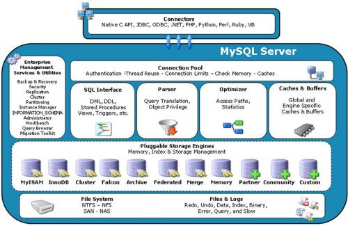

一、MySQL的架构介绍

## 高级MySQL

- MySQL内核
- SQL优化
- MySQL服务器的优化
- 各种参数常量设定
- 查询语句优化
- 主从复制
- 软硬件升级
-  容灾备份
- SQL编程

## MySQL的Linux版的安装

1、查看是否安装MySQL

```
rpm -qa | grep -i mysql
```

==Linux下开发：永远不要有中文和空格==

2、安装MySQL服务端和客户端

3、查看MySQL安装时创建的MySQL用户和 MySQL 组

```properties
# 安装完成后MySQL会创建MySQL用户和MySQL组
# 查看MySQL用户
cat /etc/passwd|grep mysql
# 查看MySQL用户组
cat /etc/group|grep mysql

# 查看MySQL版本，确认是否安装成功
mysqladmin --version
```

4、MySQL服务的启动和停止

```properties
# 启动mysql服务
systemctl start mysqld
# 查看启动状态
systemctl status mysqld
# 关闭MySQL服务
systemctl stop mysqld

# 连接MySQL
mysql -uroot -p
Zhoushikang975!
```

5、MySQL服务自启动

```properties
# 设置MySQL开机启动
systemctl enable mysqld
systemctl daemon-reload

# 查看MySQL是否自启动
 systemctl list-dependencies mysql
```

6、MySQL安装位置

| 路径               | 解释                      | 备注                         |
| ------------------ | ------------------------- | ---------------------------- |
| **/var/lib/mysql** | mysql数据库文件的存放路径 |                              |
| /usr/share/mysql   | 配置文件目录              |                              |
| **/usr/bin**       | 相关命令目录              | mysqladmin   mysqldump等命令 |

7、修改字符集

## MySQL配置文件


## MySQL逻辑架构

**==插件式的存储引擎架构将查询处理和其他的系统任务以及数据的存储提取相分离。==**



### 1、连接层

### 2、服务层

### 3、存储引擎层

### 4、存储层


## MySQL存储引擎

### 1、查看命令

```mysql
show variables like '%storage_engine%';
```

### 2、MyISAM 和 InnoDB

|  对比项  |                          MyISAM                          |                            InnoDB                            |
| :------: | :------------------------------------------------------: | :----------------------------------------------------------: |
|  主外键  |                          不支持                          |                             支持                             |
|   事务   |                          不支持                          |                             支持                             |
|  行表锁  | 表锁，即使操作一条记录也会锁住整个表，不适合高并发的操作 | 行锁，操作时只锁某一行，不对其他行有影响，**适合高并发的操作** |
|   缓存   |                只缓存索引，不缓存真实数据                | 不仅缓存索引还要缓存真实数据，对内存要求较高，而且内存大小对性能有决定性的影响 |
|  表空间  |                            小                            |                              大                              |
|  关注点  |                           性能                           |                             事务                             |
| 默认安装 |                            Y                             |                              Y                               |

# 二、索引优化

 ## 1、SQL性能下降原因

执行时间长，等待时间长

- **查询语句写的烂**

- **索引失效**

  - 单值

  ```mysql
  create index idx_user_name on user(name);
  ```

  - 复合

  ```mysql
  create index idx_user_nameEmail on user(name,email);
  ```

  

- **关联查询太多join（设计缺陷或不得已的需求）**
- 服务器调优及各个参数设置（缓冲、线程数等）

## 2、SQL执行加载顺序

- 机器读入

```mysql
FROM <left_table>
ON <join_condition>
<join_type> JOIN <right_table>
WHERE <where_condition>
GROUP BY <group_by_list>
HAVING <having_condition>
SELECT
DISTINCT <select_list>
ORDER BY <order_by_condition>
LIMIT <limit_number>
```

- 总结

## 3、join查询

### 1、七种join理论


### 2、七种join的SQL编写

1、INNER JOIN

```mysql
SELECT * FROM tbl_emp a INNER JOIN tbl_dept b ON a.deptId = b.id;
```

2、LEFT JOIN

```mysql
SELECT * FROM tbl_emp a LEFT JOIN tbl_dept b ON a.deptId = b.id;
```

3、RIGHT JOIN

```mysql
SELECT * FROM tbl_emp a RIGHT JOIN tbl_dept b ON a.deptId = b.id;
```

4、LEFT JOIN  WHERE b.id IS NULL

```mysql
SELECT * FROM tbl_emp a 
LEFT JOIN tbl_dept b 
ON a.deptId = b.id
WHERE b.id IS NULL;
```

5、RIGHT JOIN WHERE a.deptId IS NULL

```mysql
SELECT * FROM tbl_emp a 
RIGHT JOIN tbl_dept b 
ON a.deptId = b.id
WHERE a.deptId IS NULL;
```

6、FULL OUTER JOIN（使用union）

```mysql
SELECT * FROM tbl_emp a LEFT JOIN tbl_dept b ON a.deptId = b.id
UNION	
SELECT * FROM tbl_emp a RIGHT JOIN tbl_dept b ON a.deptId = b.id;
```

7、A 和 B 各自独有的部分

```mysql
SELECT * FROM tbl_emp a LEFT JOIN tbl_dept b ON a.deptId = b.id WHERE b.id IS NULL
UNION	
SELECT * FROM tbl_emp a RIGHT JOIN tbl_dept b ON a.deptId = b.id WHERE a.deptId IS NULL;
```


## 4、索引简介

### 1、索引是什么

> 索引是帮助MySQL高效获取数据的数据结构
>
> 本质：索引是数据结构
>
> 索引的目的在于提高查询效率，可以类比字典
>
> 

==排好序地快速查找数据结构==

**数据本身之外，数据库还维护着一个满足特定查找算法的数据结构（B树），这种数据结构以某种方式指向数据，这样就可以在这些数据结构的基础上实现高级查找算法，这种数据结构就是索引。**


一般来说，索引本身也很大，不可能全部存储到内存中，因此索引常常以索引文件的形式存储在硬盘上

### 2、索引的优势和劣势

#### 1、优势

- 提高**数据检索**的效率，降低数据库的IO成本
- 通过索引列对数据进行**排序**，降低数据排序的成本，降低了CPU的消耗
- 索引可以将随机 I/O 变为顺序 I/O


#### 2、劣势

- 实际上索引也是一张表，该表保存了主键与索引字段，并指向实体表的记录，所以索引列也是要占用空间的
- 虽然索引大大提高了查询速度 ，同时却会降低更新表的速度，如对表进行 INSERT、UPDATE 和 DELETE。因为更新表时，MySQL不仅要保存数据，还要保存索引文件每次更新添加了索引列的字段，都会调整因为更新所带来的键值变化后的索引信息
- 索引只是提高效率的一个因素，如果MySQL有大数据量的表，就需要花时间研究如何建立最优秀的索引


### 3、MySQL索引分类

#### 1、单值索引

一个索引只包含单个列，一个表可以有多个单列索引

#### 2、唯一索引

索引列的值必须唯一，但允许有空值

#### 3、复合索引

即一个索引包含多个列

基本语法

```mysql
# 创建
CREATE [UNIQUE] INDEX indexName ON mytable(columnName(length));

ALTER mytable ADD [UNIQUE] INDEX [indexName] ON (columnName(length));
# 删除
DROP INDEX [indexName] ON mytable;
# 查看
SHOW INDEX FROM table_name\G

# 使用ALTER命令
# 该语句添加一个主键，这意味着索引值必须是唯一的，且不能为NULL
ALTER TABLE tbl_name ADD PRIMARY KEY(column_list);
# 这条语句创建索引的值必须是唯一的（可以为NULL）
ALTER mytable ADD UNIQUE INDEX [indexName] ON (columnName(length));
# 添加普通索引，索引值可出现多次
ALTER mytable ADD INDEX [indexName] ON (columnName(length));
# 该语句指定了索引为 FULLTEXT，用于全文索引
ALTER TABLE tbl_name ADD FULLTEXT index_name (column_list);
```


### 4、MySQL索引结构

#### 1、BTREE 索引

真实的数据存储在叶子节点上

非叶子节点不存储真实的数据，只存储指引搜索方向的数据项

**3层的B+树可以表示上百万的数据，上百万的数据查找只需要三次IO** 


2、Hash 索引

3、full-text 全文索引

4、 R-Tree 索引


### 5、哪些情况需要创建索引

- 主键自动建立唯一索引
- 频繁作为查询条件的字段应该创建索引
- 查询中与其他表关联的字段，外键关系创建索引
- 单键/组合索引的选择问题？（在高并发下倾向创建组合索引）
- 查询中排序的字段，排序字段若通过索引去访问将大大提高排序速度
- 查询中统计或者分组字段

### 6、哪些情况不要创建索引

- 表记录太少
- 经常增删改的表
- 数据重复且分布平均的表字段
- 频繁更新的字段不适合创建索引
- WHERE 条件里用不到的字段不创建索引


## 5、性能分析

### 1、前提知识

MySQL常见瓶颈

- CPU：CPU在饱和的时候一般发生在数据装入内存或从磁盘上读取数据的时候
- IO：磁盘I/O瓶颈发生在装入数据远大于内存容量的时候
- 服务器硬件的性能瓶颈：top、free、iostat和vmstat来查看系统的性能状态


### 2、Explain

#### 1、Explain简介

- Explain是什么

> 使用Explain关键字可以模拟优化器执行SQL查询语句，从而知道MySQL是如何处理SQL语句的。分析查询语句或是表结构的性能瓶颈

- Explain能做什么
  - 表的读取顺序
  - 数据读取操作的操作类型
  - 哪些索引可以使用
  - 哪些索引被实际使用
  - 表之间的引用
  - 每张表有多少行被优化器查询

- Explain怎么用：Explain + SQL语句
- 执行计划包含的信息

```
id
select_type
table
type
possible_keys
key
key_len
ref
rows
Extra
```

#### 2、各字段解释

##### 1、id*（表的读取顺序）

select查询的序列号，包含一组数字，表示查询中执行select子句或操作表的顺序

三种情况：

1、id相同，执行顺序由上至下

2、id不同，如果是子查询，id的序号会递增，==id值越大优先级越高，越先被执行==

3、id相同和不同同时存在：id如果相同，可以认为是一组，从上往下顺序执行；在所有组中，id值越大，优先级越高，越先执行

##### 2、select_type（数据读取操作的操作类型）

常见和常用的值：

```
SIMPLE
PRIMARY
SUBQUERY
DERIVED
UNION
UNION RESULT
```


**查询的类型，主要用于区分普通查询、联合查询、子查询等的复杂查询**

- SIMPLE：简单的select查询，查询中不包含子查询或者UNION
- PRIMARY ：查询中若包含任何复杂的子部分，最外层查询则被标记为PRIMARY
- SUBQUERY：在select 或 where列表中包含了子查询
- DERIVED：在FROM列表中包含的子查询被标记为DERIVED（衍生），MySQL会递归执行这些子查询，把结果放在临时表里
- UNION：若第二个select出现在 UNION之后，则被标记为UNION；若UNION包含在FROM子句的子查询中，外层SELECT将被标记为：DERIVED
- UNION RESULT：从UNION表获取结果的SELECT    


##### 3、table

显示这一行的数据是关于哪张表的

##### 4、type*

显示查询使用了何种类型：

```mysql
# ALL：全表扫描

# index：Full Index Scan，index 与 ALL区别为index类型只遍历索引树。这通常比ALL快，因为索引文件通常比数据文件小。

# range：只检索给定范围的行，使用一个索引来选择行。key列显示使用了哪个索引。一般就是在where语句中出现了between、<、>、in等的查询。比全表扫描好。

# ref：非唯一性索引扫描，返回匹配某个单独值的所有行。本质上也是一种索引访问，它返回所有匹配某个单独值的行，然而，它可能会找到多个符合条件的行，所以它属于查找和扫描的混合体

# eq_ref：唯一性索引扫描，对于每个索引键，表中只有一条记录与之匹配。常见于主键或唯一索引扫描

# const：表示通过索引依次就找到了，const用于比较primary key 或者unique 索引。因为只匹配一行数据，所以很快。如将主键置于where列表中，MySQL就能将该查询转换为一个常量

# system：表只有一行记录（等于系统表），这是const类型的特例，平时不会出现，这个可以忽略不计

# NULL
```

==从最好到最差依次是：==

```mysql

system > const > eq_ref > ref > range > index > ALL
# 一般来说，得保证查询至少达到range级别，最好能达到ref
```

##### 5、possible_keys（哪些索引可以使用） 和 key*（哪些索引被实际使用）

 possiable_keys：显示可能应用在这张表中的索引，一个或多个。查询涉及到的字段上若存在索引，则该索引将被列出，**但不一定被实际查询使用。**

key：实际使用的索引。如果为NULL，则没有使用索引。

**查询中若使用了覆盖索引，则该索引仅出现在key列表中**


##### 6、key_len

表示索引中使用的字节数，可通过该列计算查询中使用的索引的长度。在不损失精确性的情况下，长度越短越好

key_len显示的值为索引字段的最大可能长度，**并非实际使用长度**，即key_len 是根据表定义计算而得，不是通过表内检索出的

##### 7、ref（表之间的引用）

显示索引的哪一列被使用了，如果可能的话，是一个常数。哪些列或常量被用于查找索引列上的值


##### 8、rows*（每张表有多少行被优化器查询）

根据表统计信息及索引选用情况，大致估算出找到所需的记录需要读取的行数（越少越好）


##### 9、Extra*

> **包含不适合在其他列中显示，但十分重要的额外信息**

1. **using filesort**：（出现表示问题比较严重）说明MySQL会对数据使用一个外部的索引排序，而不是按照表内的索引顺序进行读取。MySQL无法利用索引完成的排序操作称为“文件排序”。==按照索引的个数和顺序查找==

2. **using temporary**：（出现表示问题非常严重）使用了临时表保存中间结果，MySQL在对查询结果排序时使用临时表。常见于排序 order by 和分组查询 group by。临时表的创建很伤系统性能。==order by 和 group by按照索引的个数和顺序来。==

3. **using index**：（出现表示索引利用得当）表示相应的select 操作中使用了覆盖索引（covering index），避免访问了表的数据行，效率不错

   > 覆盖索引：（理解方式）就是select的数据列只用从索引中就能够取得，不必读取数据行，MySQL可以利用索引返回select列表中的字段，而不必根据索引再次读取数据文件。==查询列要被所建的索引覆盖==
   >
   > 注意：如果要使用覆盖索引，一定要注意select列表中只取出需要的列，不可select*

   1. 如果同时出现using where，表明索引被用来执行索引键值的查找
   2. 如果没有出现using where，表明索引被用来读取数据而非执行查找动作

4. using where：表明使用了where 过滤

5. using join buffer：使用了连接缓存

6. impossible where：where子句的值总是false，不能用来获取任何元组。

7. select tables optimized away

8. distinct


## 6、索引优化

### 1、索引分析

#### 1、单表

#### 2、两表

 左连接：索引建立在右表

右连接：索引建立在左表

#### 3、三表

Join语句的优化：

- 尽可能减少Join语句中的NestedLoop的循环次数；“永远用小结果集驱动大结果集”
- 优先优化NestedLoop的内层循环
- ==保证Join语句中被驱动表上Join条件字段已经被索引==；
- 当无法保证被驱动表的Join条件字段被索引且内存资源充足的前提下，不要太吝惜JoinBuffer的设置


### 2、索引失效（应该避免）

#### 1、全值匹配我最爱、

SQL 中查询字段的顺序，跟使用索引中字段的顺序，没有关系。优化器会在不影响 SQL 执行结果的前提下，给你自动地优化。

#### 2、最佳左前缀匹配

如果索引了多列，要遵守最左前缀法则。指的是查询从索引的最左前列开始并且==不跳过索引中的列==。

#### 3、不在索引列上做任何操作（计算、函数、（自动或手动）类型转换），会导致索引失效而转向全表扫描

```mysql
explain select * from staffs where left(name,4) = 'july';
```


#### 4、存储引擎不能使用索引中范围条件右边的列

```mysql
# pos用不到
explain select * from staffs where name = 'july' and age > 25 and pos = 'manager';
```


#### 5、尽量使用覆盖索引（只访问索引的查询（索引列和查询列一致）），减少select *

#### 6、MySQL在使用不等于（!= 或者<>）的时候无法使用索引会导致全表扫描

根据业务情况，需要写的时候也要写

#### 7、is null， is not null 也无法使用索引

#### 8、like以通配符开头（'%abc...'），MySQL索引失效，会变成全表扫描的操作

```mysql
# 全表扫描
explain select * from staffs where name like "%july%";
# 全表扫描
explain select * from staffs where name like "%july";
# range
explain select * from staffs where name like "july%";
```

解决like '%字符串%' 时索引不被使用的方法？

**使用覆盖索引**：包含主键和索引列可以使用索引，其他情况索引失效

#### 9、**字符串不加单引号索引失效**

#### 10、少用or，用它来连接时会索引失效、

#### 11、口诀

全值匹配我最爱，最左前缀要遵守；
带头大哥不能死，中间兄弟不能断；
索引列上少计算，范围之后全失效；
LIKE 百分写最右，覆盖索引不写*；
不等空值还有 OR，索引影响要注意；
VAR 引号不可丢，SQL 优化有诀窍。

#### 12、面试题

定值、范围还是排序，一般order by 给个范围

group by 基本上都需要进行排序，会有临时表产生

#### 13、一般性建议

- 对于单键索引，尽量选择针对当前query过滤性更好的索引
- 在选择组合索引时，当前query中过滤性最好的字段在索引字段顺序中，位置越靠左越好
- 在选择组合索引时，尽量选择可以能够包含当前query中的where子句中更多字段的索引
- 尽可能通过分析统计信息和调整query的写法来达到选择合适索引的目的


# 三、查询截取分析

## 1 查询优化

### 1.1 永远小表驱动大表，即小的数据集驱动大的数据集

```mysql
# EXISTS
SELECT ... FROM table WHERE EXISTS (subquery)
# 将主查询的数据，放到子查询中做条件验证，根据验证结果（TRUE或FALSE）来决定主查询的数据结果是否得以保留
# 提示
1、EXISTS(subquery)只返回TRUE 或 FALSE，因此子查询中的select * 也可以是 select 1或select 'z'，官方说法是实际执行时会忽略 select 清单，因此没有区别
2、EXISTS子查询的实际执行过程可能经过了优化而不是我们理解上的逐条对比
3、EXISTS子查询往往也可以用条件表达式、其他子查询、join来替代，何种最优需要具体情况具体分析
```

### 1.2 order by 关键字优化

1、order  by 子句，尽量使用Index方式排序，避免使用filesort方式排序

​		MySQL支持两种方式的排序，filesort 和 index，index效率高。

​		order by 默认使用升序，如果使用降序则将导致 using filesort。**同升同降也能使用索引排序**

​		order by 满足两种情况，会使用 index 排序：

​		（1）order by 语句使用索引最左前列

​		（2）使用where 子句与 order by 子句条件列组合满足索引最左前列

2、**尽可能在索引列上完成排序操作，遵照索引键的最佳左前缀原则**

3、如果不在索引列上，filesort有两种算法：MySQL就要启动双路排序和单路排序

​		（1）双路排序：MySQL4.1之前是使用双路排序，字面意思是两次扫描磁盘，最终得到数据。


​		（2）单路排序：MySQL4.1之后出现。从磁盘读取查询需要的所有列，按照order by列在buffer对它们进行排序，然后扫描排序后的列表进行输出，它的效率更快一点，避免了第二次读取数据。并且把随机IO变成了顺序IO，但是它们会使用更多的空间，因为它把每一行都保存在内存中。

​		（3）结论及引申出的问题：由于单路排序是后出的，总体而言好过双路。但单路排序有一个问题：原本只需要一次IO操作，反而导致大量的IO操作。

​			

​		**（4）优化策略**

​			**尽可能在索引列上完成排序操作，遵照索引键的最佳左前缀原则**

​			**不使用select * **

​			**增大 sort_buffer_size 参数的设置**

​			**增大 max_length_for_sort_data 参数的设置**

4、总结

​			（1）MySQL 两种排序方式：using index、using filesort

​			（2）MySQL 能为排序与查询使用相同的索引

### 1.3 group by关键字优化

几乎和order by 一致。

1、group by 实质是先排序后分组，遵照索引键的最佳左前缀

2、当无法使用索引列时，增大sort_buffer_size 参数的设置 和 增大 max_length_for_sort_data 参数的设置

**3、where 高于 having，能写在 where 限定的条件就不要 使用having限定。**

## 2 慢查询日志

### 2.1 慢查询日志是什么

（1）MySQL的慢查询日志是MySQL提供的一种日志记录，它用来记录在MySQL中响应时间超过阈值的语句，具
体指运行时间超过 long_query_time 值的SQL，则会被记录到慢查询日志中。

（2）long_query_time的默认值为10，意思是运行10秒以上的语句。

（3）由他来查看哪些SQL超出了我们的最大忍耐时间值，比如一条sql执行超过5秒钟，我们就算慢SQL，希望能
收集超过5秒的sql，结合之前explain进行全面分析。

### 2.2 慢查询日志怎么用

1、说明

**默认情况下，MySQL 数据库没有开启慢查询日志，需要我们手动来设置这个参数。**

如果不是调优需要的话，**一般不建议启动该参数**，因为开启慢查询日志会或多或少带来一定的性能影响。
慢查询日志支持将日志记录写入文件。

2、查看是否开启及如何开启

```mysql
# 查看是否开启慢查询日志
show variables like '%slow_query_log%';
# 开启慢查询日志
# 只对当前数据库生效，如果MySQL重启后则会失效 
set global slow_query_log=1;

# 永久生效：修改my.cnf文件，[mysqld]下增加或修改参数slow_query_log 和 slow_query_log_file 后，重启MySQL服务器
[mysqld]
slow_query_log=1
# 缺省的话，系统会默认给一个文件host_name-slow.log
slow_query_log_file=/var/lib/mysql/localhost-slow.log
```

​	如果要永久生效，必须修改配置文件my.cnf（其他系统变量也是如此）

3、开启了慢查询日志后，什么样的SQL才会记录到慢查询日志中：

```mysql
# 查看慢查询设定阈值
SHOW VARIABLES LIKE 'long_query_time%';

# 设定慢查询阈值（MySQL源码中是大于阈值，而不是大于或等于）
set long_query_time=1

# 永久生效也需要修改my.cnf配置文件
```

4、慢查询分析

```mysql
# 查看慢查询SQL条数
show global status like '%Slow_queries%'
```

### 2.3 日志分析工具mysqldumpslow

参数 描述 备注
-s	 是表示按照何种方式排序
c	 访问次数
l 	锁定时间
r 	返回记录
t 	查询时间
al 	平均锁定时间
ar 	平均返回记录数
at 	平均查询时间
-t 	即为返回前面多少条的数据
-g 	后边搭配一个正则匹配模式，大小写不敏感的

```properties
# Linux/windows的命令行下使用
# 得到返回记录集最多的 10 个 SQL
mysqldumpslow -s r -t 10 /var/lib/mysql/atguigu-slow.log

# 得到访问次数最多的 10 个 SQL
mysqldumpslow -s c -t 10 /var/lib/mysql/atguigu-slow.log

# 得到按照时间排序的前 10 条里面含有左连接的查询语句
mysqldumpslow -s t -t 10 -g "left join" /var/lib/mysql/atguigu-slow.log

# 另外建议在使用这些命令时结合 | 和 more 使用 ，否则有可能出现爆屏情况
mysqldumpslow -s r -t 10 /var/lib/mysql/atguigu-slow.log | more
```


## 3 批量数据脚本

### 3.1 建表语句

```mysql
CREATE TABLE `dept` (
    `id` INT(11) NOT NULL AUTO_INCREMENT,
    `deptName` VARCHAR(30) DEFAULT NULL,
    `address` VARCHAR(40) DEFAULT NULL,
    ceo INT NULL,
    PRIMARY KEY (`id`)
)  ENGINE=INNODB AUTO_INCREMENT=1 DEFAULT CHARSET=UTF8;
CREATE TABLE `emp` (
    `id` INT(11) NOT NULL AUTO_INCREMENT,
    `empno` INT NOT NULL,
    `name` VARCHAR(20) DEFAULT NULL,
    `age` INT(3) DEFAULT NULL,
    `deptId` INT(11) DEFAULT NULL,
    PRIMARY KEY (`id`)
)  ENGINE=INNODB AUTO_INCREMENT=1 DEFAULT CHARSET=UTF8;

```

### 3.2 设置参数

在执行创建函数之前，首先请保证 log_bin_trust_function_creators 参数为 1，即 on 开启状态。否则会报错...

```mysql
# 查询：
show variables like 'log_bin_trust_function_creators';
# 设置：
set global log_bin_trust_function_creators=1;
```


### 3.3 编写随机函数

#### 3.3.1 随机产生字符串

```mysql
DELIMITER $$
CREATE FUNCTION rand_string(n INT) RETURNS VARCHAR(255)
BEGIN
DECLARE chars_str VARCHAR(100) DEFAULT 'abcdefghijklmnopqrstuvwxyzABCDEFJHIJKLMNOPQRSTUVWXYZ';
DECLARE return_str VARCHAR(255) DEFAULT '';
DECLARE i INT DEFAULT 0;
WHILE i < n DO
SET return_str =CONCAT(return_str,SUBSTRING(chars_str,FLOOR(1+RAND()*52),1));
SET i = i + 1;
END WHILE;
RETURN return_str;
END $$
```

如果要删除函数，则执行：drop function rand_string;

#### 3.3.2 随机产生部门编号

```mysql
#用于随机产生多少到多少的编号
DELIMITER $$
CREATE FUNCTION rand_num (from_num INT ,to_num INT) RETURNS INT(11)
BEGIN
DECLARE i INT DEFAULT 0;
SET i = FLOOR(from_num +RAND()*(to_num -from_num+1)) ;
RETURN i;
END$$
```


### 3.4 创建存储过程

#### 3.4.1 创建往 emp 表中插入数据的存储过程

```mysql
#创建
DELIMITER $$
CREATE PROCEDURE insert_emp( START INT , max_num INT )
BEGIN
DECLARE i INT DEFAULT 0;
#set autocommit =0 把 autocommit 设置成 0
SET autocommit = 0;
REPEAT
SET i = i + 1;
INSERT INTO emp (empno, NAME ,age ,deptid ) VALUES ((START+i) ,rand_string(6) , rand_num(30,50),rand_num(1,10000));
UNTIL i = max_num
END REPEAT;
COMMIT;
END$$


#删除
# DELIMITER ;
# drop PROCEDURE insert_emp;
```

#### 3.4.2 创建往 dept 表中插入数据的存储过程

```mysql
#执行存储过程，往 dept 表添加随机数据
DELIMITER $$
CREATE PROCEDURE `insert_dept`( max_num INT )
BEGIN
DECLARE i INT DEFAULT 0;
SET autocommit = 0;
REPEAT
SET i = i + 1;
INSERT INTO dept ( deptname,address,ceo ) VALUES (rand_string(8),rand_string(10),rand_num(1,500000));
UNTIL i = max_num
END REPEAT;
COMMIT;
END$$

#删除
# DELIMITER ;
# drop PROCEDURE insert_dept;
```


### 3.5 调用存储过程

#### 3.5.1 添加数据到部门表

```mysql
#执行存储过程，往 dept 表添加 1 万条数据
DELIMITER ;
CALL insert_dept(10000);
```


#### 3.5.2 添加数据到员工表

```mysql
#执行存储过程，往 emp 表添加 50 万条数据
DELIMITER ;
CALL insert_emp(100000,500000);
```


### 3.6 批量删除某个表上的所有索引

#### 3.6.1 删除索引的存储过程

```mysql
DELIMITER $$
CREATE PROCEDURE `proc_drop_index`(dbname VARCHAR(200),tablename VARCHAR(200))
BEGIN
DECLARE done INT DEFAULT 0;
DECLARE ct INT DEFAULT 0;
DECLARE _index VARCHAR(200) DEFAULT '';
DECLARE _cur CURSOR FOR SELECT index_name FROM information_schema.STATISTICS WHERE
table_schema=dbname AND table_name=tablename AND seq_in_index=1 AND index_name <>'PRIMARY' ;
DECLARE CONTINUE HANDLER FOR NOT FOUND set done=2 ;
OPEN _cur;
FETCH _cur INTO _index;
WHILE _index<>'' DO
SET @str = CONCAT("drop index ",_index," on ",tablename );
PREPARE sql_str FROM @str ;
EXECUTE sql_str;
DEALLOCATE PREPARE sql_str;
SET _index='';
FETCH _cur INTO _index;
END WHILE;
CLOSE _cur;
END$$
```

#### 3.6.2 执行存储过程

```mysql
CALL proc_drop_index("dbname","tablename");
```


## 4 Show Profile

利用 show profile 可以查看 sql 的执行周期！

### 2.1 开启 profile

```mysql
#查看 profile 是否开启：
show variables like '%profiling%'

#开启profile
set profiling=1
```

### 2.2 使用profile

```mysql
#执行 show profiles 命令，可以查看最近的几次查询。
show profiles

#根据 Query_ID,可以进一步执行 show profile cpu,block io for query Query_id 来查看 sql 的具体执行步骤。
show profile cpu,block io for query Query_id
#参数备注
#all  --显示所有的开销信息
#block io -- 显示块IO相关开销
#context switches   --上下文切换相关开销
#CPU   --显示CPU相关开销
#IPC  --显示发送和接收相关信息
#memory  --显示内存相关开销
#page faults  --显示页面错误相关开销
#source  -- 显示和source_function,source_file,source_line相关的开销
#swaps  --显示交换次数相关开销

```

### 2.3 show profile 显示的较为严重的问题

1、converting HEAP to MyISAM：查询结果太大，内存不够用而往硬盘上使用。

2、create tmp table：创建临时表

3、**copying to tmp table on disk**：把内存中临时表复制到磁盘，危险！

4、locked：

## 5、全局查询日志（测试使用）

==永远不要在生产环境开启这个功能==

### 5.1 配置启用

### 5.2 编码启用


# 四、MySQL的锁机制

## 1  表锁（偏读）

偏向MyISAM 存储引擎，开销小，加锁快；无死锁；锁定粒度大，发生锁冲突的概率最高，并发度最低。

**MyISAM的读写锁调度是写优先，这也是MyISAM不适合做写为主表的引擎。因为写锁后，其他线程不能做任何的操作，大量的更新会使查询很难得到锁，从而造成永远阻塞。**

```mysql
# 添加锁
lock table mytalbe read;
# 查看锁
show open table
# 释放锁
unlock tables;
# 分析表锁定
show status like 'table%'
```

加读锁

| session_1                                     | session_2                                         |
| --------------------------------------------- | ------------------------------------------------- |
| 获得表 mylock 的READ 锁定                     | 连接终端                                          |
| 当前session可以查询该表记录                   | 其他session也可以查询该表记录                     |
| 当前session不能查询其他没有锁定的表           | 其他session可以查询或更新为锁定的表               |
| 当前session中插入或者更新锁定的表都会提示错误 | 其他session插入或者更新锁定表==会一直等待==获得锁 |
| 释放锁                                        | session2获得锁，插入操作完成                      |

加写锁

| session_1                                         | session_2                                         |
| ------------------------------------------------- | ------------------------------------------------- |
| 获得表mylock 的WRITE锁定                          | 连接终端                                          |
| 当前session对锁定表的查询+更新+插入操作都可以执行 | 其他session对锁定表的查询被阻塞，需要等待锁被释放 |
| 释放锁                                            | session2获得锁，查询返回                          |

==读锁会阻塞写，但是不会阻塞读。而写锁会阻塞读和写==

### 如何分析表锁定

可以通过检查 table_locks_waited 和 table_locks_immediate 状态变量来分析系统上的表锁定。

```mysql
show status like 'table%';
```

- table_locks_immediate：产生表级锁定的次数，表示可以立即获取锁的查询次数，每立即获取锁值加1；
- table_locks_waited：出现表级锁定争用而发生等待的次数（不能立即获取锁的次数，每等待一次锁值加1），此值高则说明存在着较严重的表级锁争用情况

## 2 行锁

偏向 InnoDB 引擎，开销大，加锁慢；会出现死锁；锁定粒度最小，发生锁冲突的概率最低，并发度也最高。

InnoDB 与 MyISAM 最大的不同有两点：一是支持事务（TRANSACTION）；二是采用了行级锁。

### 2.1 行锁支持事务

#### 2.1.1  事务及其ACID属性

1. **原子性：** 事务是最小的执行单位，不允许分割。事务的原子性确保动作要么全部完成，要么完全不起作用；
2. **一致性：** 执行事务前后，数据保持一致，多个事务对同一个数据读取的结果是相同的；
3. **隔离性：** 并发访问数据库时，一个用户的事务不被其他事务所干扰，各并发事务之间数据库是独立的；
4. **持久性：** 一个事务被提交之后。它对数据库中数据的改变是持久的，即使数据库发生故障也不应该对其有任何影响。

#### 2.1.2 并发事务处理带来的问题

- **脏读（Dirty read）**: 当一个事务正在访问数据并且对数据进行了修改，而这种修改还没有提交到数据库中，这时另外一个事务也访问了这个数据，然后使用了这个数据。因为这个数据是还没有提交的数据，那么另外一个事务读到的这个数据是“脏数据”，依据“脏数据”所做的操作可能是不正确的。 
- **丢失修改（Lost to modify）**: 指在一个事务读取一个数据时，另外一个事务也访问了该数据，那么在第一个事务中修改了这个数据后，第二个事务也修改了这个数据。这样第一个事务内的修改结果就被丢失，因此称为丢失修改。例如：事务1读取某表中的数据A=20，事务2也读取A=20，事务1修改A=A-1，事务2也修改A=A-1，最终结果A=19，事务1的修改被丢失。 
- **不可重复读（Unrepeatableread）**: 指在一个事务内多次读同一数据。在这个事务还没有结束时，另一个事务
  也访问该数据。那么，在第一个事务中的两次读数据之间，由于第二个事务的修改导致第一个事务两次读取的
  数据可能不太一样。这就发生了在一个事务内两次读到的数据是不一样的情况，因此称为不可重复读。 
- **幻读（Phantom read）**: 幻读与不可重复读类似。它发生在一个事务（T1）读取了几行数据，接着另一个并发
  事务（T2）插入了一些数据时。在随后的查询中，第一个事务（T1）就会发现多了一些原本不存在的记录，就
  好像发生了幻觉一样，所以称为幻读。 

#### 2.1.3  事务隔离级别（MySQL默认是Repeatable Read）

| 读数据一致性及允许的并发副作用 | 读数据一致性                             | 脏读 | 不可重复读 | 幻读 |
| ------------------------------ | ---------------------------------------- | ---- | ---------- | ---- |
| 未提交读（Read Uncommitted）   | 最低级别，只能保证不读取物理上损坏的数据 | 是   | 是         | 是   |
| 已提交读（Read commited）      | 语句级                                   | 否   | 是         | 是   |
| 可重复读（Repeatable Read）    | 事务级                                   | 否   | 否         | 是   |
| 可序列化（ Serializable）      | 最高级别，事务级                         | 否   | 否         | 否   |

查看当前数据库的事务隔离级别

```mysql
show variables like 'tx_isolation';
```

### 2.2 行锁演示

将自动提交关闭

```mysql
set autocommit=0;
```

| session_1                        | session_2                               |
| -------------------------------- | --------------------------------------- |
| set autocommit=0;                | set autocommit=0;                       |
| 更新但是不提交，没有手写commit； | session_2更新相同行记录被阻塞，只能等待 |
| 提交更新                         | 阻塞解除，更新正常进行                  |
|                                  | commit命令执行                          |
| session_1更新a=1                 | session_2更新a = 9                      |
| 都可以进行更新                   |                                         |


==索引失效行锁变表锁==

#### 2.2.1 间隙锁的危害

间隙锁：当我们用范围条件而不是相等条件检索数据，并请求共享或排它锁时，InnoDB会给符合条件的已有数据记录的索引项加锁；对于键值在条件范围内但不存在的记录，叫做‘间隙（GAP）’。InnoDB也会对这个“间隙”加锁，这种锁机制就是间隙锁（Next-Key锁）。

==危害==：因为Query执行过程中通过范围查找的话，会锁定整个范围内所有的索引键值，即使这个键值不存在。间隙锁比较致命的弱点，就是由上述原因而造成在锁定的时候无法插入锁定键值范围内的任何数据。在某些场景下这可能会对性能造成很大的危害

#### 2.2.2 如何锁定一行（自动提交下）

```mysql
begin;
select * from mytable where a = 8 for update;
#select xxx for update 锁定某一行后，其他的操作会被阻塞，直到锁定行的会话提交（commit）
commit;
```


### 2.3 分析行锁定

通过检查InnoDB_row_lock 状态变量来分析系统上的行锁的争夺情况

```mysql
show status like 'innodb_row_lock';
```

- **innodb_row_lock_waits**：系统启动后到现在总共等待的次数
- innodb_row_lock_current_waits：当前正在等待锁定的数量
- **innodb_row_lock_time**：从系统启动到现在锁定的总时间长度；
- **innodb_row_lock_time_avg**：每次等待所花平均时间
- innodb_row_lock_time_max：从系统启动到现在等待最长的一次所花的时间

==使用 show profile 调优。==

### 2.4 优化建议

- **尽可能让所有数据检索都通过索引来完成，避免无索引行锁升级为表锁**
- 合理设计索引，尽量缩小锁的范围
- 尽可能减少检索条件，避免间隙锁
- 尽量控制事务大小，减少锁定资源量和时间长度
- 尽可能低级别事务隔离


# 五、主从复制

