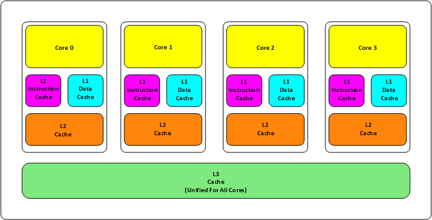
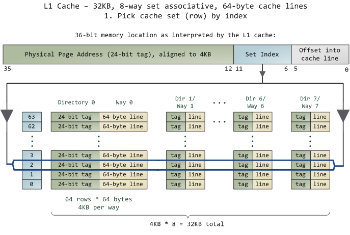

## 一、基础知识

- 三级缓存（L1、L2、L3）
  - L1 缓存分为**指令缓存**，**数据缓存**。
  - L1 和 L2 缓存在每一个 CPU 核中，L3 是所有 CPU 核心共享的内存。
  - L1、L2、L3 的空间越离 CPU 近就越小，速度也越快。
- **缓存的速度**
  - L1 的存取速度：4 个 CPU 时钟周期
  - L2 的存取速度：11 个 CPU 时钟周期
  - L3 的存取速度：39 个 CPU 时钟周期
  - RAM 内存的存取速度：107 个 CPU 时钟周期
- 空间
  - L1/L2：KB 级别
  - L3：MB 级别
- 数据到达顺序：L3 ----> L2 ----> L1 ----> CPU 寄存器
- 设计三层的原因
  - 物理速度
  - 数据状态需要在多个 CPU 中进行同步
- **两个主要问题**
  - 缓存的命中率问题（相对简单）
  - 缓存更新的一致性问题（复杂）

## 二、缓存的命中

- Cache Line：CPU 一整块加载数据的单位，通常是 64 Bytes。

  - 先把 Cache 分布多个 Cache Line；如： L1 有 32KB，则 32KB / 64B = 512 个 Cache Line

- 地址关联算法

  - 哈希求模
  - 容忍一定的 hash 冲突：N-Way 关联
    - 把连续 N 个 Cache Line 绑成一组，先找到相关的组，然后找到相关的 Cache Line —— Set Associativity
  - 示例：Intel 的 L1 Cache，32KB，8-Way 关联，Cache Line 64 Bytes
    - 32KB / 64B = 512 条 Cache Line；每一 Way 有 512 / 8 = 64 条 Cache Line
    - 每一路有 64 * 64 = 4096 Bytes 内存
  - 为了方便索引内存，设计内存地址：
    - **Tag**：每条 Cache Line 前会有一个独立分配的 24 bits 来存的 tag，对应内存地址的前 24 bits
    - **Index**：内存地址后续的 6 个 bits 是在这一 Way 的 Cache Line 索引，2^6 = 64，刚好可以索引 64 条 Cache Line
    - **Offset**：再往后的 6 bits 用于表示在 Cache Line 里的偏移量。

  

  - 在一个 8 组的 Cache Line 中，进行 O(n) n = 8 的遍历，匹配前 24 bits 的 tag。如果匹配中了，就算命中；如果没有匹配，则是 cache miss。如果是读操作，就需要向后面缓存进行访问。
  - L2/L3 使用相同的算法。

- 淘汰算法

  - 随机
  - LRU（常用，通过增加一个访问计数器来实现）

## 三、缓存的一致性

- 缓存写操作的两种策略
  - Write Back：写操作只要在 Cache 上，然后再 flush 到内存上。（常用）
  - Write Through：写操作同时写到 Cache 和内存上。
- 缓存一致性问题的两种解决方法
  - Directory 协议：集中式控制器
  - Snoopy 协议：数据通知的消息总线（常用）
- CPU 不用考虑网络问题，所以 CPU 多核心缓存间的同步的核心是管理好数据的状态。
- 状态协议：
  - MESI 协议
  - MOESI 协议：允许 CPU Cache 间同步数据，降低了对内存的操作。性能提升非常大，但是控制逻辑也非常复杂。
  - MESIF 协议

## 四、调优

1. CPU 会以一个 Cache Line(64 Bytes) 加载数据，相当于 16 个 int 整数，在该个数下的操作基本差不多。
2. 二维数组遍历过程中，逐列遍历对 CPU Cache 的运作方式不友好。
3. 多个线程同时操作一个数组的两个不同的元素时，相邻的数据会在同一个 Cache Line 上。导致虽然两个线程在写不同的数据，但是因为两个数据在同一条 Cache Line 上，需要缓存不断在两个 CPU 的 L1/L2 中进行同步。
4. False Sharing：多个线程操作同一个变量，导致所有线程都在不断地重新同步该变量所在的 Cache Line。使用局部变量解决。