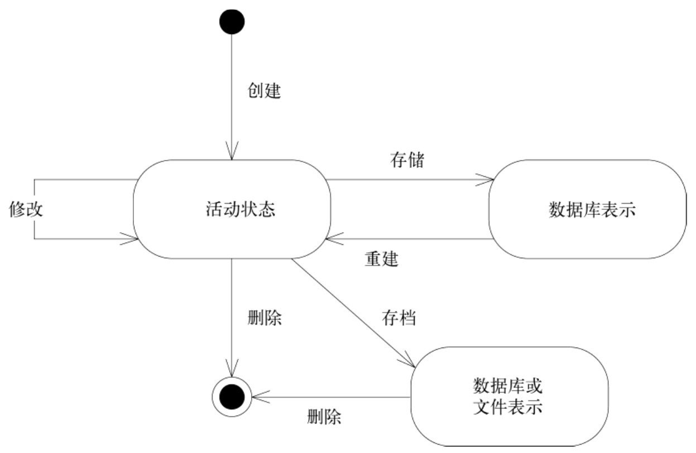
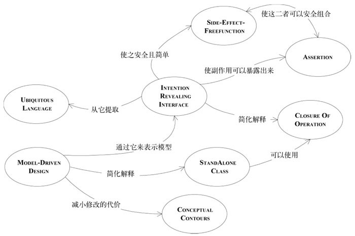
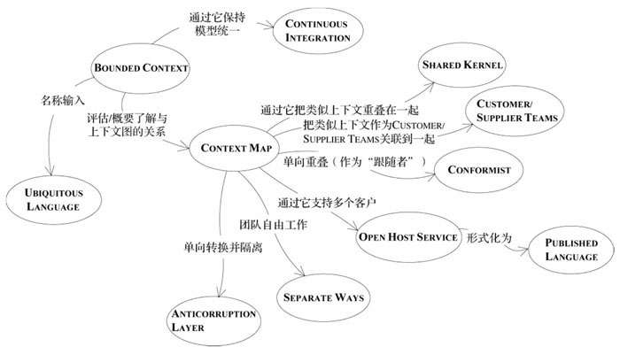
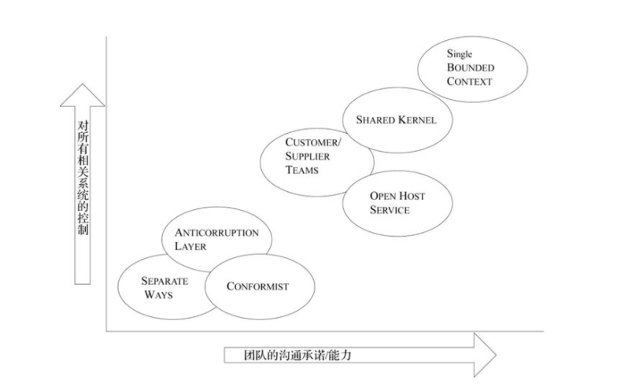
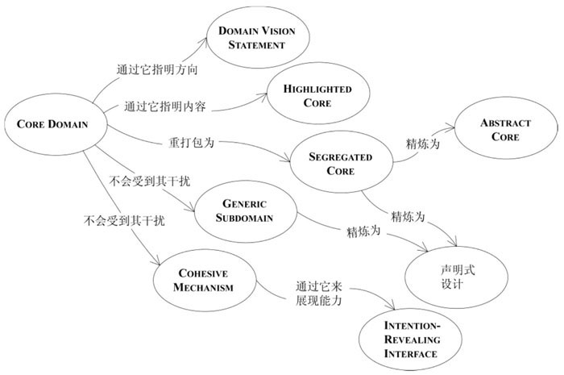
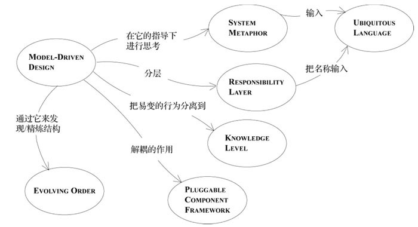
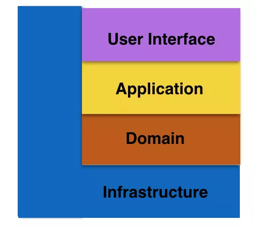
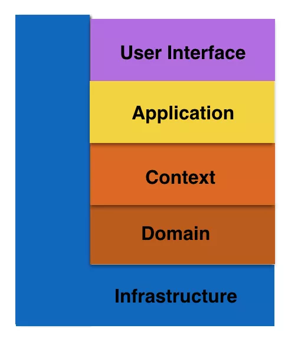

# 一、运用领域模型

## 1.1 消化知识

- 模型在领域驱动设计中的三个作用
  - 模型和设计的核心相互影响
  - 模型是软对所有成员使用的通用语言的中枢。
  - 模型是浓缩的知识。
- 有效建模的要素——》知识消化 ——》持续学习 ——》知识丰富的设计——》深层模型

## 1.2 交流与语言的使用

- 模式：Ubiquitous Language
- ”大声地“建模
- 一个团队，一个语言
- 文档和图（UML 图）
  - 书面设计文档：作为代码和口头交流的补充
  - 完全依赖可执行代码的情况
- 解释性模型

## 1.3 绑定模型和实现

- Model-Driven Design 模式
- 建模范式和工具支持
- 模型反映用户和领域专家关心的问题
- Hands-on Modeler 模式

# 二、模型驱动设计的构造块

## 2.1 分离领域

- Layered Architecture(分层架构) 模式
  - 层次
    - 用户界面层（表示层）
    - 应用层
    - 领域层（或模型层）
    - 基础设施层
  - 将各层关联起来——MVC 模式
  - 架构框架（如 Spring、SpringBoot）

- 领域层是模型的精髓
- The Smart UI "反模式" 模式：领域和应用层不分离

## 2.2 软件中所表示的模型

- 关联
- Entity 模式（Reference Object）
  - Entity 建模（考虑属性、行为、具有唯一标识）
  - 设计标识操作（唯一 ID）
- Value Object 模式
  - 用于描述领域的某个方面而本身没有概念标识的对象称为VALUE OBJECT（值对象）。
  - 设计 Value Object
    - 复制、共享
    - Value Object 的可变性
- Service 模式
  - 对象不是一个事物，而是一系列的操作。无状态。
  - Service 与孤立的领域层
    - 使用 Facade 模式，将外部 Service 包装起来，以模型作为输入，返回一个固定的对象

- Module 模式（Package）
  - 低耦合，高内聚
  - Java 的包模式
- 建模范式
  - 对象范式

## 2.3 领域对象的生命周期

- 模式：Aggregate（全局事务）
- 模式：Factory（对象工厂模式、抽象工厂模式、构建器 builder）
  - 当创建一个对象或创建整个 AGGREGATE 时，如果创建工作很复杂，或者暴露了过多的内部结构，则可以使用 FACTORY 进行封装。
  - 两个基本需求：
    - 每个创建方法都是原子的，而且要保证被创建对象或 Aggregate 的所有固定规则。
    - Factory 应该被抽象为所需的类型，而不是要创建的具体类**（泛型）**。
  - 选择 Factory 及其应用位置
  - 工厂模式不是适用于所有对象的构建
- 模式：Repository（DAO）
  - 我们可以通过对象之间的关联来找到对象。但当它处于生命周期的中间时，必须要有一个起点，以便从这个起点遍历到一个 ENTITY 或 VALUE。
  - FACTORY 负责处理对象生命周期的开始，而 REPOSITORY 帮助管理生命周期的中间和结束。
- 为关系数据库设计对象

## 2.4 适用语言：示例

- 确定 UML 图
- 隔离领域：引入应用层
- 将 Entity 和 Value Object 区别开
- 设计运输领域中的关联
  - 循环关联
  - 双向关联
- Aggregate 边界
- 选择 Repository
- 场景走查（列举场景及解决）
- 对象的创建（Factor 或构造函数）
- 重构设计
- module
- 引入新特性
  - 连接两个系统：使用接口——Enterprise Segment
  - 进一步完善模型：划分业务
- 性能优化：增加缓存

# 三、通过重构来加深理解

## 3.1 突破

- 重构的原则是始终小步前进，始终保持系统正常运转。
- 

## 3.2 将隐式概念转变为显示概念

- 概念挖掘
  - 倾听语言
  - 检查不足之处
  - 思考矛盾之处
  - 查阅书籍 + 和领域专家合作
  - 不断尝试：不能避免设计上的失误
- 如何为不太明显的概念建模
  - 显式的**约束**
  - 将**过程**建模为领域对象（**模板策略模式**）
  - 模式：Specification
    - Specification 可以测试任何对象以检验它们是否满足指定的标准。
    - 将规则保留在领域层
  - Specification 的应用和实现
    - 三个目的（满足一个或多个）：
      1. 验证对象
      2. 从集合中选择一个对象
      3. 指定在创建新对象时必须满足某种需求。
  - 通过可工作的原型来摆脱开发僵局（多个开发团队之间）

## 3.3 柔性设计（supple design）

-  模式：Intention-Revealing Interfaces
  - 所有复杂的机制都应该封装到抽象接口的后面，接口只表明意图，而不表明方式。
- 模式：Side-Effect-Free Function
  - 把命令和查询严格地放在不同的操作中。
  - Value Object 可以在一次查询的响应中被创建和传递，然后被丢弃。
- 模式：Assertion
- 模式：Conceptual Contour
  - 在连续的重构过程中观察发生变化和保证稳定的规律性，并寻找能够解释这些变化模式的底层 CONCEPTUAL CONTOUR。使模型与领域中那些一致的方面（正是这些方面使得领域成为一个有用的知识体系）相匹配。
- 模式：Standalone Class
  - 尽力把最复杂的计算提取到 Standalone Class 中——从存在大量依赖的类中将 Value Object 建模出来。
- 模式：Closure Of Operation
  - 在适当情况下，在定义操作时让它的返回类型与其参数的类型相同。
- 声明式设计
  - 注解实现
  - 声明式设计风格
- 切入问题的角度
  - 分割子领域
  - 尽可能利用已有的形式

## 3.4 应用分析模式

## 3.5 将设计模式应用于模型

- 模式：Strategy
- 模式：Composite

## 3.6 通过重构得到更深层的理解

- 开始重构
- 探索团队
- 借鉴先前的经验
- 针对开发人员的设计
- 重构的时机
  - 持续重构
- 危机就是机遇

# 四、战略设计

- 上下文
- 精炼
- 大型结构

## 4.1 保持模型的完整性

- 模式：Bounded Context
  - 明确定义模型所应用的上下文。根据团队的组织、软件系统的各个部分的用法以及物理表现来设置模型的边界。**在这些边界中严格保持模型的一致性。**
  - 将不同模型的元素组合到一起可能会引发两类问题
    - 重复的概念
    - 假同源
- 模式：Continuous Integration
  - 保持模型统一
  - 把一个上下文中的所有工作足够频繁地合并到一起，并使它们保持一致，以便当模型发生分裂时，可以迅速发现并纠正问题。
  - 两个级别：
    - 模型概念的集成
    - 实现的集成
- 模式：Context Map
  - 识别在项目中起作用的每个模型，并定义其 Bounded Context；为每个 Bounded Context 命名，并把名称添加到 UL 中。
- Bounded Context 之间的关系
- 模式：Shared Kernel
  - 把类似上下文重叠在一起（减少重复）
  - 要经常进行集成，但是集成的频率要比 Continuous Integration 要低。
- 模式：Customer/Supplier Development Team
  - 在两个团队之间建立一种明确的客户/供应商关系。在计划会议中，下游团队相当于上游团队的客户。根据下游团队的需求来协商需要执行的任务，并未这些任务做预算，以便每个人都知道双方的约定和进度。
  - 两个关键要素：
    - 关系必须是客户和供应商的关系，其中客户的需求是至关重要的。
    - 必须有自动测试套件，使上游团队在修改代码时不必担心破坏下游团队的工作，并使下游团队能够专注于自己的工作，而不用总是密切关注上游团队的行动。
- 模式：Conformist（单方面跟随）
  - 跟随者（循规蹈矩）
  - 通过严格遵从上游团队的模型，可以消除在 Bounded Context 之间进行转换的复杂性。
- 模式：Anticorruption Layer
  - 在不同的模型和协议之间转换概念对象和操作的机制。
  - 考虑事项：
    - 设计 Anticorruption Layer 的接口：通常以一组 Service 的形式出现
    - 实现 Anticorruption Layer：实现为 Facade、Adapter + 转换器 + 系统间的通信和传输机制
- 模式：Separate Way
- 模式：Open Host Service（Open API）
  - 定义一个协议，把子系统作为一组 Service 供其他系统访问。开放这个协议，以便所有需要与这个子系统集成的人都可以使用它。
- 模式：Published Language
  - XML、JSON、Protobuf
- 选择模型上下文策略
  - 团队决策或更高层决策
  - 置身上下文中
  - 转换边界

- 转换
  - 合并 Context：Separate Way ——》 Shared Kernel
    - 评估初始状况
    - 建立合并过程
    - 选择某个小的子领域作为开始。
  - 合并 Context：Shared Kernel ——》 Continuous Integration
  - 逐步淘汰遗留系统
  - Open Host Service ——》 Published Language

## 4.2 精炼

- 模式：Core Domain
  - 自主开发的软件的最大价值来自于对 Core Domain 的完全控制。
- 模式：Generic Subdomain
  - 识别与项目意图无关的内聚子领域，把这些子领域的通用模型提取出来，并放到单独的 Module 上。
  - 内部实现（结合公共发布的设计或模型）
    - 易于集成；只开发自己需要的，不做多余的工作；可以临时把工作分包出去
    - 需要承担后续的维护和培训负担；容易低估开发的时间和成本。
- 模式：Domain Vision Statement
  - 写一份 Core Domain 的简短描述以及它将会创造的价值（价值主张）。尽量精简
  - 为团队提供统一方向
- 模式：HighLighted Core
  - 精炼文档：描述并解释核心，并给出进一步研究核心部分的理由。
  - 标明 Core：
  - 把精炼文档作为过程工具
- 模式：Cohesive Mechanism(内聚机制)
  - 解决描述性模型所提出的复杂计算问题。
  - 模型提出问题，Cohesive Mechanism 解决问题。
- 模式：Segregated Core
  - 提高 Core Domain 的内聚性
- 模式：Abstract Core（基类）
  - 把模型中最基本的概念识别出来，并分离到不同的类、抽象类或接口中。

## 4.3 大型结构

- 模式：Evolving Order（演变的顺序）
  - 发现/精炼结构
- 模式：System Metaphor
  - 隐喻思维
  - 当系统的一个具体类比正好符合团队成员对系统的想象，并且能够引导他们向着一个有用的方向进行思考时，就应该把这个类比用作一种大型结构。围绕这个隐喻进行设计，并把它吸收到 UL 中。应不断检查隐喻是否过度或不恰当，当发现它起到妨碍作用时，要随时准备抛弃它。
- 模式：Responsibility Layer
  - 职责驱动
  - 分层模式
    - 严格分层架构：某层只能与位于直接下方的层发生耦合
    - **松散分层系统**：某一层中的组件可以访问任何比它低的层，而不限于只能访问直接与它相邻的下一层。
- 模式：Knowledge Level
  - ？？？
- 模式：Pluggable Component Framework（可插入式组件框架）
  - 

## 4.4 领域驱动设计的综合运用

- 三大基本原则
  - 上下文
  - 精炼
  - 大型结构
- 制定战略设计决策的 6 个要点
  1. 决策必须传达到整个团队
  2. 决策过程必须收集反馈意见
  3. 计划必须允许演变
  4. 架构团队不必把所有最好、最聪明的人员都吸收进来
  5. 战略设计需要遵守简约和谦逊的原则
  6. 对象的职责要专一，而开发人员应该是多面手
- 注意总体规划：piecemeal growth

# 五、DDD 分层架构经典的三种模式

## 5.1 四层架构

- User Interface 层主要是 **Restful 消息处理、配置文件解析、等等**。
- Application 层主要是**多进程管理及调度、多线程管理及调度、多协程调度和状态机管理、等等**。
- Domain 层主要是**领域模型的实现，包括领域对象的确立，领域对象的生命周期管理及关系，领域服务的定义，领域事件的发布，等等**
- Infrastructure 层主要是**业务平台、编程框架、第三方库的封装、基础算法，等等**

## 5.2 五层架构

- User Interface 是用户接口层，主要用于**处理用户发送的 Restful 请求和解析用户输入的配置文件等，并将信息传递给 Application 层的接口**。
- Application 层是应用层，**负责多进程的管理及调度、多线程管理及调度、多协程调度和维护业务实例的状态模型。**当应用层收到用户接口层的请求后，委托 Context 层与本次业务相关的上下文进行处理。
- Context 层是环境层，**以上下文（Context）为单位，将 Domain 层的领域对象 cast 成合适的 Role，让 Role 交互起来完成业务逻辑。**
- Domain 层是领域层，**定义领域模型，不仅包括领域对象及其之间关系的建模，还包括对象的角色 Role 的显示建模**。
- Infrastructure 层是基础设施层，为其他层提供通用的技术能力：**业务平台，编程框架，持久化机制，消息机制，第三方库的封装，通用算法，等等**。

## 5.3 六层架构

- User Interface 是用户接口层，主要**用于处理用户发送的 Restful 请求和解析用户输入的配置文件等，并将信息传递给 Scheduler 层的接口。**
- Scheduler 是调度层，**负责多进程管理及调度、多线程管理及调度、多协程调度和维护业务实例的状态模型**。当调度层收到用户接口层的请求后，委托Transaction 层与本次操作相关的事务进行处理。
- Transaction 是事务层，对应一个业务流程，比如 UE Attach，**将多个同步消息或异步消息的处理序列组合成一个事务，而且在大多场景下，都有选择结构**。万一事务执行失败，则立即进行回滚。**当事务层收到调度层的请求后，委托 Context 层的 Action 进行处理，常常还伴随使用 Context 层的 Specification（谓词）进行 Action 的选择。**
- Context 是环境层，**以 Action 为单位，处理一条同步消息或异步消息，将 Domain 层的领域对象 cast 成合适的 role，让 role 交互起来完成业务逻辑**。环境层通常也包括 Specification 的实现，即通过 Domain 层的知识去完成一个条件判断。
- Domain 层是领域层，定义领域模型，不仅包括领域对象及其之间关系的建模，还包括对象的角色 role 的显式建模。
- Infrastructur e层是基础实施层，为其他层提供通用的技术能力：业务平台，编程框架，持久化机制，消息机制，第三方库的封装，通用算法，等等。

## 5.4 六边形架构