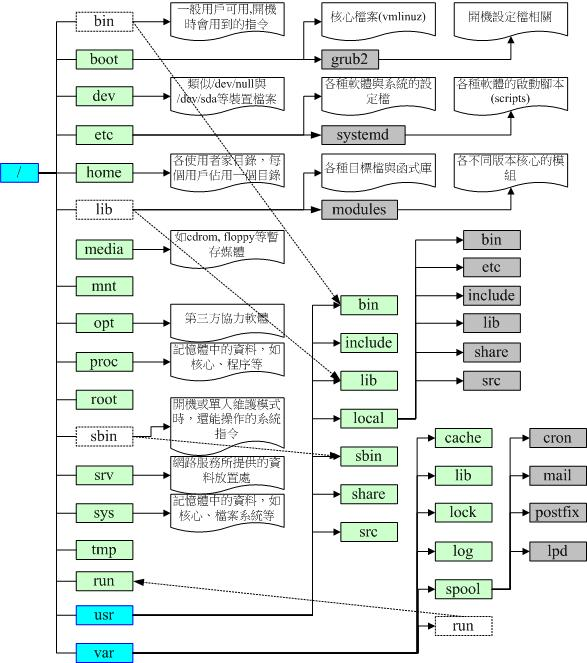

## 重要指令

- 帮助文件指令
  - --help
  - man
  - info
  - 软件说明文档：/usr/share/doc
- 系统使用状态
  - who：有谁在线上
  - netstat -a：网络的连线状态
  - ps -aux：后台执行的程序
- 关机/重启指令（root）：
  - sync：将资料同步写入硬碟中的指令
  - shutdown：关机（常用）
  - reboot：重启
  - halt/poweroff：关机
- 基础指令
  - date：日期
  - cal：日历
  - bc：计算器
  - 


## 文件权限与目录配置

- 身份
  - User：/etc/shadow
  - Group：/etc/group
  - Others
  - Root：/etc/passwd


- 改变文件属性与权限
  - chgrp ：改变文件所属群组
  - chown ：改变文件拥有者
  - chmod ：改变文件的权限, SUID, SGID, SBIT等等的特性
  
- 目录配置

  

- 

## 文件与目录管理

### 特殊的目录

```
. 代表此层目录
.. 代表上一层目录
- 代表前一个工作目录
~ 代表『目前使用者身份』所在的家目录
~account 代表account 这个使用者的家目录(account是个帐号名称)
```

### 常见的处理目录的指令

- cd：变换目录
- pwd：显示目前的目录
- mkdir：建立一个新的目录
- rmdir：删除一个空的目录

### 复制、删除与移动： cp, rm, mv

- cp：复制文件或目录，建立链接。

  - ```
     选项与参数：
     -a ：相当于-dr --preserve=all的意思，至于dr请参考下列说明；(常用)
    -d ：若来源档为连结档的属性(link file)，则复制连结档属性而非文件本身；
    -f ：为强制(force)的意思，若目标文件已经存在且无法开启，则移除后再尝试一次；
    -i ：若目标档(destination)已经存在时，在覆盖时会先询问动作的进行(常用)
    -l ：进行硬式连结(hard link)的连结档建立，而非复制文件本身；
    -p ：连同文件的属性(权限、用户、时间)一起复制过去，而非使用预设属性(备份常用)；
    -r ：递回持续复制，用于目录的复制行为；(常用)
    -s ：复制成为符号连结档(symbolic link)，亦即『捷径』文件；
    -u ：destination 比source 旧才更新destination，或destination 不存在的情况下才复制。
    --preserve=all ：除了-p 的权限相关参数外，还加入SELinux 的属性, links, xattr 等也复制了。
    最后需要注意的，如果来源档有两个以上，则最后一个目的档一定要是『目录』才行！
    ```

  - 由于cp 有种种的文件属性与权限的特性，所以，在复制时，你必须要清楚的了解到：

    - 是否需要完整的保留来源文件的资讯？
    - 来源文件是否为连结档(symbolic link file)？
    - 来源档是否为特殊的文件，例如FIFO, socket 等？
    - 来源档是否为目录？

- rm：移除文件或目录。、

  - ```
    选项与参数：
    -f ：就是force 的意思，忽略不存在的文件，不会出现警告讯息；
    -i ：互动模式，在删除前会询问使用者是否动作
    -r ：递回删除啊！最常用在目录的删除了！这是非常危险的选项！！！
    ```

- mv ：移动文件与目录，或更名

  - ```
    选项与参数：
    -f ：force 强制的意思，如果目标文件已经存在，不会询问而直接覆盖；
    -i ：若目标文件(destination) 已经存在时，就会询问是否覆盖！
    -u ：若目标文件已经存在，且source 比较新，才会更新(update)
    ```

### 文件内容查阅

- cat：由第一行开始显示文件内容

  - ```
    选项与参数：
    -A ：相当于-vET 的整合选项，可列出一些特殊字符而不是空白而已；
    -b ：列出行号，仅针对非空白行做行号显示，空白行不标行号！
    -E ：将结尾的断行字元$ 显示出来；
    -n ：列印出行号，连同空白行也会有行号，与-b 的选项不同；
    -T ：将[tab] 按键以^I 显示出来；
    -v ：列出一些看不出来的特殊字符
    ```

- tac：从最后一行开始显示，可以看出tac 是cat 的倒着写！

- nl：显示的时候，顺道输出行号！

  - ```
    选项与参数：
    -b ：指定行号指定的方式，主要有两种：
          -ba ：表示不论是否为空行，也同样列出行号(类似cat -n)；
          -bt ：如果有空行，空的那一行不要列出行号(预设值)；
    -n ：列出行号表示的方法，主要有三种：
          -n ln ：行号在萤幕的最左方显示；
          -n rn ：行号在自己栏位的最右方显示，且不加0 ；
          -n rz ：行号在自己栏位的最右方显示，且加0 ；
    -w ：行号栏位的占用的字元数。
    ```

- more：一页一页的显示文件内容

  - 空白键(space)：代表向下翻一页；
  - Enter ：代表向下翻『一行』；
  - /字串 ：代表在这个显示的内容当中，向下搜寻『字串』这个关键字；
  - :f ：立刻显示出档名以及目前显示的行数；
  - q ：代表立刻离开more ，不再显示该文件内容。
  - b 或[ctrl]-b ：代表往回翻页，不过这动作只对文件有用，对管线无用。

- less：与 more 类似，但是比 more 更好的是，他可以往前翻页！

  - 空白键 ：向下翻动一页；
  - [pagedown]：向下翻动一页；
  - [pageup] ：向上翻动一页；
  - /字串 ：向下搜寻『字串』的功能；
  - ?字串 ：向上搜寻『字串』的功能；
  - n ：重复前一个搜寻(与/ 或? 有关！)
  - N ：反向的重复前一个搜寻(与/ 或? 有关！)
  - g ：前进到这个资料的第一行去；
  - G ：前进到这个资料的最后一行去(注意大小写)；
  - q ：离开less 这个程序；

- head：只看头几行

  - ```
    选项与参数：
    -n ：后面接数字，代表显示几行的意思
    ```

- tail：只看尾巴几行

- od：以二进位的方式读取文件内容！

  - ```
    选项或参数：
    -t ：后面可以接各种『类型(TYPE)』的输出，例如：
          a ：利用预设的字元来输出；
          c ：使用ASCII 字元来输出
          d[size] ：利用十进位(decimal)来输出资料，每个整数占用size bytes ；
          f[size] ：利用浮点数值(floating)来输出资料，每个数占用size bytes ；
          o[size] ：利用八进位(octal)来输出资料，每个整数占用size bytes ；
          x[size] ：利用十六进位(hexadecimal)来输出资料，每个整数占用size bytes ；
    ```

### 修改文件时间或建置新档： touch

```
选项与参数：
-a ：仅修订 access time；
-c ：仅修改文件的时间，若该文件不存在则不建立新文件；
-d ：后面可以接欲修订的日期而不用目前的日期，也可以使用--date="日期或时间"
-m ：仅修改 mtime ；
-t ：后面可以接欲修订的时间而不用目前的时间，格式为[YYYYMMDDhhmm]
```

- 最常被使用的情况是：
  - 建立一个空的文件；
  - 将某个文件日期修订为目前(mtime 与atime)

### 文件与目录的预设权限与隐藏权限

- 文件预设权限：umask

  > - 若使用者建立为『文件』则预设『没有可执行( x )权限』，亦即只有rw这两个项目，也就是最大为666分，预设权限如下：
  >   **-rw-rw-rw-**
  > - 若使用者建立为『目录』，则由于x与是否可以进入此目录有关，因此预设为所有权限均开放，亦即为777分，预设权限如下：
  >   **drwxrwxrwx**
  >
  > 
  >
  > umask的分数指的是『该预设值需要减掉的权限！』
  >
  > 
  >
  > - 建立文件时：(-rw-rw-rw-) - (-----w--w-) ==> -rw-r--r--
  > - 建立目录时：(drwxrwxrwx) - (d----w--w-) ==> drwxr-xr-x


### 文件隐藏属性

>  chattr指令只能在Ext2/Ext3/Ext4的Linux传统文件系统上面完整生效

- **chattr (设定文件隐藏属性)**

  ```
  选项与参数：
  + ：增加某一个特殊参数，其他原本存在参数则不动。
  - ：移除某一个特殊参数，其他原本存在参数则不动。
  = ：设定一定，且仅有后面接的参数
  
  A ：当设定了A 这个属性时，若你有存取此文件(或目录)时，他的存取时间atime 将不会被修改，
       可避免I/O 较慢的机器过度的存取磁碟。(目前建议使用文件系统挂载参数处理这个项目)
  S ：一般文件是非同步写入磁碟的(原理请参考前一章sync的说明)，如果加上S这个属性时，
       当你进行任何文件的修改，该更动会『同步』写入磁碟中。
  a ：当设定a 之后，这个文件将只能增加资料，而不能删除也不能修改资料，只有root 才能设定这属性
  c ：这个属性设定之后，将会自动的将此文件『压缩』，在读取的时候将会自动解压缩，
       但是在储存的时候，将会先进行压缩后再储存(看来对于大文件似乎蛮有用的！)
  d ：当dump 程序被执行的时候，设定d 属性将可使该文件(或目录)不会被dump 备份
  i ：这个i 可就很厉害了！他可以让一个文件『不能被删除、改名、设定连结也无法写入或新增资料！』
       对于系统安全性有相当大的助益！只有root 能设定此属性
  s ：当文件设定了s 属性时，如果这个文件被删除，他将会被完全的移除出这个硬碟空间，
       所以如果误删了，完全无法救回来了喔！
  u ：与s 相反的，当使用u 来设定文件时，如果该文件被删除了，则资料内容其实还存在磁碟中，
       可以使用来救援该文件喔！
  注意1：属性设定常见的是a 与i 的设定值，而且很多设定值必须要身为root 才能设定
  注意2：xfs 文件系统仅支援AadiS 而已
  ```

- **lsattr (显示文件隐藏属性)**

  ```
  选项与参数：
  -a ：将隐藏档的属性也秀出来；
  -d ：如果接的是目录，仅列出目录本身的属性而非目录内的档名；
  -R ：连同子目录的资料也一并列出来！ 
  ```
  - 观察文件类型：file（data、ASCII、binary）

### 指令与文件的搜寻

- **指令文件名的搜寻：which (寻找『执行文件』)**

  ```
  选项或参数：
  -a ：将所有由PATH 目录中可以找到的指令均列出，而不止第一个被找到的指令名称
  ```
  - 这个指令是根据『[PATH](http://linux.vbird.org/linux_basic/0220filemanager.php#dir_path)』这个环境变数所规范的路径，去搜寻『执行文件』的文件名
  - 因为 history 是『bash 内建的指令』，而 which 预设是找 PATH 内所规范的目录，所以找不到 history 指令(有 bash 就有 history！)

- 文件名的搜寻

  - **whereis (由一些特定的目录中寻找文件档名)**

    ```shell
    选项与参数：
    #-l :可以列出whereis 会去查询的几个主要目录而已
    -b :只找binary 格式的文件
    -m :只找在说明档manual 路径下的文件
    -s :只找source 来源文件
    -u :搜寻不在上述三个项目当中的其他特殊文件
    ```

    -  whereis 主要是针对 /bin /sbin 底下的执行文件， 以及 /usr/share/man 底下的 man page 文件，跟几个比较特定的目录来处理而已。

  - **locate / updatedb**

    ```shell
    选项与参数：
    -i ：忽略大小写的差异；
    -c ：不输出档名，仅计算找到的文件数量
    -l ：仅输出几行的意思，例如输出五行则是-l 5
    -S ：输出locate 所使用的资料库文件的相关资讯，包括该资料库纪录的文件/目录数量等
    -r ：后面可接正规表示法的显示方式
    ```

    - updatedb：根据/etc/updatedb.conf 的设定去搜寻系统硬碟内的档名，并更新/var/lib/mlocate 内的资料库文件；
    - locate：依据/var/lib/mlocate 内的资料库记载，找出使用者输入的关键字档名。

  - **find**

    ```shell
    选项与参数：
    1. 与时间有关的选项：共有-atime, -ctime 与-mtime ，以-mtime 说明
       -mtime n ：n 为数字，意义为在n 天之前的『一天之内』被更动过内容的文件；
       -mtime +n ：列出在n 天之前(不含n 天本身)被更动过内容的文件档名；
       -mtime -n ：列出在n 天之内(含n 天本身)被更动过内容的文件档名。
       -newer file ：file 为一个存在的文件，列出比file 还要新的文件档名
    2. 与使用者或群组名称有关的参数：
       -uid n ：n 为数字，这个数字是使用者的帐号ID，亦即UID ，这个UID 是记录在
                /etc/passwd 里面与帐号名称对应的数字。这方面我们会在第四篇介绍。
       -gid n ：n 为数字，这个数字是群组名称的ID，亦即GID，这个GID 记录在
                /etc/group，相关的介绍我们会第四篇说明～
       -user name ：name 为使用者帐号名称喔！例如dmtsai
       -group name：name 为群组名称喔，例如users ；
       -nouser ：寻找文件的拥有者不存在/etc/passwd 的人！
       -nogroup ：寻找文件的拥有群组不存在于/etc/group 的文件！
                    当你自行安装软体时，很可能该软体的属性当中并没有文件拥有者，
                    这是可能的！在这个时候，就可以使用-nouser 与-nogroup 搜寻。
    3. 与文件权限及名称有关的参数：
       -name filename：搜寻文件名称为filename 的文件；
       -size [+-]SIZE：搜寻比SIZE 还要大(+)或小(-)的文件。这个SIZE 的规格有：
                       c: 代表byte， k: 代表1024bytes。所以，要找比50KB
                       还要大的文件，就是『 -size +50k 』
       -type TYPE ：搜寻文件的类型为TYPE 的，类型主要有：一般正规文件(f), 装置文件(b, c),
                       目录(d), 连结档(l), socket (s), 及FIFO (p) 等属性。
       -perm mode ：搜寻文件权限『刚好等于』 mode 的文件，这个mode 为类似chmod
                     的属性值，举例来说， -rwsr-xr-x 的属性为4755 ！
       -perm -mode ：搜寻文件权限『必须要全部囊括mode 的权限』的文件，举例来说，
                     我们要搜寻-rwxr--r-- ，亦即0744 的文件，使用-perm -0744，
                     当一个文件的权限为-rwsr-xr-x ，亦即4755 时，也会被列出来，
                     因为-rwsr-xr-x 的属性已经囊括了-rwxr--r-- 的属性了。
       -perm /mode ：搜寻文件权限『包含任一mode 的权限』的文件，举例来说，我们搜寻
                     -rwxr-xr-x ，亦即-perm /755 时，但一个文件属性为-rw-------
                     也会被列出来，因为他有-rw.... 的属性存在！
                     
    4. 额外可进行的动作：
       -exec command ：command 为其他指令，-exec 后面可再接额外的指令来处理搜寻到的结果。
       -print ：将结果列印到萤幕上，这个动作是预设动作！
    ```

    - +4代表大于等于5天前的档名：ex> find /var -mtime +4
    - -4代表小于等于4天内的文件档名：ex> find /var -mtime -4
    - 4则是代表4-5那一天的文件档名：ex> find /var -mtime 4

## 磁盘与文件系统管理

### 磁碟与目录的容量

- df：列出文件系统的整体磁碟使用量；

  ```shell
  选项与参数：
  -a ：列出所有的文件系统，包括系统特有的/proc 等文件系统；
  -k ：以KBytes 的容量显示各文件系统；
  -m ：以MBytes 的容量显示各文件系统；
  -h ：以人们较易阅读的GBytes, MBytes, KBytes 等格式自行显示；
  -H ：以M=1000K 取代M=1024K 的进位方式；
  -T ：连同该partition 的filesystem 名称(例如xfs) 也列出；
  -i ：不用磁碟容量，而以inode 的数量来显示
  ```

  - 

- du：评估文件系统的磁碟使用量(常用在推估目录所占容量)

  ```shell
  选项与参数：
  -a ：列出所有的文件与目录容量，因为预设仅统计目录底下的文件量而已。
  -h ：以人们较易读的容量格式(G/M) 显示；
  -s ：列出总量而已，而不列出每个各别的目录占用容量；
  -S ：不包括子目录下的总计，与-s 有点差别。
  -k ：以KBytes 列出容量显示；
  -m ：以MBytes 列出容量显示；
  ```

  - 

### 实体连结与符号连结： ln

- **Hard Link (实体连结, 硬式连结或实际连结)**
  - hard link只是在某个目录下新增一笔档名连结到某inode号码的关连记录而已。
  - 限制
    - 不能跨Filesystem；
    - 不能link 目录。
  - 示意图
    - 
    - 可以透过1或2的目录之inode指定的block找到两个不同的档名，而不管使用哪个档名均可以指到real那个inode去读取到最终资料。**好处：【安全】**

- **Symbolic Link (符号连结，亦即是捷径)**

  - Symbolic link就是在建立一个独立的文件，而这个文件会让资料的读取指向他link的那个文件的档名

    ```
    选项与参数：
     -s ：如果不加任何参数就进行连结，那就是hard link，至于-s就是symbolic link 
    -f ：如果目标档存在时，就主动的将目标档直接移除后再建立！
    ```

  - 链接文件改变的是原文件。

  - 当我们建立一个新的目录时， 『新的目录的link数为2 ，而上层目录的link数则会增加1』

###  观察磁碟分割状态

- **lsblk 列出系统上的所有磁碟列表**

  ```
  选项与参数：
  -d ：仅列出磁碟本身，并不会列出该磁碟的分割资料
  -f ：同时列出该磁碟内的文件系统名称
  -i ：使用 ASCII 的线段输出，不要使用复杂的编码(在某些环境下很有用)
  -m ：同时输出该装置在/dev 底下的权限资料(rwx 的资料)
  -p ：列出该装置的完整档名！而不是仅列出最后的名字而已。
  -t ：列出该磁碟装置的详细资料，包括磁碟伫列机制、预读写的资料量大小等
  ```

  - NAME：就是装置的档名啰！会省略/dev 等前导目录！
  - MAJ:MIN：其实核心认识的装置都是透过这两个代码来熟悉的！分别是主要：次要装置代码！
  - RM：是否为可卸载装置(removable device)，如光碟、USB 磁碟等等
  - SIZE：当然就是容量啰！
  - RO：是否为唯读装置的意思
  - TYPE：是磁碟(disk)、分割槽(partition) 还是唯读记忆体(rom) 等输出
  - MOUTPOINT：就是前一章谈到的挂载点！

- **blkid 列出装置的UUID 等参数**

- **parted 列出磁碟的分割表类型与分割资讯**


## 文件与文件系统的压缩，打包与备份

### 压缩文件的用途与技术

- 压缩技术
  - 将这些没有使用到的空间释放出来，以让文件占用的空间变小
  - 将重复的资料进行统计记录的

- 

### Linux 系统常见的压缩指令

- 压缩文件的副文件名大多是：『*.tar, *.tar.gz, *.tgz, *.gz, *.Z, *.bz2, *.xz』

  - ```
    *.Z compress 程序压缩的档案； 
    *.zip zip 程序压缩的档案；
    *.gz gzip 程序压缩的档案； 
    *.bz2 bzip2 程序压缩的档案； 
    *.xz xz 程序压缩的档案； 
    *.tar tar 程序打包的资料，并没有压缩过； 
    *.tar.gz tar 程序打包的档案，其中并且经过gzip 的压缩 
    *.tar.bz2 tar 程序打包的档案，其中并且经过bzip2 的压缩 
    *.tar.xz tar 程序打包的档案，其中并且经过xz 的压缩
    ```

#### gzip, zcat/zmore/zless/zgrep

- gzip 可以解开compress, zip 与gzip 等软体所压缩的档案

  - ```
    选项与参数：
    -c ：将压缩的资料输出到萤幕上，可透过资料流重导向来处理；
    -d ：解压缩的参数；
    -t ：可以用来检验一个压缩档的一致性～看看档案有无错误；
    -v ：可以显示出原档案/压缩档案的压缩比等资讯；
    -# ：# 为数字的意思，代表压缩等级，-1 最快，但是压缩比最差、-9 最慢，但是压缩比最好！预设是-6
    ```

  - **使用gzip进行压缩时，在预设的状态下原本的档案会被压缩成为.gz的档名，原始档案就不再存在了。**

  - **zcat/zmore/zless** 则可以对应于cat/more/less 的方式来读取纯文字档被压缩后的压缩档

  - **zgrep**：对应 grep，查找压缩文件中的某一字符串

#### bzip2,bzcat/bzmore/bzless/bzgrep

- bzip2 则是为了取代gzip 并提供更佳的压缩比而来的，用法和 gzip 类似。

  - ```
    选项与参数：
    -c ：将压缩的过程产生的资料输出到萤幕上！
    -d ：解压缩的参数
    -k ：保留原始档案，而不会删除原始的档案喔！
    -z ：压缩的参数(预设值，可以不加)
    -v ：可以显示出原档案/压缩档案的压缩比等资讯；
    -# ：与gzip 同样的，都是在计算压缩比的参数， -9 最佳， -1 最快！
    ```


#### xz,xzcat/xzmore/xzless/xzgrep

- xz 具有更好的压缩比，用法也跟 gzip、bzip2 类似。

  - ```
    选项与参数：
    -d ：就是解压缩啊！
    -t ：测试压缩档的完整性，看有没有错误
    -l ：列出压缩档的相关资讯
    -k ：保留原本的档案不删除～
    -c ：同样的，就是将资料由萤幕上输出的意思！
    -# ：同样的，也有较佳的压缩比的意思！
    ```

- **如果时间是你的重要成本，那么gzip 恐怕是比较适合的压缩软件。**

### 打包指令： tar

- **tar**

  - ```shell
    选项与参数：
    -c ：建立打包档案，可搭配-v来察看过程中被打包的档名(filename) 
    -t ：察看打包档案的内容含有哪些档名，重点在察看『档名』就是了；
    -x ：解打包或解压缩的功能，可以搭配-C (大写)在特定目录解开
          特别留意的是， -c, -t, -x不可同时出现在一串指令列中。
    -z ：透过gzip的支援进行压缩/解压缩：此时档名最好为*.tar.gz 
    -j ：透过bzip2的支援进行压缩/解压缩：此时档名最好为*.tar.bz2 
    -J ：透过xz的支援进行压缩/解压缩：此时档名最好为*.tar.xz 
          特别留意， -z, -j, -J不可以同时出现在一串指令列中
    -v ：在压缩/解压缩的过程中，将正在处理的档名显示出来！
    -f filename：-f后面要立刻接要被处理的档名！建议-f单独写一个选项啰！(比较不会忘记) 
    -C目录：这个选项用在解压缩，若要在特定目录解压缩，可以使用这个选项。
    
    其他后续练习会使用到的选项介绍：
    -p(小写) ：保留备份资料的原本权限与属性，常用于备份(-c)重要的设定档
    -P(大写) ：保留绝对路径，亦即允许备份资料中含有根目录存在之意；
    --exclude=FILE：在压缩的过程中，不要将FILE打包！
    ```

  - **『 -f filename 』是紧接在一起的**


## 内核态和用户态

