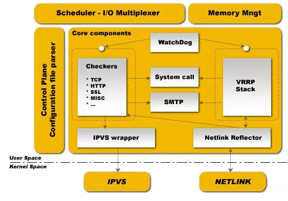

## Haproxy（四层、七层代理）

### HaProxy 功能

- 四层负载均衡（TCP）
- 七层负载均衡（HTTP）
  - 支持正则表达式处理，可以做动静分离
  - 支持 Session 的保持、Cookie 的引导。
  - Haproxy 在状态监测方面功能强大，可支持**端口、URL、脚本**等多种状态检测方式。

### HaProxy 主要工作

1. HaProxy 处理传入的链接
2. 定期检查后端服务器的状态
3. 与其他 HaProxy 节点交换信息

### HaProxy 术语

- **访问控制列表（ACL）**：可配置开放策略和拒绝策略。通过 ACL 配置过滤请求，可以保证服务器安全性。
- 前端（frontend）：前端定义请求如何转发到后端。
- 后端（backend）：一组接收转发请求的服务器。

### HaProxy 常用负载均衡算法

- 轮询算法：round robin
- 根据请求源 IP 算法：source
- 最少连接者先处理算法：leastconn


### HaProxy 文件存放位置

```bash
/etc/sysconfig/haproxy
# 安装目录
/usr/local/services/src/haproxy-1.6.9
# 二进制文件
/usr/local/services/haproxy-1.6.9/sbin
# 文档文件
/usr/local/services/haproxy-1.6.9/doc
/usr/local/services/open-falcon/plugin/haproxy
/usr/local/services/open-falcon/logs/haproxy 

# 重启 HaProxy
systemctl restart haproxy
```


## keepalived(三层代理)

- keepalived 是一个**基于 VRRP 协议**来实现的服务高可用方案，可以利用其来避免 IP 单点故障。它的作用是检测服务器的状态，如果有一台服务器宕机，或出现故障，keepalivedd 将检测到，使用其他服务器代替该服务器的工作，**当服务器工作正常后 keepalived 自动将服务器加入到服务器群中。**
- keepalived 一般不会单独出现，而是与其它负载均衡技术（如 lvs、haproxy、nginx）一起工作来达到集群的高可用。

### keepalived 如何实现高可用

- keepalived 是通过 vrrp（虚拟路由冗余协议）实现高可用。

#### VRRP 协议介绍

- 网络在设计的时候必须考虑到冗余容灾，包括线路冗余，设备冗余等，**防止网络存在单点故障**，那**在路由器或三层交换机处**实现冗余就显得尤为重要。在网络里面有个协议就是来做这事的，这个协议就是 VRRP 协议，Keepalived 就是巧用 VRRP 协议来实现高可用性(HA)的发生。
- VRRP 全称 Virtual Router Redundancy Protocol，即**虚拟路由冗余协议**。对于 VRRP，需要清楚知道的是：
  1. **三层代理协议**：VRRP 是用来实现**路由器冗余**的协议。
  2. **为消除路由器单点故障引起的网络故障而设计的主备模式的协议**：VRRP 协议是为了消除在静态缺省路由环境下路由器单点故障引起的网络失效而设计的**主备模式**的协议，使得发生故障而进行设计设备功能切换时可以不影响内外数据通信，不需要再修改内部网络的网络参数。
  3. **VRRP 协议需要具有 IP 备份，优先路由选择，减少不必要的路由器通信等功能**。
  4. **Master 拥有 VIP，具有各种功能，而 backup 只接收 master 的 vrrp 状态通告信息**：VRRP 协议将两台或多台路由器设备虚拟成一个设备，对外提供虚拟路由器 IP（一个或多个）。然而，在路由器组内部，如果实际拥有这个对外 IP 的路由器如果工作正常的话，就是 master，或者是通过算法选举产生的，MASTER 实现针对虚拟路由器 IP 的各种网络功能，如 ARP 请求，ICMP，以及数据的转发等，其他设备不具有该 IP，状态是 BACKUP。除了接收 MASTER 的 VRRP 状态通告信息外，不执行对外的网络功能，当主级失效时，BACKUP 将接管原先 MASTER 的网络功能。
  5. **配置 VIP 和优先权值，通过优先权值来选举 master（大者优先）**：VRRP 协议配置时，需要配置每个路由器的虚拟路由 ID(VRID) 和优先权值，使用 VRID 将路由器进行分组，具有相同 VRID 值的路由器为同一个组，VRID 是一个 0-255 的整整数，；同一个组中的路由器通过使用优先权值来选举 MASTER。优先权大者为 MASTER，优先权也是一个 0-255 的正整数。

### keepalived使用场景

- 通常业务系统需要保证 7X24 小时不 down 机。比如公司内部 OA 系统，每天公司人员都需要使用，则不允许 down 机。作为业务系统来说随时随地地都要求可用。

### keepalived工作原理
- **keepalived 提供 vrrp 以及 health-check（健康检测） 功能**：

  - 可以只用它提供双机浮动的 vip（vrrp 虚拟路由功能），这样可以简单实现一个双机热备高可用功能；
  - keepalived 是以 VRRP 虚拟路由冗余协议为基础实现高可用的，可以认为是实现路由器高可用的协议，即将 N 台提供相同功能的路由器组成一个路由器组，这个组里面有一个 master 和多个 backup，master 上面有一个对外提供服务的 vip（该路由器所在局域网内其他机器的默认路由为该 vip），master 会发组播，当 backup 收不到 VRRP 包时就认为 master 宕掉了，这时就需要根据 VRRP 的优先级来选举一个 backup 当 master。这样的话就可以保证路由器的高可用了。

- 下图是 keepalived 的组件图

  

- keepalived 也是模块化设计，不同模块复杂不同的功能，它主要有三个模块，分别是 **core、check 和 VRRP**，其中：

  - core 模块：为 keepalived 的核心组件，负责**主进程的启动、维护以及全局配置文件的加载和解析**；
  - **check：负责健康检查，包括常见的各种检查方式；**
  - **VRRP 模块：是来实现 VRRP 协议的。**
  - system call: 系统调用
  - watch dog: 监控 check 和 vrrp 进程的看管者，check 负责检测器子进程的健康状态，当其检测到 master上 的服务不可用时则通告 vrrp 将其转移至backup服务器上。
  - 除此之外，keepalived还有下面两个组件：
    - libipfwc：iptables(ipchains) 库，配置LVS会用到
    - libipvs*：配置 LVS 会用到
    - 注意，keepalived 和 LVS 完全是两码事，只不过他们各负其责相互配合而已。

### keepalived 高可用抢占式和非抢占式

- **默认配置为抢占式**：master 挂掉，backup 上台，master 重新启动则将 IP 抢占过去。
- **非抢占式配置**（RabbitMQ 使用的方式）：两台均为 backup，在优先级上做区分，如 master 挂掉，backup 上台，则 backup 变成 master，master 变为 backup。
  1. 两个节点的 state 均为 backup(官方建议)
  2. 两个节点都在 vrrp_instance 中添加 nopreempt
  3. ***其中一个节点的优先级要高于另外一个节点***，两台服务器角色都启用了 nopreempt 后，必须修改角色状态统一为 backup，唯一的区别就是优先级不同。

### keepalived 问题

- keepalived高可用故障脑裂
  - 由于某些原因，导致两台 keepalived 高可用服务器在指定时间内，无法检测到对方的心跳消息，各自取得资源及服务的所有权，而此时的两台高可用服务器又都还活着。
    1. *服务器网线松动等网络故障*
    2. *服务器硬件故障发生损坏现象而奔溃*
    3. *主备服务器都开启了 firewalld 防火墙*
  - 解决方法：
    1. 如果 Nginx 宕机, 会导致用户请求失败, 但 keepalivedd 并不会进行地址漂移
    2. 所以**需要编写一个脚本检测 Nginx 的存活状态, 如果不存活则 kill nginx 和 keepalivedd**


## HaProxy + KeepAlived 搭建