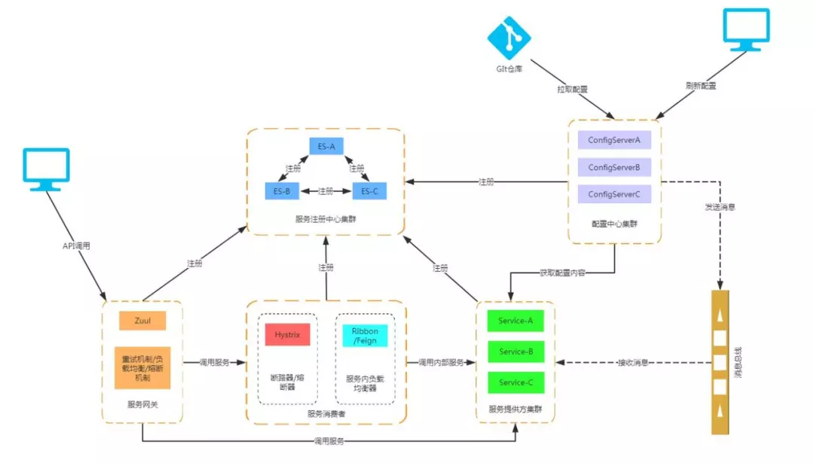

# Java

## Java 基础

#### 1.什么是泛型？类型擦除的问题及解决？如何使用？


#### 2.hashcode 和 equals；为什么要有 hashcode？为什么重写 equals 必须重写 hashcode？


#### 3.装箱和拆箱？

#### 4.方法(函数)？值传递还是引用传递？重载和重写？深拷贝和浅拷贝？


#### 5.常用关键字（final、static、this、super）


#### 6.类和对象？面向对象和面向过程？构造器？成员变量和局部变量的区别？


#### 7.String、StringBuilder、StringBuffer 的异同

- 字符串有长度限制
  - 在编译期，要求字符串常量池中的常量长度不能超过 65535，并且在 javac 执行过程中控制了最大值为 65534。
  - 在运行期，长度不能超过 Int 的范围，否则会抛异常。


## 容器

#### 1.ArrayList 和 LinkedList 的异同？ArrayList 的参数和方法？ArrayList 扩容机制？ensureCapacity 方法？


#### 2.Comparable 和 Comparator 的区别？HashSet、LinkedHashSet、TreeSet 的区别？


#### 3.HashMap？为什么使用红黑树？hash 方法（扰动函数）？hash 冲突如何解决？为什么数组长度是 2 的幂次方？HashMap 和 TreeMap 的区别？扩容的时机和原理？


#### 4.ConcurrentHashMap 底层实现？put 方法实现？


#### 5.快速失败和安全失败？

## 多线程

#### 1.volatile 的作用？与 synchronized 的区别？语义？


#### 2.synchronized 三种使用方法？如何实现单例模式？底层原理？jvm 做了什么优化？


#### 3.ThreadLocal 作用？数据结构？底层实现？hash 算法？在 ThreadLocal.get() 时发生 gc，key 是否为 null？


#### 4.为什么使用线程池？如何创建？参数？execute() 和 submit() 的区别？为什么不推荐使用 Executors 提供的线程池创建方式？线程池的使用？Executor 框架？为什么线程池核心线程满了后，是先加入阻塞队列？execute 执行步骤？workQueue 的实现？


#### 5.并发容器？CopyWriteArrayList 的读写？ConcurrentSkipListMap 的数据结构？


#### 6.Atomic 原子类？CAS 的 ABA 问题？基本类型原子类的实现？如何解决 ABA 问题？


#### 7.AQS 的作用？AQS 原理？Semaphore 的使用？CountDownLatch 的使用？CyclicBarrier 的使用、实现原理、await 方法、和 CountDownLatch 的区别？


#### 8.ReentrantLock 非公平锁和公平锁的区别？


## JVM

#### 1.Java 运行时内存区域？


#### 2.对象的创建？


#### 3.内存分配并发问题？


#### 4.对象的内存布局？


#### 5.对象的访问定位？


#### 6.类加载过程？


#### 7.必须对类进行初始化的 6 种情况？


#### 8.如何判断一个类无用？如何判断一个对象死亡？如何判断一个常量是废弃常量？


#### 9.对象分配在哪个区？


#### 10.四种引用？


#### 11.类加载器？双亲委派模型？


#### 12.垃圾收集算法？


#### 13.垃圾收集器？CMS 收集步骤？优缺点？如何调优（避免 full gc 和空间碎片合并）？


## Java 性能调优？

# MySQL


# Redis


# MQ

## RabbitMQ


## Kafka


# Netty

#### 1.Netty 是什么？为什么要用 Netty？应用场景？


# SSM

#### 1.什么是 Spring？Spring 常用模块？

- 常用模块

  ```java
  /**
  	core：基础，spring 所有功能依赖该类库
  	AOP：提供了面向切面的编程实现
  	JDBC：java 数据库连接
  	Web：用于创建 Web 应用程序
  	MVC：实现 MVC 开发模式
  	Test：提供对 Junit 和 TestNDA 测试的支持
  */
  ```

  

#### 2.Spring/SpringBoot 常用注解？bean 相关？http 请求？前后端传值？读取配置信息？参数校验？全局 Controller 异常处理？JPA？事务？json 数据处理？

- **@SpringBootApplication**：SpringBoot 项目的启动类，@Configuration + @EnableAutoConfiguration + @ComponentScan
  - **@Configuration**：允许在 Spring 上下文中注册额外的 bean 或导入其他配置类（**声明配置类**）
  - **@EnableAutoConfiguration**：启用 SpringBoot 的自动配置机制
  - **@ComponentScan**：在指定包下，扫描被 *@Component*（@Service、@Controller..) 注解的 bean
- **@RestController vs @Controller：**
  - @Controller 返回一个页面/视图（前后端不分离）
  - @RestController = @Controller + @ResponseBody，返回对象，对象数据以 Json 或 XML 形式写入 HTTP 响应
- **@Component  @Bean**
  - @Component：**作用于类，**通过类路径扫描来自动侦测以及自动装配到 Spring 容器中。
  - @Bean：**作用于方法**，在标有该注解的方法中定义产生这个 bean，
- **@Scope**：声明 Spring bean 的作用域，作用于方法上，搭配 @Bean 注解
- **@ComponentScan**：定义要扫描的路径，**从中找出标识需要装配的类自动装配到 Spring 的 bean 容器中**
- 自动装配 bean: **@Autowired**、
- 将一个类声明为 Spring 的 bean：
  - **@Component**：通用注解，可标注人以类为 Spring 组件
  - **@Repository**：对应持久层(DAO 层)，用于数据库相关操作
  - **@Service**：服务层，业务实现逻辑，需要用到DAO 层。
  - **Controller**：对应于 SpringMVC 控制层，用于接收用户请求并调用 Service 层返回数据给前端页面。
- HTTP 请求（Get、POST、Put、Delete）
  - **@GetMapping("/users")**：等价于 @RequestMapping(value="/users", method = RequestMethod.GET)
  - **@PostMapping("/users")**：
  - **@DeleteMapping("/users/{userId}")**
  - **@PutMapping("/users/{userId}")**
- 前后端传值：
  - **@PathVariable** 和 **@RequestParam**：/klasses/{123456}/teachers?type=web
    - @PathVariable：用于获取路径参数（klassId=123456）
    - @RequestParam：用于获取查询参数（type=web)
  - **@RequestBody**：用于读取 Request 请求的 body 部分并且 **Content-Type 为 application/json** 格式的数据，接收到数据之后会自动将数据绑定到 Java 对象上。
  - 一个请求方法只可以有一个`@RequestBody`，但是可以有多个`@RequestParam`和`@PathVariable`
- 读取配置信息
  - **@Value（常用）**：读取 application.yml 的配置值  `@Value("@{property}")`
  - **@ConfigurationProperties（常用）**：读取配置信息并与 bean 绑定
  - **@PropertySource（不常用）**：读取指定 properties 文件
- 参数校验（Hibernate Validator 框架）——使用 **JSR 注解**（**`javax.validation.constraints`**）
  - 字段验证
    - `@NotEmpty` 被注释的字符串的不能为 null 也不能为空
    - `@NotBlank` 被注释的字符串非 null，并且必须包含一个非空白字符
    - `@Null` 被注释的元素必须为 null
    - `@NotNull` 被注释的元素必须不为 null
    - `@AssertTrue` 被注释的元素必须为 true
    - `@AssertFalse` 被注释的元素必须为 false
    - `@Pattern(regex=,flag=)`被注释的元素必须符合指定的正则表达式
    - `@Email` 被注释的元素必须是 Email 格式。
    - `@Min(value)`被注释的元素必须是一个数字，其值必须大于等于指定的最小值
    - `@Max(value)`被注释的元素必须是一个数字，其值必须小于等于指定的最大值
    - `@DecimalMin(value)`被注释的元素必须是一个数字，其值必须大于等于指定的最小值
    - `@DecimalMax(value)` 被注释的元素必须是一个数字，其值必须小于等于指定的最大值
    - `@Size(max=, min=)`被注释的元素的大小必须在指定的范围内
    - `@Digits (integer, fraction)`被注释的元素必须是一个数字，其值必须在可接受的范围内
    - `@Past`被注释的元素必须是一个过去的日期
    - `@Future` 被注释的元素必须是一个将来的日期
  - 验证请求体（RequestBody）:在需要验证的参数上添加 **@Valid** 注解，验证失败，将抛出异常。
  - 在类上添加**@Validated** 注解，用于验证请求参数（校验方法参数）
- 全局处理 Controller 层异常
  - **@ControllerAdvice**：定义全局异常处理类（添加到类上）
  - **@ExceptionHandler**：声明异常处理方法（添加到方法上）
- JPA 相关
  - 创建表：
    - @Entity：声明一个类对应一个数据库实体
    - @Table：设置表名
  - 创建主键：
    - @Id：声明一个字段为主键
    - @GeneratedValue：指定主键生成策略，使用 JPA 内置提供的四种策略（TABLE(使用数据库表格存储主键)、SEQUENCE(不支持主键自增长)、**IDENTITY(主键自增长)、AUTO(交给持久化引擎生成，会根据数据库选择其中一种，默认)**）
    - **通过 `@GenericGenerator`声明一个主键策略，然后 `@GeneratedValue`使用这个策略**
  - @Column：声明字段
  - @Transient：声明不需要与数据库映射的字段，在保存的时候不需要保存进数据库（还可以使用 static、final、transient 关键字）
  - @Lob：声明大字段
  - @Enumerated：使用枚举类型的字段
  - `@EnableJpaAuditing`：开启 JPA 审计功能。
  - @Modifying：添加到方法上，提示 JPA 该操作是修改操作，配合 @Transactional 注解使用
  - 关联关系
    - `@OneToOne` 声明一对一关系
    - `@OneToMany` 声明一对多关系
    - `@ManyToOne`声明多对一关系
    - `MangToMang`声明多对多关系
- 事务注解：**@Transactional(rollbackFor = Exception.class)**
  - 解释
    - **作用于类上时**，该类的所有 public 方法都具有该类型的事务属性。
    - **可在方法级别使用该标注来覆盖类级别的定义。**只在 public 方法才生效。
    - 使用该注解的方法抛出异常，就会回滚，数据库里面的数据也会回滚。
  - 为什么加上 rollbackFor 属性？
    - 如果不配置 rollbackFor 属性，事务只会在遇到 RuntimeException 时才会回滚，加上 Exception.class，可以让事务在遇到非运行时异常时也回滚。
  - 工作机制：基于 AOP 实现，
  - **Spring AOP 自调用问题**：同一类中其他没有 **@Transactional** 注解的方法内部调用有 **@Transactional** 注解，有注解的方法的事务会失效。
    - 只有当 @Transactional 注解的方法在类以外被调用的时候，Spring 事务管理才生效。
    - 解决办法：避免同一类中自调用；使用 AspectJ 取代 AOP 代理。
- json 数据处理
  - 过滤 json 数据
    - **`@JsonIgnoreProperties`**：作用在类上用于过滤掉特定字段不返回或者不解析
    - **`@JsonIgnore`：用于类的属性上，作用和上面的`@JsonIgnoreProperties` 一样。**
  - **@JsonFormat**：格式化 json 数据
  - **@JsonUnwrapped**：扁平化对象，去除对象的属性
- 

#### 3.Spring IOC 和 AOP

- IoC（Inverse of Control:控制反转）是一种**设计思想**，就是 **将原本在程序中手动创建对象的控制权，交由Spring框架来管理**。
  -  **IoC 容器是 Spring 用来实现 IoC 的载体， IoC 容器实际上就是个Map（key，value）,Map 中存放的是各种对象。**
  -  将对象之间的相互依赖关系交给 IoC 容器来管理，并由 IoC 容器完成对象的注入。 **IoC 容器就像是一个工厂一样，当我们需要创建一个对象的时候，只需要配置好配置文件/注解即可，完全不用考虑对象是如何被创建出来的。**
- AOP：将那些与业务无关，**却为业务模块所共同调用的逻辑或责任（例如事务处理、日志管理、权限控制等）封装起来**，便于**减少系统的重复代码**，**降低模块间的耦合度**，并**有利于未来的可拓展性和可维护性**。
  - **基于动态代理实现**
    - 要代理的对象实现了某个接口，使用 JDK Proxy 创建代理对象
    - 没有实现接口的对象，使用 Cglib 生成一个被代理对象的子类来作为代理

#### 4.Spring AOP  和 AspectJ AOP 有什么区别？

- Spring AOP 属于**运行时增强**，基于动态代理，相对于 AspectJ AOP 功能更简单，切面少的情况下性能差别不大。
- AspectJ AOP 属于**编译时增强**，基于字节码操作，最完整的 AOP 框架，功能强大，切面多的情况下性能更快。

#### 5.Spring bean？作用域？单例 bean 线程安全？注解？

- 作用域
  - singleton：唯一 bean 实例，Spring 中的 bean **默认都是单例的**。
  - prototype：每次请求会创建一个新的 bean 实例
  - request：每一次 http 请求都会产生一个新的 bean，**该 bean 仅在当前 http request 内有效**。
  - session：每一次 http 请求都会产生一个新的 bean，**该 bean 仅在当前 http session 内有效**。
- 单例 bean 是否线程安全？
  - 单例 bean 存在线程安全问题，当多个线程操作同一个对象时，对这个对象成员变量的**写操作会存在线程安全问题**。通常情况下，常用的 **Controller、Service、Dao **这些 bean 都是无状态的。无状态的 bean 不能保存数据，所以是线程安全的。
  - 解决办法：
    1. 在类中定义一个 **ThreadLocal** 成员变量，将需要的可变成员变量保存在 **ThreadLocal** 中。（推荐）
    2. 将 bean 的作用域改为 prototype，每次请求都创建一个新的 bean 实例。
  - **实践**：**在 Controller、Service 中，尽量避免定义实例变量，如果需要改变实例变量，使用 ThreadLocal 保存。**

#### 6. bean 的生命周期？

```java
/**
	1.找到 Spring bean 的定义
	2.创建 bean 实例
	3.设置对象属性值
	4.检查 Aware 相关接口，设置相关依赖（执行相关方法）
		- 传入 bean 的名称
		- 传入 ClassLoader 对象的实例
	5.如果有和加载这个 bean 相关的 BeanPostProcessor 对象，执行前置处理器方法 
	6.如果 bean 实现了 InitializingBean 接口，执行 afterPropertiesSet 方法（可在该方法实现对象逻辑，创建 bean 后自动执行）
	7.如果定义中包含 init-method 属性，执行指定的方法
	8.如果有和加载这个 bean 相关的 BeanPostProcessor 对象，执行后置处理器方法
    9.使用这个 bean 实例
    10.当要销毁 bean 的时候
    	- 如果实现了 DisposableBean，执行 destroy 方法
    	- 如果定义中包含 destroy-method 属性，执行指定的方法
*/
```

#### 7.Spring 循环依赖？怎么解决？三级缓存的作用？AOP 代理的循环依赖怎么解决？

- Spring 支持单例循环依赖。什么时候完成依赖注入的功能？单例在初始化的时候完成
- Spring 在创建 bean 的时候是按照自然排序进行创建的。
- 创建 Bean 的过程（简化成 3 步）：
  - **实例化**：createBeanInstance 方法
  - **属性注入**：populateBean 方法
  - **初始化**：initializeBean 方法
- 三级缓存：
  - **singletonObjects**：一级缓存，存储的是所有创建好了的单例 Bean 实例
  - **earlySingletonObjects**：二级缓存，存储**完成实例化**、但是还没有进行属性及初始化的对象
  - **singletonFactories**：提前暴露的一个单例工厂，二级缓存中存储的是从这个工厂中获取到的对象。
- Spring 如何解决循环依赖？
  - Spring 通过三级缓存解决循环依赖问题。
  - 当 A、B 两个类发生循环引用时，在 A 完成实例化后，就使用**实例化的对象创建一个对象工厂，并添加到三级缓存中**；如果 A 被 AOP 代理，那么通过这个工厂获取到的是 A 代理后的对象；如果 A 没有被 AOP 代理，那么这个工厂获取到的是 A 实例化后的对象。
  - 当 A 进行属性注入的时候，会去创建 B，同时 B 又依赖了 A， 所以创建 B 的同时会调用 getBean(A) 来获取需要的依赖，此时的 getBean(A) 会从缓存中获取：
    - 先获取到三级缓存中的工厂，调用对象工厂的 getObject 方法获取到对应的对象，得到对象后注入到 B 中。紧接着 B 走完它的创建流程，包括初始化、后置处理器等。
    - 当 B 创建完后，会将 B 再注入到 A 中，此时 A 再走完它的创建流程。
- 为什么使用三级缓存？二级缓存能解决循环依赖吗？
  - 使用二级缓存能解决循环依赖问题，但是意味着所有的 Bean 在实例化后就要完成 AOP 代理，生成代理对象，这样违背了 Spring 设计原则。Spring 设计之初就是通过后置处理器来在 Bean 创建的最后一步完成 AOP 代理，而不是在实例化后就立马进行 AOP 代理。
- 使用三级缓存能提高效率吗？
  - 不能
  - 没有进行 AOP 的 Bean 间的循环依赖，三级缓存的对象工厂只是将实例化的对象返回，没有没有其他操作。
  - 进行了 AOP 的 Bean 的循环依赖，使用了三级缓存的情况下，为 A 创建代理的时机是在 B 中需要注入 A 时；而不使用三级缓存，在 A 实例化后，就需要马上为 A 创建代理对象，然后放入到二级缓存中。对于整个 A、B 的创建过程，消耗的时间是一样的。
- 三级缓存为什么要使用工厂而不是直接引用？为什么需要三级缓存，而不直接使用二级缓存暴露一个引用
  - 三级缓存中对象工厂的目的是**延迟对实例化阶段生成的对象的代理**，只有真正发生循环依赖的时候，才去提前生成代理对象，否则只会创建一个对象工厂并将其放入到三级缓存中，不会通过这个工厂真正创建对象。
- 初始化的时候对 A 对象本身进行初始化，而容器中以及注入到 B 中的都是代理对象，这样不会有问题吗？
  - 不会，因为不管是 JDK 还是 cglib 动态代理生成的代理类，内部都持有一个目标类的引用。当调用代理对象的方法时，实际会去调用目标对象的方法，A 完成初始化就相当于代理对象也完成了初始化。

#### 8.Spring 容器启动流程？

- 依赖始化过程：读取 XML 文件，解析成 BeanDefinition，注册到 BeanFactory


#### 9.Spring 事务？隔离级别？传播行为？超时属性？只读属性？回滚规则？事务失效场景？

- 管理事务的方式（两种）
  - 编程式事务，在代码中硬编码（不推荐使用）
  - 声明式事务，在配置文件中配置（推荐使用）
    1. 基于 XML 的声明式事务
    2. 基于注解的声明式事务
- **事务的隔离级别**（五种）
  - MySQL 的四种
  - default：使用数据库默认的隔离级别
- **事务传播行为**（**解决业务层方法之间互相调用的事务问题**）：
  - **支持当前事务的情况**：
    - **TransactionDefinition.PROPAGATION_REQUIRED：** 如果当前（外部方法）存在事务，则（内部方法）加入该事务；如果当前没有事务，则创建一个新的事务。
    - **TransactionDefinition.PROPAGATION_SUPPORTS：** 如果当前存在事务，则加入该事务；如果当前没有事务，则以非事务的方式继续运行。
    - **TransactionDefinition.PROPAGATION_MANDATORY：** 如果当前存在事务，则加入该事务；如果当前没有事务，则抛出异常。（mandatory：强制性）
  - **不支持当前事务的情况：**
    - **TransactionDefinition.PROPAGATION_REQUIRES_NEW：** 创建一个新的事务，如果当前存在事务，则把当前事务挂起。
    - **TransactionDefinition.PROPAGATION_NOT_SUPPORTED：** 以非事务方式运行，如果当前存在事务，则把当前事务挂起。
    - **TransactionDefinition.PROPAGATION_NEVER：** 以非事务方式运行，如果当前存在事务，则抛出异常。
  - **其他情况：**
    - **TransactionDefinition.PROPAGATION_NESTED：** 如果当前存在事务，则创建一个事务作为当前事务的嵌套事务来运行；如果当前没有事务，则该取值等价于TransactionDefinition.PROPAGATION_REQUIRED
- **事务超时属性**：指一个事务所允许执行的最长时间，如果超过该时间限制但事务还没有完成，则自动回滚事务。（默认为 -1，没有超时时间）
- **事务的只读属性**：
  - 对于只有读取数据查询的事务，指定事务类型为 readonly（只读事务）。只读事务不涉及数据的修改，数据库会提供一些优化手段。
  - 使用场景：执行多条查询语句，如统计查询、报表查询时，多条查询 SQL 必须保证整体的读一致性，此时应该使用事务支持
- **事务回滚规则**：
  - 默认遇到 RuntimeException 异常和 Error 才会回滚。
  - 使用 rollbackFor = Exception.class 指定回滚异常类型
- @Transactional 失效场景
  1. **@Transactional 应用在非 public 修饰的方法上**（事务无效，不会报错）：invoke 方法最终会减产目标方法的修饰符是否为 public，不是 public 则不会获取 @Transactional 的属性配置信息。
  2. **@Transactional 注解属性 propagation（传播行为） 设置错误**：Supports、Not Supported、Never
  3. **@Transactional 注解属性 rollbackFor 设置错误**：抛出了除 RuntimeException 和 Error 的异常，事务没有回滚
  4. **同一个类中方法调用，导致 @Transactional 失效**：非事务方法调用事务方法，事务会失效(当事务方法被当前类以外的代码调用时，才会由 Spring aop 生成的代理对象管理)
  5. **@Transactional 方法抛出的异常被 catch 了**：事务不能回滚（catch 时抛出 RuntimeException）
  6. **数据库引擎不支持事务**

#### 10.Spring 中使用到的设计模式

1. 控制翻转(IoC)和依赖注入(DI)
2. 工厂设计模式
3. 单例设计模式：通过 ConcurrentHashMap（线程安全） 实现单例注册表（singletonObjects）
4. 代理设计模式：AOP 基于动态代理实现
5. 模板方法模式：`jdbcTemplate`、`hibernateTemplate` 等以 Template 结尾的对数据库操作的类，使用到了模板模式。
6. 观察者模式：Spring 的**事件驱动模型**应用的是观察者模式。
7. 适配器模式：将一个接口转换成客户希望的另一个接口，使接口不兼容的类可以一起工作。（包装器）
   - Spring AOP 的增强或通知(Advice)使用到了适配器模式。
   - SpringMVC 的适配器模式：
     - 
     - Spring MVC 中的 `Controller` 种类众多，不同类型的 `Controller` 通过不同的方法来对请求进行处理。如果不利用适配器模式的话，`DispatcherServlet` 直接获取对应类型的 `Controller`，需要的自行来判断

#### 11.Spring JPA（Java Persistence API）


#### 12.SpringMVC 工作原理

- DispatcherServlet：前端控制器，接收用户请求和响应结果
- HandlerMapping：处理器映射器，用于请求查找 Handler，返回 handler 执行链
- HandlerAdapter：处理器适配器，找到 handler 对应的处理器(Contorller)，将 handler 发给对应的 controller
- Controller：Handler 处理器，执行 Handler，返回 ModelAndView
- View Resolver：视图解析器，解析视图并返回


#### 13.#{} 和 ${} 的区别是什么？

- `${}` 是 Properties 文件中的变量占位符，它可以用于标签属性值和 sql 内部，属于静态文本替换。可能导致 SQL 注入问题。
- `#{}` 是 sql 的参数占位符，Mybatis 会在预编译的时候将 sql 中的 #{} 替换为 ? 号，在 sql 执行前会使用 `PreparedStatement` 的参数设置方法，按需给 sql 的 ? 号 占位符设置参数值。不会有 sql 注入问题。


#### 14.预编译是什么？优势？

- **sql 预编译**：数据库驱动在发送 sql 语句和参数给 DBMS 之前对 sql 语句进行编译，这样 DBMS 执行 sql 时，就不需要重新编译。JDBC 使用 PreparedStatement 对象来抽象预编译语句。
- 优势
  - 预编译阶段可以优化 sql 的执行：DBMS 可以直接执行预编译后的 sql，而且预编译阶段可以合并多次操作为一个操作。
  - 预编译语句对象可以重复利用：把一个 sql 预编译后产生的 PreparedStatement 对象缓存下来，下次对于同一个 sql，可以直接使用这个缓存的 PreparedStatement 对象。提高效率和 

# SpringBoot

#### 1.容器启动过程

- 构造一个 SpringApplication 的实例，进行初始化工作
  1. **把参数 sources 设置到 SpringApplication 属性中**，这个 sources 可以是任何类型的参数。（启动类的 class 对象）
  2. 判断**是否是 web 程序**，并设置到 **webEnvironment** 这个 boolean 属性中
  3. 找出所有的**初始化器**，默认有 5 个，设置到 **initializers** 属性中（默认从 **spring.factories** 文件获取）
  4. 找出所有的**应用程序监听器**，默认有 9 个，设置到 **listeners** 属性中（默认从 **spring.factories** 文件获取）
  5. 找出运行的主类(main.class)
- 调用 run 方法，启动 SpringApplication
  1. 构造一个 StopWatch 任务执行观察期，观察 SpringApplication 的执行（记录开始时间）
  2. 找出所有的 SpringApplicationRunListener 并封装到 SpringApplicationRunListeners 中，**用于监听 run 方法的执行**。监听的过程中会封装成事件并广播出去，让初始化过程中产生的应用程序监听器进行监听。
  3. 构造 Spring 容器（ApplicationContext），并返回
     1. 判断**是否是 web 环境**，是的话构造 AnnotationConfigEmbeddedWebApplicationContext，否则构造 AnnotationConfigApplicationContext
     2. SpringApplication 初始化过程中产生的**初始器开始工作**
     3. Spring 容器的刷新（完成 bean 的解析、各种处理器(processor)接口的执行、条件注解的解析等等）
  4. 从 Spring 容器中找出 ApplicationRunner 和 CommandLineRunner 接口的实现类并**排序后依次执行**

#### 2.过滤器和拦截器（AOP 的具体实现）

- 过滤器(Filter)：有多个请求，只过滤符合要求的请求。定义这些要求的工具，就是过滤器。

  - 实现 javax.servlet.Filter 接口

  - 重写三个方法

    ```java
    /*
    	1.init: 初始化过滤器后执行的操作(只会被调用一次，必须执行成功)
    	2.doFilter: 对请求进行过滤
    		- 用户发送请求到 web 服务器,请求会先到过滤器
    		- 过滤器会对请求进行一些处理比如过滤请求的参数、修改返回给客户端的 response 的内容、判断是否让用户访问该接口等等
    		- 用户请求响应完毕
    		- 进行一些自己想要的其他操作
    	3.destroy：销毁过滤器后执行的操作，主要用于对某些资源的回收（只会被调用一次）
    */
    ```

- 拦截器(Interceptor)：当一个流程正在进行的时候，要干预它的进展甚至是终止它的进行。这就是拦截器的工作。

  - 实现 **HandlerInterceptor** 接口或继承 **HandlerInterceptorAdapter**类

  - 重写三个方法：

    ```java
    /*
    	1.preHandle：在请求处理之前进行调用（该方法返回 false，将视为当前请求结束，所有的拦截器都会失效）
    	2.postHandle：在 preHandle 方法返回 true 时才会执行。在 Controller 中的方法调用之后，在 DispatcherServlet 返回渲染视图之前被调用。（调用的顺序和 preHandle 相反，先声明的拦截器 preHandle 方法先执行，而 postHandle 方法后执行。）
    	3.afterCompletion：在 preHandle 方法返回 true 时才会执行。在整个请求结束之后，DispatcherServlet 渲染了对应的视图之后执行。
    */
    ```

- 不同之处

  1. 实现原理不同：过滤器基于函数回调实现，拦截器基于 Java 反射机制（动态代理）实现。
  2. 使用范围不同：Filter 的使用要依赖于 Tomcat 等容器，只能在 web 程序中使用。而 Interceptor 是一个 Spring 组件，由 Spring 容器管理，可以单独使用。
  3. 触发时机不同：Filter 是在请求进入容器后，但在进入 servlet 之前进行预处理，在 servlet 处理完以后请求结束；Interceptor 是在请求进入 servlet 后，在进入 controller 之前进行预处理，Controller 中渲染了对应的视图之后请求结束。
  4. 拦截的请求范围不同：过滤器几乎可以对所有进入容器的请求起作用，而拦截器只会对`Controller`中请求或访问`static`目录下的资源请求起作用。
  5. 注入 Bean 的情况不同：


#### 3.SpringBoot 自动装配原理？是什么？

- @EnableAutoConfiguration: 实现自动装配的核心注解。
  - 通过 `AutoConfigurationImportSelector`类加载自动装配类。实现了 `ImportSelector` 接口，实现了该接口的 `selectImports` 方法。
    - `selectImports`方法：主要用于**获取所有符合条件的类的全限定类名，这些类需要被加载到 IoC 容器中**
      - 判断自动装配开关是否打开（默认打开）：通过 @EnableAutoConfiguration 开启
      - 获取`EnableAutoConfiguration`注解中的 `exclude` 和 `excludeName`
      - 获取需要自动装配的所有配置类，读取`META-INF/spring.factories`
      - `@ConditionalOnXXX` 中的所有条件都满足，该类才会生效（不会加载 spring.factories 中的所有类）

#### 4.SpringBoot 处理异常的常用方式

1. 使用 **@ControllerAdvice** 和 **@ExceptionHandler** 处理全局异常
   - 自定义异常类型，继承 **RuntimeException**，属性（code/message/exception)
   - 自定义全局异常类 **GlobalExceptionHandler**，**@ControllerAdvice 标注当前类为全局异常处理类**，可以让异常处理类处理特定类抛出的异常（不常用）
   - @ExceptionHandler 拦截特定异常，进行处理


#### 5.SpringBoot 相比 Spring 的优势？

1. 自动配置，针对 Spring 常见的应用功能，SpringBoot 能自动提供相关配置
2. 起步依赖，告诉 SpringBoot 需要什么功能，它就能引入需要的库

# SpringCloud



#### 0.SpringCloud 是什么？有什么组件？

- 微服务系统架构的一站式解决方案，SpringCloud 提供了一套简易的编程模型，让我们能在 SpringBoot 的基础上轻松地实现微服务项目的构建。

#### 1.Eureka：服务发现框架？基础概念？实现原理？

- 基本概念
  - **服务发现**：
  - 三个角色：
    - **服务提供者**：提供服务，注册到 Eureka 上
    - **服务消费者**：使用 Eureka 上的服务
    - **服务注册中心**：Eureka
  - **服务注册**：当 Eureka 客户端向`Eureka Server`注册时，它提供自身的**元数据**，比如 IP 地址、端口，运行状况指示符 URL，主页等
  - **服务续约**：Eureka 客户端会每个 30 秒发送一次心跳来续约。如果 Eureka 在 90 秒没有收到 Eureka 客户端的心跳，会将实例从其注册表中删除。
  - **获取注册列表信息**：**Eureka 客户端从服务器获取注册表信息，并将其缓存在本地**。客户端会使用该信息查找其他服务，从而进行远程调用。(每 30 秒更新一次)
  - **服务下线**：Eureka 客户端在程序关闭时向 Eureka 服务器发送取消请求。发送请求后，该客户端实例信息将从服务器的实例注册表中删除。
  - **服务剔除**：如果 Eureka 在 90 秒没有收到 Eureka 客户端的心跳，会将实例从其注册表中删除。
- 服务注册实现原理：

#### 2.Ribbon：负载均衡（消费者端）？负载均衡算法？

- Ribbon 是什么：客户端/进程内负载均衡器，**运行在消费者端**。

- **`RestTemplate`是`Spring`提供的一个访问Http服务的客户端类**
- 负载均衡算法：
  - 轮询策略：默认采用，轮询找到可用的 provider
  - 随机策略：从所有可用的 provider 中随机选择一个
  - 重试策略：先按照轮询策略获取 provider，若获取失败，在指定的时限内重试。

#### 3.Open Feign：

- 基于映射，不使用 RestTemplate 调用 API，而是像调用原来代码一样进行各个服务间的调用。
- 运行在消费者端，内置了 Ribbon 进行负载均衡。


#### 4.Hystrix：断路器？熔断和降级？

- 熔断：当指定时间窗内的请求失败率达到设定阈值时（**服务雪崩**），系统将通过**断路器**直接将此请求链路断开。（断路器模式）
  - **Hystrix 的断路器模式**：使用 @HystrixCommand 注解标注某个方法，Hystrix 会使用**断路器**来“包装”这个方法，每当调用时间超过指定时间时，断路器就会中断对这个方法的调用。
- **降级**：为了更好的用户体验，当一个方法调用异常时，通过执行另一种代码逻辑来给用户友好的回复
  - **Hystrix 的后备处理模式**：通过设置`fallbackMethod`来给一个方法设置备用的代码逻辑


#### 5.Zuul：微服务网关？路由功能？过滤功能？

- 网关：Zuul 提供对于服务消费者的统一入口。网关是系统唯一对外的入口，介于客户端和服务器端之间，用于对请求进行**鉴权、限流、路由、监控**等功能。
- **Zuul 的路由功能**
  - 配置：首先，`Zuul`需要向 Eureka 进行注册，可以拿到所有 Consumer 的信息（元数据），可以直接做**路由映射**；然后在启动类上加入** @EnableZuulProxy ** 注解。
  - **统一前缀、路由策略配置(自定义路径)、服务名屏蔽(微服务名称)、路径屏蔽(屏蔽指定的路径 URI，限权)、敏感请求头屏蔽**
- **Zuul 的过滤功能**：实现**限流、灰度发布、权限控制**（ZuulFilter：相当于 Interceptor）
  - 限流：令牌桶限流、
- Zuul 存在单点故障问题，要保证 Zuul 的高可用，需要进行 Zuul 的集群配置（借助 KeepAlived+HaProxy、Nginx）


#### 6.Config：统一配置管理？为什么要使用？

- Config 既能对配置文件统一地进行管理（**Git 或 SVN**），又能在项目运行时动态修改配置文件。（常用**阿波罗**）
  - 应用只有在启动时候才会进行配置文件的加载，SpringCloud Config 暴露出一个借口给启动应用来获取配置文件，应用获取到配置文件后再进行它的初始化工作。
  - 不能动态修改配置文件。
- 使用 Bus(消息总线) + SpringCloud Config 进行配置的动态刷新。


#### 7.SpringCloud Bus：消息总线

- Bus：用于将服务和服务实例与分布式消息系统链接在一起的**事件总线**。（事件监听）**管理和广播分布式系统中的消息**。
  - 使用：创建请求，加上 @RefreshScope 注解，进行配置的动态修改

# 分布式理论


## 理论

### CAP 理论

### BASE 理论

## 一致性协议和算法

### 2PC


### 3PC


### Paxos 算法


### Raft 算法


### Zab 算法